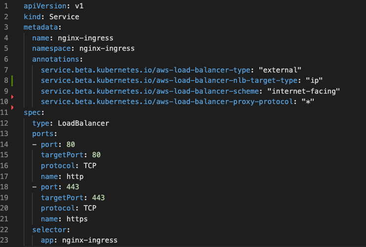
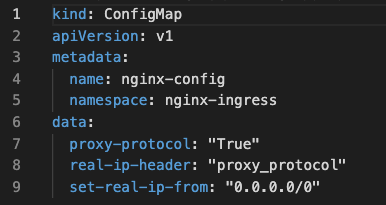

# Lab 4: Configuring NGINX Ingress Controller for Internet Access

## Introduction

You will configure the AWS services to provide a Public IP address, and a DNS record, so that your Ingress Controller is accessible over the open Internet.  *`Warning, there are no security measures in place during this Workshop, do not do this for production workloads without proper Security protections.`*


## Learning Objectives 

- Inspect and deploy the `LoadBalancer` Service
- Test and verify access to the Ingress Controller using the external IP address.

## Inspect and Deploy LoadBalancer Service

1. Configure the Load Balancer Service.

   This step will give the Ingress Controller a Public IP address from the Cloud Provider's IP Address Mgmt system. `NOTE: this WILL expose your Ingress Controller to the open Internet with NO PROTECTION other than basic TCP port filters. Doing this in production would require Security/Firewall Protections, which are not part of this lab exercise.`

   In AWS, the Load Balancer service allocates both a Public IP address and a DNS A record for you. The PROXY protocol is used to pass the original Client IP:Port info to NGINX.

   To configure the Load Balancer Service, we need to deploy the AWS Load Balancer Controller to an Amazon EKS cluster.
      1. Create an IAM Policy
         ```bash
         # Fetch the IAM policy required for our Service-Account
         curl -o lab4/iam_policy.json https://raw.githubusercontent.com/kubernetes-sigs/aws-load-balancer-controller/v2.4.7/docs/install/iam_policy.json

         # Create the IAM policy
         aws iam create-policy \
         --policy-document file://lab4/iam_policy.json \
         --policy-name AWSLoadBalancerControllerIAMPolicy            
         ```

      2. Create an IAM role. Create a Kubernetes service account named `aws-load-balancer-controller` in the `kube-system` namespace for the AWS Load Balancer Controller and annotate the Kubernetes service account with the name of the IAM role.
      We will use `eksctl` to create the IAM role and Kubernetes service account.
         ```bash
         # Set relevant variables
         MY_REGION=us-east-1
         MY_EKS=eks-shouvik-useast1
         MY_AWS_ACCOUNT_ID=$(aws sts get-caller-identity --query 'Account' --output text)
         MY_IAM_POLICY_NAME=AWSLoadBalancerControllerIAMPolicy
         MY_IAM_SA=aws-load-balancer-controller
         
         # Check if all variables are set
         set | grep MY_ 

         # Create the k8s Service Account
         eksctl create iamserviceaccount \
         --cluster=${MY_EKS} \
         --namespace=kube-system \
         --name=${MY_IAM_SA} \
         --attach-policy-arn=arn:aws:iam::${MY_AWS_ACCOUNT_ID}:policy/${MY_IAM_POLICY_NAME} \
         --override-existing-serviceaccounts \
         --approve \
         --region ${MY_REGION}

         # Check out the new SA in your cluster for the AWS LB controller
         kubectl -n kube-system get sa aws-load-balancer-controller -o yaml
         ```

      3. Install the AWS Load Balancer Controller using Helm
         ```bash
         helm repo add eks https://aws.github.io/eks-charts
         helm repo update

         helm install aws-load-balancer-controller eks/aws-load-balancer-controller \
         -n kube-system \
         --set clusterName=${MY_EKS} \
         --set serviceAccount.create=false \
         --set serviceAccount.name=${MY_IAM_SA}

         # Check out the new pods in your cluster for the AWS LB controller
         kubectl get po -n kube-system 

         # Scale the deployment to 1 replica count
         kubectl scale deploy aws-load-balancer-controller -n kube-system --replicas=1
         ```

2. Review the `lab4/loadbalancer-aws-elb.yaml` manifest. Take note of the following:

   - AWS annotation for load balancer type.
   - AWS annotation for load balancer target type.
   - AWS annotation for load balancer scheme.
   - AWS annotation for enabling load balancer proxy protocol.
   - Ports being forwarded to NGINX Ingress Controller.
  
   You can also see that port `80` and `443` are being opened and we are requesting a public IP address.  

    

    **IMPORTANT SECURITY NOTE:** In a real world deployment using a Cloud Provider, with a public IP address, this would expose your Ingress Controller to the open Internet with `NO PROTECTION` other than basic TCP port filters. Doing this in production would require Security/Firewall Protections, which are not part of this lab exercise.

3. Review the `lab4/nginx-config.yaml` file. Take note of the following:
   - Proxy protocol is set to `True`.
   - Real-IP-Header is being used.

   

4. Apply above two manifest to configure AWS and NGINX to use the proxy protocol:
   ```bash
   kubectl apply -f lab4/loadbalancer-aws-elb.yaml
   
   kubectl apply -f lab4/nginx-config.yaml
   ```
  
5. Confirm there is an `nginx-ingress` service with `TYPE: LoadBalancer`. Run the following command to get networking details of our pod:

   ```bash
   kubectl get deployments,services -n nginx-ingress
   ```
   
   You will see the External FQDN DNS name under the **`EXTERNAL-IP`**. Also you will notice a **`CLUSTER-IP`**, which is an Internal Cluster address. Both of those IPs must exist for the `LoadBalancer` service to work correctly.

   ```bash
   kubectl get deployments,services -n nginx-ingress

   ###Sample output###
   NAME                            READY   UP-TO-DATE   AVAILABLE   AGE
   deployment.apps/nginx-ingress   1/1     1            1           3d5h

   NAME                    TYPE           CLUSTER-IP      EXTERNAL-IP                                                                     PORT(S)                      AGE
   service/nginx-ingress   LoadBalancer   10.100.82.40   k8s-nginxing-nginxing-2256d4c17a-4b69de8cf22a87fa.elb.us-east-1.amazonaws.com   880:32168/TCP,443:31498/TCP   10m
   ```
 
   In the example above you see: 

   - `Cluster-IP` address of `10.100.82.40`  
   - `External-IP` address of `[aws-hostname].elb.us-east-1.amazonaws.com` 
   - Both IPs are mapped from port `80` to a NodePort (`32168`); and from port `443` to NodePort (`31498`)

   **NOTE:** 

   - Your `Cluster-IP` address may be different based on your cluster. 

## Verify access to the Ingress Controller using the External IP

1. Run `nslookup` on the `External-IP` hostname to get the IP behind the hostname.
   ```bash
   export EXT_HOST=$(kubectl get svc nginx-ingress -n nginx-ingress -o jsonpath='{.status.loadBalancer.ingress[0].hostname}')

   nslookup $EXT_HOST
   ```
2. Store the IP behind the hostname into a variable which we will make use in the later section.
   ```bash
   export EIP=$(nslookup $EXT_HOST | awk -F': ' 'NR==6 {print $2 }')
   
   echo $EIP
   ```
3. Use the `LoadBalancer` External-IP address that we captured inside the variable `EIP` from the previous step to test your **nginx-ingress** service. Use `curl` command to test it.

   ```bash
   #Test Access to Ingress through LoadBalancer:
   curl -I http://$EIP
   ```
   You should see the following output if the `LoadBalancer` Service is configured correctly for Ingress:
   ```bash
   ###Sample output###
   HTTP/1.1 404 Not Found
   Server: nginx/1.23.2
   Date: Thu, 27 Apr 2023 17:10:58 GMT
   Content-Type: text/html
   Content-Length: 153
   Connection: keep-alive
   ```

   **Question: Why did you get a 404?** 

   <details><summary>Click for Hints!</summary>
   <br/>
   <p>
   <strong>Answer</strong> – The Ingress Controller default server will return an <b>HTTP 404 Not Found page, or an HTTP 400 Bad Request status code</b> for all requests that have no Ingress routing rules defined; this is NGINX's default 404 error page. You will deploy a Demo application in the subsequent labs, which will fix this.
   </p>
   </details>

## Update local DNS

We will be using FQDN hostnames for the labs, and you will need to update your local computer's `hosts` file, to use these names with your Nginx Ingress Controller.

Edit your local hosts file, adding the FQDNs as shown below.  Use the `External-IP` Address, from the previous step:

vi /etc/hosts

```bash
vi /etc/hosts

52.73.14.232 cafe.example.com bar.example.com dashboard.example.com grafana.example.com prometheus.example.com juiceshop.example.com
```

>Note that all 6 hostnames are mapped to the same Loadbalancer External-IP.  You will use the Ingress Controller to route the traffic correctly in the upcoming labs.  
Your External-IP address will likely be different than the example.


**This completes this Lab.**


## References:  
- [NGINX NIC LoadBalancer for cloud
  providers](https://docs.nginx.com/nginx-ingress-controller/installation/installation-with-manifests/#get-access-to-the-ingress-controller)
- [Kubernetes LoadBalancer Service
  Type](https://kubernetes.io/docs/concepts/services-networking/service/#loadbalancer)
- [AWS Load Balancer Controller Add-on](https://docs.aws.amazon.com/eks/latest/userguide/aws-load-balancer-controller.html)
 
### Authors
- Chris Akker - Solutions Architect - Community and Alliances @ F5, Inc.
- Shouvik Dutta - Solutions Architect - Community and Alliances @ F5, Inc.

-------------

Navigate to ([Lab5](../lab5/readme.md) | [Main
Menu](../LabGuide.md))
