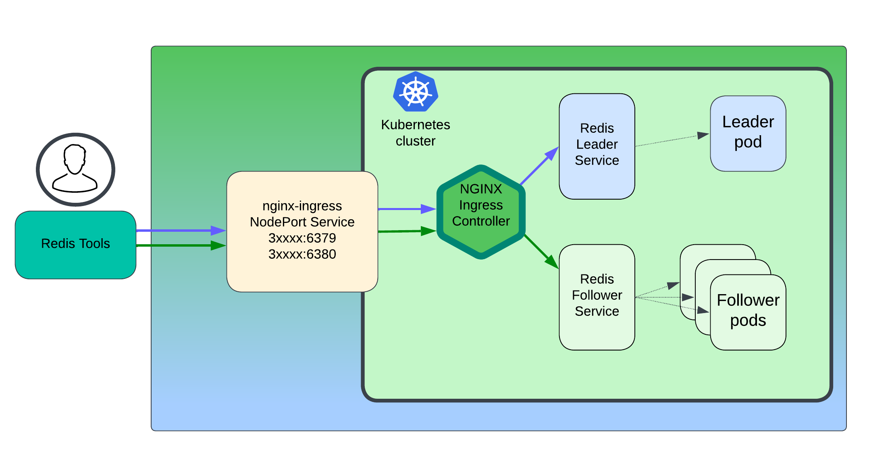
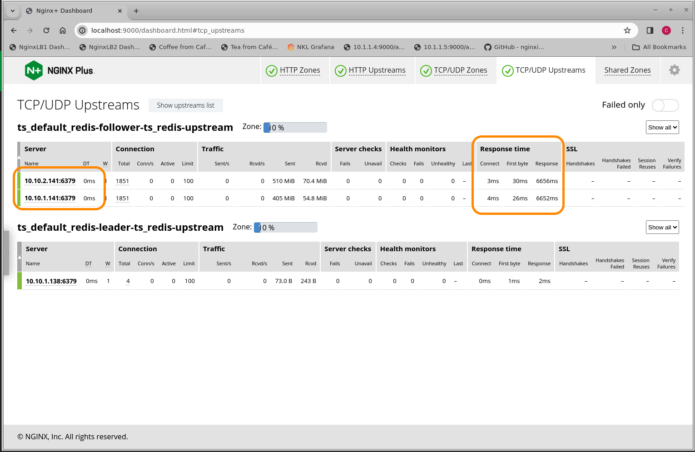
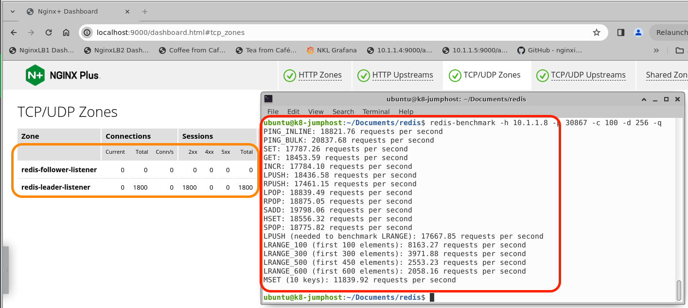

# Redis Caching with NGINX Ingress Controller

## Introduction

In this lab, you will configure NIC to handle `Redis Cache` read and write connections, to and from a Redis Cluster running inside your Kubernetes cluster.

Redis is a popular In-Memory caching solution, providing very high speed, low latency reading and writing of Key:Value records using the memory of Redis servers.  There are many use cases for running Redis, and it works well in Kubernetes environments.  In this lab exercise you will deploy it and test it out using a basic Redis Cluster configuration of 1 Redis Leader and 2 Redis Followers.  You will use standard Redis Client and Benchmark tools for these tests.  You can find a link to more information on Redis in the References section.

>>**It is important to note, that NGINX Ingress will load balance new TCP connections from Redis Clients, it does not load balance Redis requests or transactions.**

## Learning Objectives 

By the end of the lab you will be able to: 
 * Deploy Redis Leader pod and service
 * Deploy Redis Follower pods and service
 * Re-configure NGINX Ingress to expose well-known Redis TCP ports
 * Install Redis Tools
 * Test Redis read/write functions using Redis tools
 * Monitor NIC and Kubernetes pods during tests
 * Optional: Load sample data into Redis and query records

<br/>

NGINX | Redis | Benchmark
:-------------------------:|:-------------------------:|:-------------------------:
  |  |

<br/>

### 1. Deploy Redis Leader to the Kubernetes Cluster

1. Inspect the `lab9/redis-leader.yaml` manifest.  You will see that we are using an example manifest from a Google tutorial configuration, which will deploy a single Redis Leader pod, and create the matching Redis Leader Service.

   Apply the Redis Leader manifest:

   ```bash
   kubectl apply -f lab9/redis-leader.yaml
   ```

2. Verify the Redis Leader pod and Service are up and running.

   ```bash
   kubectl get pods,svc |grep redis
   ```

   ```bash
   #Output should be similar to:

   pod/redis-leader-766465cd9c-b7lx4     1/1     Running   10 (160m ago)   20d
   service/redis-leader     ClusterIP   10.107.72.62   <none>        6379/TCP   20d
   ```
<br/>

### 2. Deploy Redis Follower to the Kubernetes Cluster

1. Inspect the `lab9/redis-follower.yaml` manifest.  You will see that we are using an example manifest from the same Google tutorial configuration, which will deploy two Redis Follower pods, and create the matching Redis Follower Service.

   Apply the Redis Follower manifest:

   ```bash
   kubectl apply -f lab9/redis-follower.yaml
   ```

2. Verify the Redis Follower pods and Service are up and running.

   ```bash
   kubectl get pods,svc |grep redis
   ```

   ```bash
   #Output should be similar to:

   pod/redis-follower-7dcc9bdc5b-5qnp8   1/1     Running   10 (160m ago)   20d
   pod/redis-follower-7dcc9bdc5b-7zf8w   1/1     Running   10 (157m ago)   20d
   pod/redis-leader-766465cd9c-b7lx4     1/1     Running   10 (160m ago)   20d
   service/redis-follower   ClusterIP   10.99.7.133    <none>        6379/TCP   20d
   service/redis-leader     ClusterIP   10.107.72.62   <none>        6379/TCP   20d
   ```

   If you see three Pods and two Services running, you are ready to continue.

<br/>

>NOTE:  Thanx and Credit to Google for providing the Guestbook Tutorial with Redis Leader and Follower configurations.

<br/>


### 3. Re-configure NGINX Ingress Controller for TCP ports and Redis traffic

Using the default configuration, NGINX Ingress Controller is only open for HTTP and HTTPS traffic on ports 80 and 443.  You will need to modify the `nginx-ingress Deployment or Daemonset` to enable Layer4 TCP traffic, and open the appropriate TCP ports for Redis Client Leader and Follower connections.  
- You will configure NGINX Ingress to enable custom TCP ports using the `Global Configuration` Custom Resource Definition (CRD).
- The example shown here uses the standard Redis TCP ports.
- You will also be using the NGINX Ingress Controller's `Transport Server` Custom Resource Definition (CRD), used for load balancing TCP traffic.  

>>*It is important to note, that NIC will load balance new TCP connections from Redis Clients, it does not load balance `Redis requests or transactions`.*

<br/>

*Redis cluster and network Overview**



<br/>

1. Inspect the `nginx-plus-ingress-redis.yaml` Manifest file.  Near the bottom, noticed that the `Global Configuration command-line parameter` has been enabled by removing the comment character (it is disabled by default).  This will allow NGINX Ingress to bind and use additional TCP ports for incoming traffic.  NOTE:  The only open TCP ports on NGINX Ingress are 80 and 443 for web/tls traffic by default.  For Redis to be accessible outside the Kubernetes cluster, you need to add the standard Redis TCP port of 6379 for the Leader connections, and we also add TCP port 6380 for the Follower connections.  Of course, you can change these TCP port numbers to match your client requirements as needed.

1. Delete the current nginx-ingress Deployment (or Daemonset).  

   >**NOTE:  Use Caution - this will delete the NGINX Ingress Controller and drop ALL traffic!**

   ```bash
   kubectl delete deployment nginx-ingress -n nginx-ingress
   ```

   ```bash
   #Output should be similar to:
   
   deployment.apps/nginx-ingress deleted
   ```

1. Apply the new `nginx-plus-ingress-redis.yaml` Manifest, with Global Configuration command line arguement enabled:

   ```bash
   kubectl apply -f /lab9/nginx-plus-ingress-redis.yaml
   ```
  
   ```bash
   #Output should be similar to:

   deployment.apps/nginx-ingress created
   ```

1. Inspect the `lab9/global-configuration-redis.yaml` Manifest.  You will see that two TCP Ports are being opened, and labeled with `redis-leader-listener` and `redis-follower-listener` labels.  

1. Enable the NIC Global Configuration, that opens TCP ports 6379 and 6380:

   ```bash
   kubectl apply -f lab9/global-configuration-redis.yaml
   ```
   ```bash
   #Output should be similar to:

   globalconfiguration.k8s.nginx.org/nginx-configuration created
   ```
1. Verify the Global Configuration was accepted, there should be no errors under `Events`:

   ```bash
   kubectl describe gc nginx-configuration -n nginx-ingress
   ```

    ```yaml
    #Output should be similar to:

    Name:         nginx-configuration
    Namespace:    nginx-ingress
    Labels:       <none>
    Annotations:  <none>
    API Version:  k8s.nginx.org/v1alpha1
    Kind:         GlobalConfiguration
    Metadata:
      Creation Timestamp:  2023-12-20T17:42:16Z
      Generation:          1
      Managed Fields:
        API Version:  k8s.nginx.org/v1alpha1
        Fields Type:  FieldsV1
        fieldsV1:
          f:metadata:
            f:annotations:
              .:
              f:kubectl.kubernetes.io/last-applied-configuration:
          f:spec:
            .:
            f:listeners:
        Manager:         kubectl-client-side-apply
        Operation:       Update
        Time:            2023-12-20T17:42:16Z
      Resource Version:  3434162
      UID:               a04ace42-d88d-4ff7-9d67-851a8163e43b
    Spec:
      Listeners:
        Name:      redis-leader-listener
        Port:      6379
        Protocol:  TCP
        Name:      redis-follower-listener
        Port:      6380
        Protocol:  TCP
    Events:        <none>

    ```

1. Inspect the `redis-leader-ts.yaml` Manifest.  This is an NGINX Ingress `Transport Server` CRD, which defines TCP traffic handling for Redis Leader traffic on port 6379.  This creates a new `stream server block` in NIC.

1. Apply the Redis Leader Transport Server manifest:

    ```bash
    kubectl apply -f lab9/redis-leader-ts.yaml
    ```
    ```bash
    #Output should be similar to:

    transportserver.k8s.nginx.org/redis-leader-ts created
    ```

1. Inspect the `redis-follower-ts.yaml` Manifest.  This is an NGINX Ingress `Transport Server` CRD, which defines TCP traffic handling for Redis Follower traffic on port 6379.  This also creates a new `stream server block` in NIC.

1. Apply the Redis Leader Transport Server manifest:

    ```bash
    kubectl apply -f lab9/redis-follower-ts.yaml
    ```
    ```bash
    #Output should be similar to:

    transportserver.k8s.nginx.org/redis-follower-ts created
    ```

1. Verify both NIC Transport Servers have a `Valid` STATE.  If they show `InValid` STATE, you must fix your manifests before proceeding.

    ```bash
    kubectl get ts -A
    ```

    ```bash
    #Output should be similar to:

    NAMESPACE   NAME                STATE   REASON           AGE
    default     redis-follower-ts   Valid   AddedOrUpdated   89s
    default     redis-leader-ts     Valid   AddedOrUpdated   7s
    ```

1. NIC Under the Hood...let's log into the NIC pod, and check the NGINX config, and verify that the Stream Server block, listeners, and Redis Upstream blocks have been created.

    Set the NIC bash variable:
    ```bash
    export NIC=$(kubectl get pods -n nginx-ingress -o jsonpath='{.items[0].metadata.name}')
    ```

    Connect to the bash console of the NIC pod with Kube Exec.
    ```bash
    kubectl exec -it $NIC -n nginx-ingress -- /bin/bash
    ```
    Prompt should look like:

    >nginx@nginx-ingress-5645d64dd8-sjjc7:$ 

1. After you are connected to the NIC pod's bash shell, change to /etc/nginx folder and look around.  If you explore the `/etc/nginx/stream-conf.d` folder, you will see 2 NGINX `stream .conf files`, one for Redis Leader, one for Redis Follower.

    ```bash
    cd /etc/nginx/stream-conf.d

    ls-l
    ```

    ```bash
    #Output should be similar to:

    total 8
    -rw-r--r-- 1 nginx nginx 568 Jan  9 17:34 ts_default_redis-follower-ts.conf
    -rw-r--r-- 1 nginx nginx 483 Jan  9 17:34 ts_default_redis-leader-ts.conf
    ```

    ```bash
    cat ts_default_redis-leader-ts.conf 
    ```

    ```bash
    #Output should be similar to:

    upstream ts_default_redis-leader-ts_redis-upstream {            # Redis Leader Upstream block
        zone ts_default_redis-leader-ts_redis-upstream 256k;
        least_time last_byte;                                       # Choose the fastest pod
        server 10.10.1.152:6379 max_fails=3 fail_timeout=10s max_conns=100;    # Redis Leader Pod
    }

    server {
        listen 6379;             # Redis Leader Listener
        listen [::]:6379;
        status_zone redis-leader-listener;
        proxy_pass ts_default_redis-leader-ts_redis-upstream;
        proxy_timeout 10m;
        proxy_connect_timeout 60s;
    }

    ```

1. Check out the Redis Follower configuration as well, notice there are TWO upstreams to match the Deployment manifest.

    ```bash
    cat ts_default_redis-follower-ts.conf

    ```

    ```bash
    #Output should be similar to:

    upstream ts_default_redis-follower-ts_redis-upstream {      # Redis Follower Upstream block
        zone ts_default_redis-follower-ts_redis-upstream 256k;
        least_time last_byte;                                   # Choose the fastest pod

        server 10.10.2.144:6379 max_fails=3 fail_timeout=10s max_conns=100;   #Redis Follower Pods
        server 10.10.1.155:6379 max_fails=3 fail_timeout=10s max_conns=100;  
    }

    server {
        listen 6380;              # Redis Follower Listener
        listen [::]:6380;
        status_zone redis-follower-listener;
        proxy_pass ts_default_redis-follower-ts_redis-upstream;
        proxy_timeout 10m;
        proxy_connect_timeout 60s;
    }

    ```

    After you are finished looking around, type `exit` to Exit the bash shell to the NIC pod.

1. Expose the NGINX Ingress Transport Servers outside the cluster with *either* a `NodePort or LoadBalancer Service`.  Pick the one appropriate for your environemnt, do not use both.

    If you want to use a NodePort Service, follow these steps:

1. Inspect the `nodeport-redis.yaml` Manifest.  This new NodePort Service definition ADDS the two new Redis ports to the nginx-ingress Service, and Kubernetes opens two new NodePorts.

    ```yaml
    # NIC Nodeport Service file
    # Add ports 6379 and 6380 for Redis
    # Chris Akker, Jan 2024
    #
    apiVersion: v1
    kind: Service
    metadata:
      name: nginx-ingress
      namespace: nginx-ingress
    spec:
      type: NodePort 
      ports:
      - port: 80
        targetPort: 80
        protocol: TCP
        name: http
      - port: 443
        targetPort: 443
        protocol: TCP
        name: https
      - port: 6379
        targetPort: 6379
        protocol: TCP
        name: redis-leader
      - port: 6380
        targetPort: 6380
        protocol: TCP
        name: redis-follower
      selector:
        app: nginx-ingress

    ```

1. Apply the new `nodeport-redis-yaml` manifest:

    ```bash
    kubectl apply -f lab9/nodeport-redis.yaml
    ```

1. Verify the new NodePort was accepted, and Kubernetes assigned new high-number TCP ports:

    ```bash
    kubectl get svc -n nginx-ingress
    ```

    ```bash
    #Output should be similar to:

    NAME            TYPE       CLUSTER-IP    EXTERNAL-IP    PORT(S)                                                    AGE
    nginx-ingress   NodePort   10.100.1.85   <none>         80:31013/TCP,443:32040/TCP,6379:31126/TCP,6380:32401/TCP   16d

    ```

    In the example above, the `Redis Leader and Follower Services` are now exposed on all the Kubernetes Nodes, at ports `31126 and 32401` respectively.

1. If you want to use a `LoadBalancer Service`, follow these steps:

    Alternative to the NodePort nginx-ingress Service, you could use an nginx-ingress Loadbalancer Service.  This example uses a static IP address from a lab environment, which you can modify to meet your needs.  If you are using a Cloud Provider, the External-IP is provided for you.

1. Inspect the `loadbalancer-redis.yaml` Manifest.  This new LoadBalancer Service definition ADDS the two new Redis ports to the nginx-ingress Service, and Kubernetes opens two new NodePorts.

    ```yaml
    # NIC LoadBalancer Service file, adding Redis
    # Add ports 6379 and 6380 for Redis
    # Chris Akker, Apr 2024 
    #
    apiVersion: v1
    kind: Service
    metadata:
      name: nginx-ingress
      namespace: nginx-ingress
    spec:
      type: LoadBalancer
      ports:
      - port: 80
        targetPort: 80
        protocol: TCP
        name: http
      - port: 443
        targetPort: 443
        protocol: TCP
        name: https
      - port: 6379
        targetPort: 6379
        protocol: TCP
        name: redis-leader
      - port: 6380
        targetPort: 6380
        protocol: TCP
        name: redis-follower
      selector:
        app: nginx-ingress
    ```

1. Apply the new `loadbalancer-redis.yaml` manifest:

    ```bash
    kubectl apply -f lab9/loadbalancer-redis.yaml
    ```

1. Verify the new LoadBalancer Service was accepted, and Kubernetes assigned new high-number TCP ports:

    ```bash
    kubectl get svc -n nginx-ingress
    ```

    ```bash
    #Output should be similar to:

    NAME            TYPE       CLUSTER-IP    EXTERNAL-IP   PORT(S)                                           AGE
    nginx-ingress   ModePort   10.100.1.85   <PublicIP>        80:31013/TCP,443:32040/TCP,6379:31126/TCP,6380:32401/TCP   20s

    ```

In this example, Redis is now ready for traffic!

- The Redis Leader is now accessible at `KubernetesNodeIP`:31126.
- The Redis Follower is now accessiable at `KubernetesNodeIP`:32401.

<br/>


<br/>

### 4. Install Redis Client Tools

Let's install some Redis Tools, so you can test and verify that Redis connections work as expected, and you can send read and write requests to the Redis Leader and Followers.

1. Install Redis CLI Tool on Ubuntu

    ```bash
    sudo apt-get install redis-tools
    ```

    ```bash
    #Output should be similar to:

    Reading package lists... Done
    Building dependency tree       
    Reading state information... Done
    The following package was automatically installed and is no longer required:
      libllvm11
    Use 'sudo apt autoremove' to remove it.
    Suggested packages:
      ruby-redis
    The following NEW packages will be installed:
      redis-tools
    0 upgraded, 1 newly installed, 0 to remove and 241 not upgraded.
    Need to get 0 B/489 kB of archives.
    After this operation, 2479 kB of additional disk space will be used.
    Selecting previously unselected package redis-tools.
    (Reading database ... 151247 files and directories currently installed.)
    Preparing to unpack .../redis-tools_5%3a5.0.7-2ubuntu0.1_amd64.deb ...
    Unpacking redis-tools (5:5.0.7-2ubuntu0.1) ...
    Setting up redis-tools (5:5.0.7-2ubuntu0.1) ...
    Processing triggers for man-db (2.9.1-1) ...

    ```

1. Verify Redis CLI and Benchmark Tools are available:

    ```bash
    which redis-cli
    ```

    ```bash
    #Output should be similar to:

    /bin/redis-cli
    ```

    ```bash
    which redis-benchmark
    ```

    ```bash
    #Output should be similar to:

    /bin/redis-benchmark
    ```

<br/>

### 5. Test Redis Read/Write Access from outside the Kubernetes Cluster

Let's use the Redis Tools installed, to verify we can connect to both the `Redis Leader and Follower Services` running inside Kubernetes.

1. Verify the NodePort TCP Ports that were assigned by Kubernetes, from the nginx-ingress NodePort or Loadbalancer Service.  These are the two ports opened on every Kubernetes Node, you will use these port numbers for the following tests.

    ```bash
    kubectl get svc -n nginx-ingress
    ```

    ```bash
    #Output should be similar to:

    NAME            TYPE       CLUSTER-IP    EXTERNAL-IP   PORT(S)                                           AGE
    nginx-ingress   ModePort   10.100.1.85   <none>        80:31013/TCP,443:32040/TCP,6379:31126/TCP,6380:32401/TCP   20s

    ```

    In the example above, the Redis Leader was assigned `31126/TCP`, and the Redis Follower was assigned `32401/TCP`.  Your port numbers will likely be different, as these are normally ephemeral and dynamically assigned.

1. Optional:  Update your local DNS resolver `hosts` file, and add the IP address for `redis.example.com`.  Or you can use the actual IP address directly if you like, or update your DNS server as appropriate.

1. Verify connection to `Redis Leader` is working, use the K8s NodeIP, and the `Leader` NodePort:

    ```bash
    redis-cli -h <KubernetesNodeIP> -p 31126 PING
    ```

    ```bash
    #Output should be similar to:

    PONG

    ```

    ```bash
    redis-cli -h <KubernetesNodeIP> -p 31126 HELLO 2
    ```
    ```bash
    #Output should be similar to:

    1) "server"
    2) "redis"
    3) "version"
    4) "6.0.5"
    5) "proto"
    6) (integer) 2
    7) "id"
    8) (integer) 9
    9) "mode"
    10) "standalone"
    11) "role"
    12) "master"
    13) "modules"
    14) (empty list or set)

    ```


1. Verify connection to Redis Follower is working, use the K8s NodeIP, and the `Follower` NodePort:

    ```bash
    redis-cli -h <KubernetesNodeIP> -p 32401 PING
    ```

    ```bash
    #Output should be similar to:

    PONG

    ```

    ```bash
    redis-cli -h <KubernetesNodeIP> -p 32401 HELLO 2
    ```

    ```bash
    #Output should be similar to:

    1) "server"
    2) "redis"
    3) "version"
    4) "6.0.5"
    5) "proto"
    6) (integer) 2
    7) "id"
    8) (integer) 5
    9) "mode"
    10) "standalone"
    11) "role"
    12) "replica"
    13) "modules"
    14) (empty list or set)

    ```

If the PING and HELLO tests are successful for both the Leader and Follower Services, you are ready to go!  Let's try a few benchmark tests and see Redis in action under load.

<br/>


<br/>

### Redis Benchmark

In these tests, we will use the Redis provided Benchmarking test tool, and see what kind of performance we can get from our Redis and Kubernetes clusters.   You will use the `NGINX Ingress Controller Dashboard`, so you can see the Redis server block, upstreams, and the TCP metrics that NGINX is collecting.

1. Set the NIC pod bash varible:

   ```bash
   export NIC=$(kubectl get pods -n nginx-ingress -o jsonpath='{.items[0].metadata.name}')
   ```

1. Set up K8s port-forward to the NIC pod:

    ```bash
    kubectl port-forward $NIC -n nginx-ingress 9000:9000
    ```

    ```bash
    #Output should be similar to:

    Forwarding from 127.0.0.1:9000 -> 9000
    Forwarding from [::1]:9000 -> 9000
    Handling connection for 9000

    ```

1. Open a browser, and go to http://localhost:9000/dashboard.html , click on the `TCP/UDP Zones` tab to see the Redis Transport Servers.  

1. Then click on the `TCP/UDP Upstreams` tab, to see your Redis upstream pods.

    

    Imporant Items to notice on the NIC Dashboard.

    - You will see one Upstream for the Redis Leader pod
    - And two Upstreams for the Redis Follower pods  
    - As Redis performance is highly dependant on network and cluster latency, pay attention to the `Response time` section of the Dashboard, so you can see how quickly your Redis cluster and pods are responding.  NGINX is tracking the TCP connect time, and response times for First Byte and Last Byte from the Redis pods.
    - Consider adding these metrics to your statistics collection platform you have running for Kubernetes, they are exported by NGINX Ingress using `Prometheus`, which is covered in a different lab exercise.
    - The NAME of the Upstreams follow a standard naming format =
    - - `ts_default_redis-leader-ts_redis-upstream`
    - - ts for Transport Server
    - - default for the k8s namespace
    - - redis-leader-ts for the Leader Transport Server name
    - - redis-upstream for the upstream block name
    - - -  these names come from your k8s manifests, and are created and used in the NIC's .conf files, which you saw when when you kube exec logged into the NIC pod's bash shell earlier.


    >Leave this Dashboard browser window open, and watch the metrics as you run the following benchmark tests.

1. Performance Test the Redis Leader.  (Adding the -q option for just a Summary Ouput).  In this example you are using 100 TCP Connections, and a 256 byte data size.  Adjust as needed to meet your own test requirements:

    ```bash
    redis-benchmark -h 10.1.1.8 -p 31126 -c 100 -d 256 -q
    ```

    ```bash
    #Output should be similar to:

    PING_INLINE: 20721.09 requests per second
    PING_BULK: 20108.59 requests per second
    SET: 21867.48 requests per second
    GET: 21706.10 requests per second
    INCR: 19267.82 requests per second
    LPUSH: 19723.87 requests per second
    RPUSH: 21088.15 requests per second
    LPOP: 21276.60 requests per second
    RPOP: 20872.47 requests per second
    SADD: 22177.87 requests per second
    HSET: 21083.70 requests per second
    SPOP: 13137.15 requests per second
    LPUSH (needed to benchmark LRANGE): 21061.50 requests per second
    LRANGE_100 (first 100 elements): 20529.67 requests per second
    LRANGE_300 (first 300 elements): 20610.06 requests per second
    LRANGE_500 (first 450 elements): 21593.61 requests per second
    LRANGE_600 (first 600 elements): 21706.10 requests per second
    MSET (10 keys): 13706.14 requests per second

    ```

    >In the following screenshot, you can see that each test within the benchmark opens 100 new TCP connections.

    

    >> Bonus!  If you have kube-metrics installed in your cluster, use the `kubectl top pod` command to see the CPU/ram usage of the pods during the benchmark.

    ```bash
    kubectl top pod |grep redis
    ```

    ```bash
    #Output should be similar to:

    redis-follower-7dcc9bdc5b-5qnp8   52m          62Mi            
    redis-follower-7dcc9bdc5b-7zf8w   144m         37Mi            
    redis-leader-766465cd9c-b7lx4     478m         60Mi 
    ```

1. Performance Test the Redis Follower.  (Adding the -q option for just a Summary Output).  Again using 100 TCP Connections, and a 256 byte data size. Adjust as needed to meet your own test requirements:

    ```bash
    redis-benchmark -h 10.1.1.8 -p 32401 -c 100 -d 256 -q
    ```

    ```bash
    #Output should be similar to:

    PING_INLINE: 21454.62 requests per second
    PING_BULK: 20764.12 requests per second
    SET: 19704.43 requests per second
    GET: 21258.50 requests per second
    INCR: 20627.06 requests per second
    LPUSH: 22036.14 requests per second
    RPUSH: 19762.85 requests per second
    LPOP: 21012.82 requests per second
    RPOP: 20185.71 requests per second
    SADD: 23078.70 requests per second
    HSET: 19758.94 requests per second
    SPOP: 21231.42 requests per second
    LPUSH (needed to benchmark LRANGE): 20100.50 requests per second
    LRANGE_100 (first 100 elements): 21436.23 requests per second
    LRANGE_300 (first 300 elements): 22639.80 requests per second
    LRANGE_500 (first 450 elements): 18921.48 requests per second
    LRANGE_600 (first 600 elements): 19805.90 requests per second
    MSET (10 keys): 14768.87 requests per second

    ```

    If you have kube-metrics installed, use the `kubectl top pod` command to see the CPU/ram usage of the pods during the benchmark.

    ```bash
    kubectl top pod |grep redis
    ```

    ```bash
    #Output should be similar to:

    redis-follower-7dcc9bdc5b-5qnp8   230m         13Mi            
    redis-follower-7dcc9bdc5b-7zf8w   706m         12Mi            
    redis-leader-766465cd9c-b7lx4     2m           8Mi
    ```

<br/>

If you have more than one Kubernetes Worker Node, you might like to benchmark them all, and see what kind of performance they have, you might will be surprised at the variance.

<br/>

### Optional:  Import Redis sample User database

If you would like to load a sample dataset into Redis, and test reading those records, use the following commands to load and test access:

1. Import ~6,000 records into Redis, using the Leader NodePort:

    ```bash
    redis-cli -h 10.1.1.8 -p 31126 < ./import_users.redis
    ```

    ```bash
    #Output should be similar to:

    (integer) 11
    ...
    (integer) 11
    "5996 Users Created"

    ```

1. Test READ access to the data, using the `Leader` NodePort Service:

    ```bash
    redis-cli -h 10.1.1.8 -p 31126 HMGET user:11 first_name last_name email city country
    ```

    ```bash
    #Output should be similar to:

    1) "Helaine"
    2) "Willett"
    3) "hwilletta@artisteer.com"
    4) "Peoria"
    5) "United States"

    ```

1. Test READ access to the data, using the `Follower` NodePort Service:

    ```bash
    redis-cli -h 10.1.1.8 -p 32401 HMGET user:11 first_name last_name email city country
    ```

    ``` bash
    #Output should be similar to:

    1) "Helaine"
    2) "Willett"
    3) "hwilletta@artisteer.com"
    4) "Peoria"
    5) "United States"

    ```

<br/>

>NOTE:  Thanx to the Redis team for providing these Sample Datasets, which you can find on the Redis Developer GitHub.

https://github.com/redis-developer/redis-datasets/tree/master

<br/>

**This completes this Lab.** 

<br/>

## References: 

- [Redis](https://redis.com/)
- [Google Guestbook Tutorial](https://cloud.google.com/kubernetes-engine/docs/tutorials/guestbook)
- [Redis Tools](https://redis.io/resources/tools/)
- [Redis Benchmark](https://redis.io/docs/management/optimization/benchmarks/)
- [Redis Sample User Database](https://github.com/redis-developer/redis-datasets/blob/master/user-database/README.md)
- [NGINX Ingress Controller Global Configuration](https://docs.nginx.com/nginx-ingress-controller/configuration/global-configuration/globalconfiguration-resource/)
- [NGINX Ingress Controller Tranport Server](https://docs.nginx.com/nginx-ingress-controller/configuration/transportserver-resource/)
- [NGINX Ingress Controller Dashboard ](https://docs.nginx.com/nginx/admin-guide/monitoring/live-activity-monitoring/)

<br/>

### Authors
- Chris Akker - Solutions Architect - Community and Alliances @ F5, Inc.
- Shouvik Dutta - Solutions Architect - Community and Alliances @ F5, Inc.

-------------

Navigate to ([Lab10](../lab10/readme.md) | [Main Menu](../LabGuide.md))
