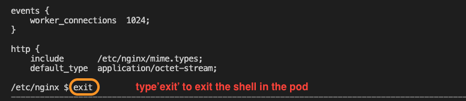

# Lab 1: Deploying NIC to AKS cluster

<br/>

## Introduction

In this section, you will ...
<br/>

## Learning Objectives
- one
- two 

## Install NGINX Plus Ingress Controller using Manifest files

1. Make sure your AKS cluster is running. If it is in stopped state then you can start it using below command. 
   ```bash
   MY_RESOURCEGROUP=s.dutta
   MY_AKS=aks-shouvik

   az aks start --resource-group $MY_RESOURCEGROUP --name $MY_AKS
   ```
   **Note**: The FQDN for API server for AKS might change on restart of the cluster which would result in errors running `kubectl` commands from your workstation. To update the FQDN re-import the credentials again using below command. This command would prompt about overwriting old objects. Enter "y" to overwrite the existing objects.
   ```bash
   az aks get-credentials --resource-group $MY_RESOURCEGROUP --name $MY_AKS
   ```
   ```bash
   ##Sample Output##
   A different object named aks-shouvik already exists in your kubeconfig file.
   Overwrite? (y/n): y
   A different object named clusterUser_s.dutta_aks-shouvik already exists in your kubeconfig file.
   Overwrite? (y/n): y
   Merged "aks-shouvik" as current context in /Users/shodutta/.kube/config
   ```

1. Clone the Ingress Controller repo and navigate into the deployments folder to make it your working directory:
   ```bash
   git clone https://github.com/nginxinc/kubernetes-ingress.git --branch v3.2.1
   cd kubernetes-ingress/deployments
   ```

1. Create a namespace and a service account for the Ingress Controller
    ```bash
    kubectl apply -f common/ns-and-sa.yaml
    ```
1. Create a cluster role and cluster role binding for the service account
    ```bash
    kubectl apply -f rbac/rbac.yaml
    ```

1. Create Common Resources:
     1. Create a secret with TLS certificate and a key for the default server in NGINX.
        ```bash
        cd ..
        kubectl apply -f examples/shared-examples/default-server-secret/default-server-secret.yaml
        cd deployments
        ```
     1. Create a config map for customizing NGINX configuration.
        ```bash
        kubectl apply -f common/nginx-config.yaml
        ```
     1. Create an IngressClass resource. (**Note:** If you would like to set the NGINX Ingress Controller as the default one, uncomment the annotation `ingressclass.kubernetes.io/is-default-class` within the below file)
        ```bash
        kubectl apply -f common/ingress-class.yaml
        ```

1. Create Custom Resources
    1. Create custom resource definitions for VirtualServer and VirtualServerRoute, TransportServer and Policy resources:
        ```bash
        kubectl apply -f common/crds/k8s.nginx.org_virtualservers.yaml
        kubectl apply -f common/crds/k8s.nginx.org_virtualserverroutes.yaml
        kubectl apply -f common/crds/k8s.nginx.org_transportservers.yaml
        kubectl apply -f common/crds/k8s.nginx.org_policies.yaml
        ```
   
    1. Create a custom resource for GlobalConfiguration resource:
        ```bash
        kubectl apply -f common/crds/k8s.nginx.org_globalconfigurations.yaml
        ```
1. Deploy the Ingress Controller as a Deployment:

   The sample deployment file(`nginx-plus-ingress.yaml`) can be found within `deployment` sub-directory within your present working directory.

   Highlighted below are some of the parameters that would be changed in the sample `nginx-plus-ingress.yaml` file.
   - Change Image Pull to Private Repo
   - Enable Prometheus
   - Add port and name for dashboard
   - Change Dashboard Port to 9000
   - Allow all IPs to access dashboard
   
   <br/>

   Navigate to Azure/labs directory 
    ```bash
    cd ../../Azure/labs
    ```
  
    Observe the `lab1/nginx-plus-ingress.yaml` looking at below details:
     - On line #36, we have replaced the `nginx-plus-ingress:3.2.1` placeholder with a workshop image that we pushed in the private ACR registry.
     - On lines #50-51, we have added TCP port 9000 for the Plus Dashboard.
     - On lines #96-97, we have enabled the Dashboard and set the IP access controls to the Dashboard.
     - On line #106, we have enabled Prometheus to collect metrics from the NGINX Plus stats API.
     - On lines #16-19, we have enabled Prometheus related annotations.
    (Check this two below lines with Chris)
     - On line #65, ...?
     - On line #95, uncomment to make use of default TLS secret. ...?

    <br/>

    Now deploy NGINX Plus Ingress Controller as a Deployment using the updated manifest file.
    ```bash
    kubectl apply -f lab1/nginx-plus-ingress.yaml
    ```

## Check your Ingress Controller

1. Verify the NGINX Plus Ingress controller is up and running correctly in the Kubernetes cluster:

   ```bash
   kubectl get pods -n nginx-ingress
   ```

   ```bash
   # Should look similar to this...
   NAME                            READY   STATUS    RESTARTS   AGE
   nginx-ingress-5764ddfd78-ldqcs   1/1     Running   0          17s
   ```

   **Note**: You must use the `kubectl` "`-n`", namespace switch, followed by namespace name, to see pods that are not in the default namespace.

2. Instead of remembering the unique pod name, `nginx-ingress-xxxxxx-yyyyy`, we can store the Ingress Controller pod name into the `$NIC` variable to be used throughout the lab.

   **Note:** This variable is stored for the duration of the terminal session, and so if you close the terminal it will be lost. At any time you can refer back to this step to save the `$NIC` variable again.

   ```bash
   export NIC=$(kubectl get pods -n nginx-ingress -o jsonpath='{.items[0].metadata.name}')
   ```

   Verify the variable is set correctly.
   ```bash
   echo $NIC
   ```
   **Note:** If this command doesn't show the name of the pod then run the previous command again.

## Check the NIC Plus Dashboard (Optional)

1. Using Kubernetes [port-forwarding](https://kubernetes.io/docs/tasks/access-application-cluster/port-forward-access-application-cluster/), see if the dashboard is running on port `9000`. Using the VScode terminal pane, run the following `kubectl port-forward` command:

   ```bash
   kubectl port-forward -n nginx-ingress $NIC 9000:9000
   ```

1. Now open Chrome web browser to view the NGINX Plus Dashboard, at [http://localhost:9000/dashboard.html](http://localhost:9000/dashboard.html). 
   
   Do you see the NGINX Plus Dashboard? If so, your Ingress Controller pod is up and running!

   

   **Question - Why is there almost nothing else to see?**  

   <details><summary>Click for Hints!</summary>
   <br/>
   <p>
   <strong>Answer</strong> – you have not configured the Ingress Controller to handle any traffic yet, but you will in the next Lab.
   </p>
   </details>
   </br>

2. Close Chrome Web Browser, and hit `Control-C` in the terminal to stop the Port Forward.

   

## Take a look "under the hood" of Ingress Controller (Optional)

The NGINX Ingress Controller is a pod running NGINX Plus under the hood, let's go check it out.

1. Use the VScode Terminal to enter a shell in the NGINX Ingress Controller pod by running the [`kubectl exec`](https://kubernetes.io/docs/tasks/debug-application-cluster/get-shell-running-container/) command 

   ```bash
   kubectl exec -it $NIC -n nginx-ingress -- /bin/bash
   ```

2. Once inside a shell in the NGINX Ingress Controller pod, run the following commands to inspect the root NGINX configuration:

   ```bash
   cd /etc/nginx
   more nginx.conf
   ```

   If you have worked with NGINX config files, it should look very similar!

3. Type `q ` to quit viewing the `nginx.conf `

   

4. Type `exit` to close the connection to the Ingress pod.

   

## Getting Access to NGINX Ingress Controller using LoadBalancer Service

In this section you will give the Ingress Controller a Public IP address from the Azure's IP Address Mgmt system. 

1. Inspect the `lab1/loadbalancer.yaml` manifest. You can see that port `80` and `443` are being opened and we are requesting an external IP address. This will give the Ingress Controller a static private IP address from an IP address management system in the lab.
 
   

   **Note:** This WILL expose your Ingress Controller to the open Internet with `NO PROTECTION` other than basic TCP port filters. Doing this in production would require Security/Firewall Protections, which are not part of this lab exercise.
   
2. Apply the above manifest to deploy loadbalancer service:
   ```bash
   kubectl apply -f lab1/loadbalancer.yaml
   ```
  
3. Confirm there is an `nginx-ingress` service with `TYPE: LoadBalancer`. Run the following command to get networking details of our pod:

   ```bash
   kubectl get deployments,services -n nginx-ingress
   ```
   
   You will see an **`EXTERNAL-IP`** which is the public IP. Also you will notice a **`CLUSTER-IP`**, which is an Internal Cluster address. Both of those IPs must exist for the `LoadBalancer` service to work correctly.

   ```bash
   kubectl get deployments,services -n nginx-ingress
   ```
   ```bash
   ###Sample output###
   NAME                            READY   UP-TO-DATE   AVAILABLE   AGE
   deployment.apps/nginx-ingress   1/1     1            1           22h

   NAME                    TYPE           CLUSTER-IP    EXTERNAL-IP     PORT(S)                      AGE
   service/nginx-ingress   LoadBalancer   10.0.80.190   13.86.100.10   80:32600/TCP,443:31137/TCP   49s
   ```
 
   In the example above you see: 

   - `Cluster-IP` address of `10.0.80.190`  
   - `External-IP` address of `13.86.100.10` 
   - Both IPs are mapped from port `80` to a NodePort (`32600`); and from port `443` to NodePort (`31137`)

   **NOTE:** Your `Cluster-IP` and `External-IP` address will be different based on your cluster. 

## Verify access to the Ingress Controller using the External IP

1. Store the External-IP into an environment variable by running below command.
   ```bash
   export EIP=$(kubectl get svc nginx-ingress -n nginx-ingress -o jsonpath='{.status.loadBalancer.ingress[0].ip}')
   ```
2. Use the `LoadBalancer` External-IP address that we captured inside the variable `EIP` from the previous step to test your **nginx-ingress** service. Use `curl` command to test it.

   ```bash
   #Test Access to Ingress through LoadBalancer:
   curl -I http://$EIP
   ```
   You should see the following output if the `LoadBalancer` Service is configured correctly for Ingress:
   ```bash
   ###Sample output###
   HTTP/1.1 404 Not Found
   Server: nginx/1.25.1
   Date: Tue, 03 Oct 2023 22:22:04 GMT
   Content-Type: text/html
   Content-Length: 153
   Connection: keep-alive
   ```

   **Question: Why did you get a 404?** 

   <details><summary>Click for Hints!</summary>
   <br/>
   <p>
   <strong>Answer</strong> – The Ingress Controller default server will return an <b>HTTP 404 Not Found page, or an HTTP 400 Bad Request status code</b> for all requests that have no Ingress routing rules defined; this is NGINX's default 404 error page. You will deploy a Demo application in the subsequent labs, which will fix this.
   </p>
   </details>

## Update local DNS

We will be using FQDN hostnames for the labs, and you will need to update your local computer's `hosts` file, to use these names with your NGINX Plus Ingress Controller.

Edit your local hosts file, adding the FQDNs as shown below.  Use the `External-IP` Address, from the previous step:

```bash
vi /etc/hosts

13.86.100.10 cafe.example.com bar.example.com dashboard.example.com grafana.example.com prometheus.example.com juiceshop.example.com
```

>Note that all 6 hostnames are mapped to the same Loadbalancer External-IP.  You will use the Ingress Controller to route the traffic correctly in the upcoming labs.  
Your External-IP address will likely be different than the example.

**This completes the Lab.** 
<br/>

## References: 

- [NGINX Ingress Controller Installation using Manifests](https://docs.nginx.com/nginx-ingress-controller/installation/installation-with-manifests/)
<br/>

### Authors
- Chris Akker - Solutions Architect - Community and Alliances @ F5, Inc.
- Shouvik Dutta - Solutions Architect - Community and Alliances @ F5, Inc.
- Jason Williams - Principle Product Management Engineer @ F5, Inc.

-------------

Navigate to ([Lab1](../lab1/readme.md) | [Main Menu](../LabGuide.md))
