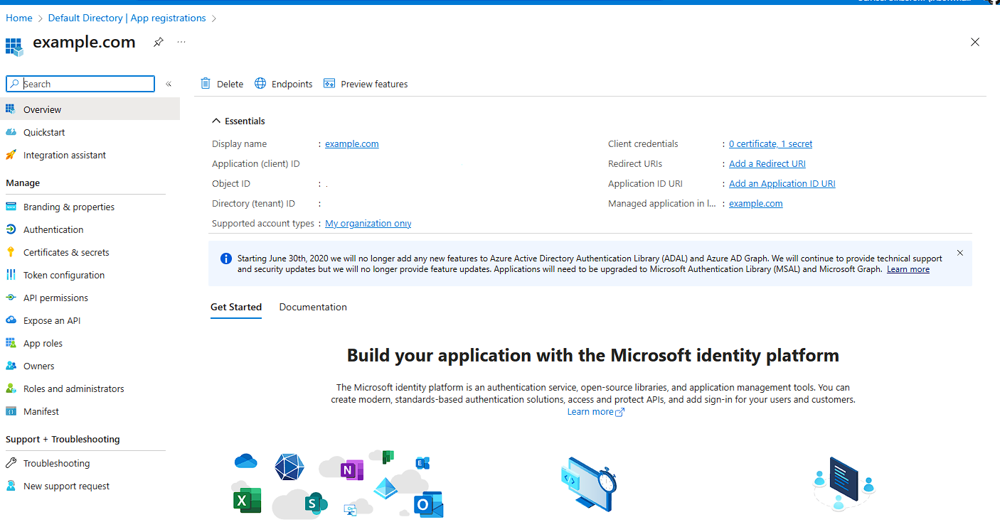
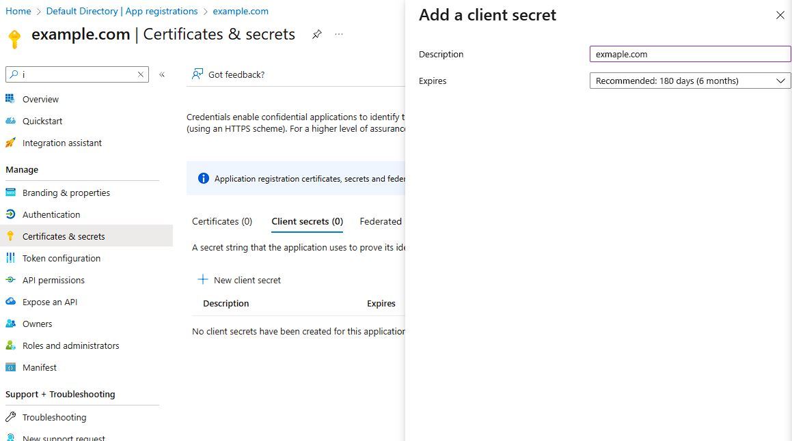
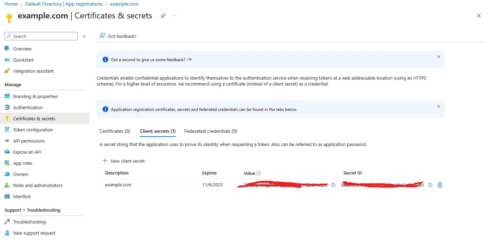
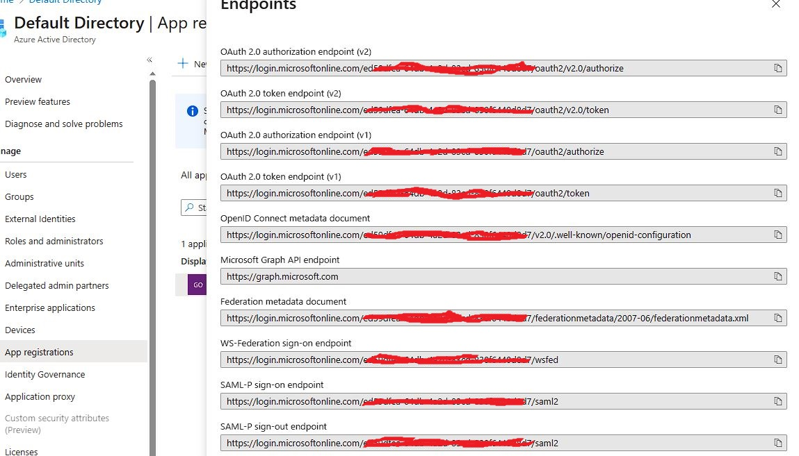
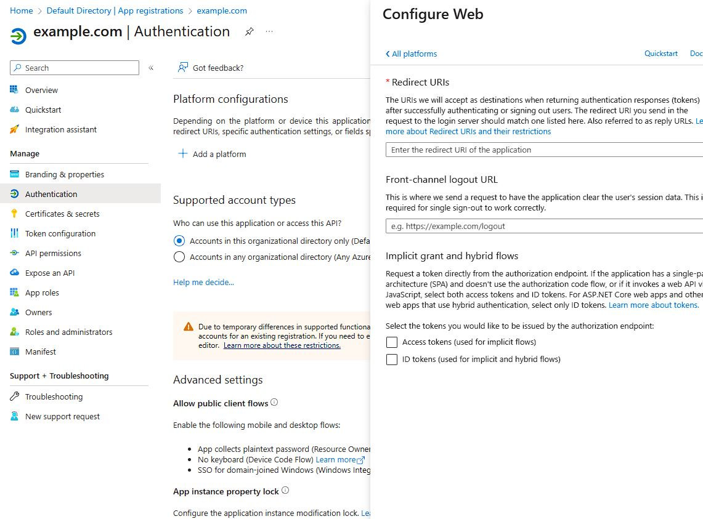

# Lab 3: Configuring NIC with AzureAD

<br/>

## Introduction

In this section, you will we are going to configure NGINX Ingress controller with Microsoft Azure Active directory to add authentication to a specific application. We will be adding a `policy` and `client-secret` to the cluster to know how to connect to Microsoft Azure Active Directory.
<br/>

## Learning Objectives

What you will need from Microsoft Azure AD:

- Azure account
- Azure AD setup
- Configure NGINX Ingress controller `policy` with Azure AD
- Request access to `/tea` and verify the redirection and authentication page is presented.
- Verify that after successfully logging into Azure AD, the redirect back to NGINX Ingress controller successfully routes you to `/tea`

You will want to create a new `app registration` from within Azure Active Directory.



Take note of the `application (client) ID` as that will be required for setup.
You will need to create a new `client credentials` for the secret that will be used with NIC and Azure AD.

Creating "client secret"
When you create a new app registration, you will also need to create a new `client-secret` that will be used by NGINX Ingress controller. This secret will be used to generate a Kubernetes Secret as part of the workdflow
Within the Azure AD portal and app registration screen, create your `client-secret`:



After you create your `client-secret`, make sure you copy the the `value` portion of the secret, and use that to create your Kubernetes secret




Here is a sample NGINX Ingress controller OIDC secret for reference:

```yaml
apiVersion: v1
kind: Secret
metadata:
  name: oidc-secret
type: nginx.org/oidc
data:
  client-secret: <insert-secret-here>
```

Ensure to replace `client-secret` with the value provided in the Azure AD portal.

The `endpoints` tab will have the information that NGINX Ingress controller needs (authorization endpoint, token endpoint, .well-known/openid-configuration).



You can `curl` the `.well-known/openid-configuration` endpoint to retrieve the `jwksURI` which we will need to configure NGINX Ingress controller.

Below, we use `curl` to query the Azure AD endpoint information and pipe it to `jq` to parse the JSON output, making it easy to read.


```shell
curl https://login.microsoftonline.com/<replace_with_your_client_id>/v2.0/.well-known/openid-configuration | jq
```

The last piece we need to configure in Azure AD is setting up the `redirect`.
Go to your `app registration` and click on `authentication`.   
Then click `add a platform` followed one of the applications.
On the next scrren, you will `redirect URIs` and `Front-channel logout URL`. 


For the `redirect URI`, you will want to fill in with the address of the NGINX Ingress controller instance, including the port number, with `/_codexch`.
For example, if my NGINX Ingress controller is configured for OIDC to access `webapp.example.com`, you would populate the `redirect URI` with the following:



For this example, my configuration setting would be:

```bash
https://webapp.example.com:443/_codexch
```

NGINX Ingress controller setup.
You will need to use our custom resource definitions. This includes our `virtualserver` and our `policy`.
You will need to define a `resolver` so NGINX Ingress can resolve the IdP hostname
Here is the `policy` for Azure AD:

```yaml
apiVersion: k8s.nginx.org/v1
kind: Policy
metadata:
  name: oidc-policy
spec:
  oidc:
    clientID: <change_to_your_client_id>
    clientSecret: <replace_with_name_of_kubernetes_secret_created>
    authEndpoint: <authEndpoint is collected from endpoints in Azure AD>
    tokenEndpoint: <authEndpoint is collected from endpoints in Azure AD> 
    jwksURI: <authEndpoint is collected from endpoints in Azure AD> 
    scope: openid+profile+email
    accessTokenEnable: true
```

Now we apply the `policy` to our `virtualserver` resource:

```yaml
apiVersion: k8s.nginx.org/v1
kind: VirtualServer
metadata:
  name: webapp
spec:
  host: webapp.example.com
  tls:
    secret: tls-secret
    redirect:
      enable: true
  upstreams:
    - name: webapp
      service: webapp-svc
      port: 80
  routes:
    - path: /
      policies:
      - name: oidc-policy
      action:
        pass: webapp
```

You can verify the successufly setup of the `virtualserver` and `policy` by running the following commands:  

Retrieving status of `virtualserver`:
```bash
~$ kubectl get virtualserver
NAME     STATE   HOST                 IP           PORTS      AGE
webapp   Valid   webapp.example.com   172.18.0.2   [80,443]   10m
```
To retrieve the status of the `policy`:
```
~$ kubectl get policy
NAME          STATE   AGE
oidc-policy   Valid   14m
```

With the status of `virtualserver` and `policy` showing `valid` we conclude we have successuflly configured NGINX Ingress controller.

You can now test your Azure AD setup with NGINX Ingress controller.   
Open up your browser and head to `https://webapp.example.com`. 
If everything has been configured correctly, you should see the browser address bar redirect to Azure AD for authentication logon prompt. Once you successfully provide your Microsoft Azure AD credentials, NGINX Ingress controller will validate the succesfull login and then allow your reques to the backend resource.

**This completes the Lab.** 
<br/>

## References: 

- [NGINX Ingress controller OIDC](https://docs.nginx.com/nginx-ingress-controller/configuration/policy-resource/#oidc)
<br/>

### Authors
- Chris Akker - Solutions Architect - Community and Alliances @ F5, Inc.
- Shouvik Dutta - Solutions Architect - Community and Alliances @ F5, Inc.
- Jason Williams - Principle Technical Product Management Engineer @ F5, Inc.

-------------

Navigate to ([Lab4](../lab4/readme.md) | [Main Menu](../LabGuide.md))
