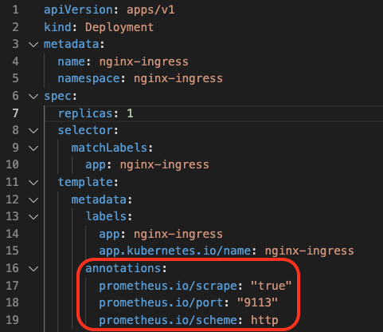
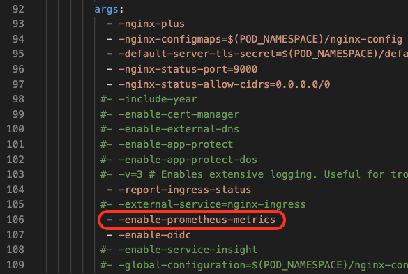

# Lab 4: Monitoring NIC with Prometheus and Grafana

<br/>

## Introduction

This lab exercise is going to walk you through how to install and use several tools to monitor your NGINX Ingress Controller in your Kubernetes cluster. 
<br/>

## Learning Objectives
By the end of the lab, you will be able to: 

- Learn and Use Helm Charts
- Deploy Prometheus using Helm
- Deploy Grafana using Helm
- Access these apps thru NGINX Ingress Controller

<br/>

Helm | Prometheus | Grafana
:-------------------------:|:-------------------------:|:-------------------------:
  |  |

<br/>

Here is a brief description of what these different tools and application provide, and how you will use them.

`Helm` will make it simple to install everything into your cluster. This keeps the setup easier to deploy and easier to manage.  (Note, you can also install using the `manifests` method or `operator` method as well). It will come down to personal preference or specific requirements when installing software into Kubernetes.  You will use the Helm Chart provided by NGINX for this lab exercise.

`Prometheus` is a software package that can watch and collect statistics from many different k8s pods and services.  It then provides those statistics in a simple html/text format, often referred to as the "scraper page", meaning that it scrapes the statistics and presents them as a simple text-based web page.

`Grafana` is a data visualization tool, which contains a time series database and graphical web presentation tools.  Grafana imports the Prometheus scraper page statistics into it's database, and allows you to create `Dashboards` of the statistics that are important to you.  There are a large number of pre-built dashboards provided by both Grafana and the k8s community, so there are many available to use. And of course, you can customize them as needed or build your own.

<br/>

## Helm Installation


1. Run below command to install helm:
    ```bash
    # Install helm command
    curl -sSL https://raw.githubusercontent.com/helm/helm/master/scripts/get-helm-3 | bash
    ```
1. Verify Helm is installed and you are running Version 3.x or higher:

    ```bash
    # check your helm version (Needs to be v3 or higher)
    helm version --short
    ```
    ```bash
    ###Sample Output###
    v3.11.2+g912ebc1
    ```
2. Create a new Kubernetes namespace called `monitoring`. You will use this namespace for Prometheus and Grafana components:

    ```bash
    kubectl create namespace monitoring
    ```
    <br/>

## Prometheus Installation


<br/>

1. The first step will be to deploy `Prometheus` into our cluster. Below are the steps to install it using Helm as follows:  

    ```bash
    helm repo add prometheus-community https://prometheus-community.github.io/helm-charts

    helm repo add kube-state-metrics https://kubernetes.github.io/kube-state-metrics

    helm repo update
    ```
    ```bash
    ###Sample Output###
    "prometheus-community" has been added to your repositories
    "kube-state-metrics" has been added to your repositories
    Hang tight while we grab the latest from your chart repositories...
    ...Successfully got an update from the "kube-state-metrics" chart repository
    ...Successfully got an update from the "prometheus-community" chart repository
    Update Complete. ⎈Happy Helming!⎈
    ```

2. Once the repos have been added to Helm, the next step is to deploy a `release`. For this lab, you will create a release called `nginx-prometheus`.   

    ```bash
    helm install nginx-prometheus prometheus-community/prometheus --set server.persistentVolume.enabled=false -n monitoring
    ```
    ```bash
    ###Sample Output###
    NAME: nginx-prometheus
    LAST DEPLOYED: Mon Oct  9 16:12:11 2023
    NAMESPACE: monitoring
    STATUS: deployed
    REVISION: 1
    TEST SUITE: None
    NOTES:
    The Prometheus server can be accessed via port 80 on the    following DNS name from within your cluster:
    nginx-prometheus-server.monitoring.svc.cluster.local


    Get the Prometheus server URL by running these commands in the same shell:
    export POD_NAME=$(kubectl get pods --namespace monitoring -l "app.kubernetes.io/name=prometheus,app.kubernetes.io/instance=nginx-prometheus" -o jsonpath="{.items[0].metadata.name}")
    kubectl --namespace monitoring port-forward $POD_NAME 9090
    #################################################################################
    ######   WARNING: Persistence is disabled!!! You will lose your data when   #####
    ######            the Server pod is terminated.                             #####
    #################################################################################


    The Prometheus alertmanager can be accessed via port 9093 on the following DNS name from within your cluster:
    nginx-prometheus-alertmanager.monitoring.svc.cluster.local


    Get the Alertmanager URL by running these commands in the same shell:
    export POD_NAME=$(kubectl get pods --namespace monitoring -l "app.kubernetes.io/name=alertmanager,app.kubernetes.io/instance=nginx-prometheus" -o jsonpath="{.items[0].metadata.name}")
    kubectl --namespace monitoring port-forward $POD_NAME 9093
    #################################################################################
    ######   WARNING: Pod Security Policy has been disabled by default since    #####
    ######            it deprecated after k8s 1.25+. use                        #####
    ######            (index .Values "prometheus-node-exporter" "rbac"          #####
    ###### .          "pspEnabled") with (index .Values                         #####
    ######            "prometheus-node-exporter" "rbac" "pspAnnotations")       #####
    ######            in case you still need it.                                #####
    #################################################################################


    The Prometheus PushGateway can be accessed via port 9091 on the following DNS name from within your cluster:
    nginx-prometheus-prometheus-pushgateway.monitoring.svc.cluster.local


    Get the PushGateway URL by running these commands in the same shell:
    export POD_NAME=$(kubectl get pods --namespace monitoring -l "app=prometheus-pushgateway,component=pushgateway" -o jsonpath="{.items[0].metadata.name}")
    kubectl --namespace monitoring port-forward $POD_NAME 9091

    For more information on running Prometheus, visit:
    https://prometheus.io/
    ```
    <br/>

## Grafana Installation


<br/>

1. Next step will be to setup and deploy Grafana into your cluster: 

    ```bash
    helm repo add grafana https://grafana.github.io/helm-charts
    ```
    ```bash
    ###Sample Output###
    "grafana" has been added to your repositories
    ```

2. The Grafana repo is added via Helm. Next you will install Grafana using the below command. For this lab, you will create a second release called `nginx-grafana`.  

    ```bash
    helm install nginx-grafana grafana/grafana -n monitoring
    ```
    ```bash
    ###Sample Output###
    NAME: nginx-grafana
    LAST DEPLOYED: Mon Oct  9 16:22:22 2023
    NAMESPACE: monitoring
    STATUS: deployed
    REVISION: 1
    NOTES:
    1. Get your 'admin' user password by running:

        kubectl get secret --namespace monitoring nginx-grafana -o jsonpath="{.data.admin-password}" | base64 --decode ; echo


    2. The Grafana server can be accessed via port 80 on the following DNS name from within your cluster:

        nginx-grafana.monitoring.svc.cluster.local

        Get the Grafana URL to visit by running these commands in the same shell:
     export POD_NAME=$(kubectl get pods --namespace monitoring -l "app.kubernetes.io/name=grafana,app.kubernetes.io/instance=nginx-grafana" -o jsonpath="{.items[0].metadata.name}")
        kubectl --namespace monitoring port-forward $POD_NAME 3000

    3. Login with the password from step 1 and the username: admin
    #################################################################################
    ######   WARNING: Persistence is disabled!!! You will lose your data when   #####
    ######            the Grafana pod is terminated.                            #####
    #################################################################################
    ```

    If you want to check the status of your helm installations, you can run this command which will show all helm deployments across the cluster"

    ```bash
    helm ls -A
    ```
    ```bash
    ###Sample Output###
    NAME                    NAMESPACE       REVISION        UPDATED                                 STATUS          CHART                   APP VERSION
    nginx-grafana           monitoring      1               2023-10-09 16:22:22.207876 -0500 CDT    deployed        grafana-6.60.4          10.1.4     
    nginx-prometheus        monitoring      1               2023-10-09 16:12:11.677934 -0500 CDT    deployed        prometheus-25.1.0       v2.47.0    
    ```
    <br/>

## Testing the NGINX Plus Prometheus "scraper" Port and Page

<br/>

Verify that NGINX Plus NIC is enabled for exporting Prometheus statistics.  This requires 3 settings:

- Prometheus `Annotations` are enabled
- Port `9113` is open
- The Plus command-line argument `- -enable-prometheus-metrics` is enabled, to allow the collection of the NIC's statistics on that port.

**!Bonus!** - These settings have already been enabled for you in this lab, but they are `not` enabled by default.  

To see these settings, inspect the `lab1/nginx-plus-ingress.yaml` file, lines 16-19, 46-47, and 106.

Annotations | Port  | Plus Args
:-------------------------:|:-------------------------:|:-------------------------:
 | |

**This completes the Lab.** 
<br/>

## References: 

- [nginx](www.nginx.com)
<br/>

### Authors
- Chris Akker - Solutions Architect - Community and Alliances @ F5, Inc.
- Shouvik Dutta - Solutions Architect - Community and Alliances @ F5, Inc.
- Jason Williams - Principle Product Management Engineer @ F5, Inc.

-------------

Navigate to ([Lab5](../lab5/readme.md) | [Main Menu](../LabGuide.md#lab-outline))
