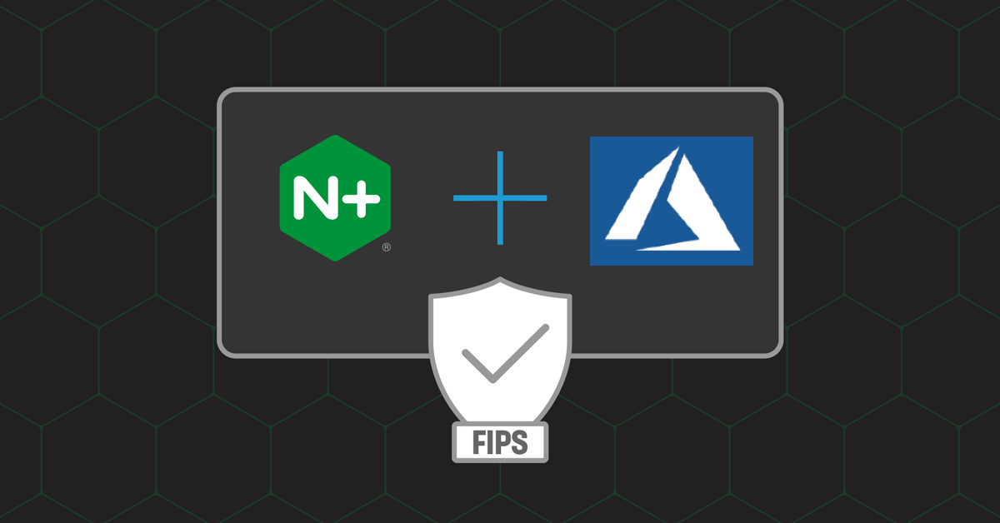

# Lab 5: Deploying NGINX Ingress with FIPS in AKS

<br/>

## Introduction

In this section, you will run the NGINX Plus Ingress Controller in FIPS mode, for compliance with Federal Information Processing Systems 140-2 Level 1 requirements.  A FIPS compliant NGINX Ingress image will be used, configured, and tested to verify that the Nginx Plus Ingress Controller meets this requirement.  You will also verify that the Kubernetes nodes are also FIPS compliant.

<br/>

Azure  |  Kubernetes  |  NGINX Plus
:-------------------------:|:-------------------------:|:-------------------------:
  |     |  

<br/>

## Learning Objectives

- Review the NGINX Ingress Controller image details
- Verity the NGINX Ingress Controller Alpine Linux OS is running in FIPS mode
- Verify the NGINX Ingress FIPS check is working
- Verify the NIC can process FIPS compliant requests
- Verify the NIC is not processing non-FIPS compliant requests
- Update and Review the NIC logging variables to capture SSL/FIPS related fields
- Verify TLS Cipher processing

<br/>

### Review the NGINX Ingress Controller image being used

Set the $NIC environment variable:

```bash
export NIC=$(kubectl get pods -n nginx-ingress -o jsonpath={.items[0].metadata.name})
```

Describe the NGINX Ingress pod:

```bash
kubectl describe pod $NIC -n nginx-ingress
```

```bash
### Sample Output - abbreviated  - look for "alpine-fips" in the Image name ###
.
.
Containers:
  nginx-plus-ingress:
    Container ID:  docker://e57d091bac4b7914bb60513ccdbd5d93de37725cfcc4e42a0fdd04ebcc6d8010
    Image:         private-registry.nginx.com/nginx-ic/nginx-plus-ingress:3.2.0-alpine-fips    ## Look here
    Image ID:      docker-pullable://private-registry.nginx.com/nginx-ic/nginx-plus-ingress@sha256:d16d23a489f115915c3660fe0b012b6d350e395a316e497d1219fd9c354fb423
    .
    .
```

Kube Exec to the Alpine Shell in the NIC Container:

```bash
  kubectl exec -it $NIC -n nginx-ingress -- /bin/ash
```

### Check if the NGINX Ingress Controller Alpine Linux OS is running in FIPS mode:

After logging into the Ingress Controller, check that Alpine OS.  The Kernel boot parameters should have `fips=1`.

```bash
~ $ cat /proc/cmdline
```

```bash
### Sample Output ###
BOOT_IMAGE=/boot/vmlinuz-3.10.0-1127.el7.x86_64 fips=1 root=UUID=6cd50e51-cfc6-40b9-9ec5-f32fa2e4ff02 ro console=tty0 console=ttyS0,115200n8 crashkernel=auto net.ifnames=0 console=ttyS0 LANG=en_US.UTF-8
```

Check the Alpine Linux System Control parameter:

```bash
~ $ sysctl -a |grep fips
```

```bash
### Sample Output ###
crypto.fips_enabled = 1    # the Alpine OS is running in FIPS mode
```

>>**If the value = 0, Alpine is not running in FIPS mode!**

```bash
### Sample Output ###
crypto.fips_enabled = 0    # the Alpine OS is NOT running in FIPS mode !!

```

Also Review the Version of NGINX Plus in the NIC image:

```bash
~ $ nginx -V
```

```bash
### Sample Output ###
nginx version: nginx/1.23.4 (nginx-plus-r29)
built by gcc 12.2.1 20220924 (Alpine 12.2.1_git20220924-r10) 
built with OpenSSL 3.1.1 30 May 2023
TLS SNI support enabled
configure arguments: --prefix=/etc/nginx --sbin-path=/usr/sbin/nginx --modules-path=/usr/lib/nginx/modules --conf-path=/etc/nginx/nginx.conf --error-log-path=/var/log/nginx/error.log --http-log-path=/var/log/nginx/access.log --pid-path=/var/run/nginx.pid --lock-path=/var/run/nginx.lock --http-client-body-temp-path=/var/cache/nginx/client_temp --http-proxy-temp-path=/var/cache/nginx/proxy_temp --http-fastcgi-temp-path=/var/cache/nginx/fastcgi_temp --http-uwsgi-temp-path=/var/cache/nginx/uwsgi_temp --http-scgi-temp-path=/var/cache/nginx/scgi_temp --with-perl_modules_path=/usr/lib/perl5/vendor_perl --user=nginx --group=nginx --with-compat --with-file-aio --with-threads --with-http_addition_module --with-http_auth_request_module --with-http_dav_module --with-http_flv_module --with-http_gunzip_module --with-http_gzip_static_module --with-http_mp4_module --with-http_random_index_module --with-http_realip_module --with-http_secure_link_module --with-http_slice_module --with-http_ssl_module --with-http_stub_status_module --with-http_sub_module --with-http_v2_module --with-mail --with-mail_ssl_module --with-stream --with-stream_realip_module --with-stream_ssl_module --with-stream_ssl_preread_module --build=nginx-plus-r29 --with-http_auth_jwt_module --with-http_f4f_module --with-http_hls_module --with-http_proxy_protocol_vendor_module --with-http_session_log_module --with-stream_mqtt_filter_module --with-stream_mqtt_preread_module --with-stream_proxy_protocol_vendor_module --with-cc-opt='-Os -Wformat -Werror=format-security -g' --with-ld-opt='-Wl,--as-needed,-O1,--sort-common -Wl,-z,pack-relative-relocs'
```

Verify the `NGINX FIPS check module` is configured to load when NGINX starts in the Container, check the nginx.conf file:

```bash
cd /etc/nginx $
more nginx.conf
```

```bash
### Sample Output ###
worker_processes  auto;

daemon off;

error_log  stderr notice;
pid        /var/lib/nginx/nginx.pid;
load_module modules/ngx_fips_check_module.so;   ### the FIPS checker module is being loaded into memory when NGINX starts
.
.
```

Check the entire NGINX configuration for FIPS related parameters. 

```bash
~$ nginx -T |grep FIPS
```

```bash
### Sample Output ###
~ $ nginx -T |grep fips
nginx: [alert] could not open error log file: open() "/var/log/nginx/error.log" failed (13: Permission denied)
nginx: the configuration file /etc/nginx/nginx.conf syntax is ok
2023/08/15 18:45:11 [notice] 37#37: OpenSSL FIPS Mode is enabled    ## FIPS Mode is enabled
nginx: configuration file /etc/nginx/nginx.conf test is successful
load_module modules/ngx_fips_check_module.so;                       ## FIPS checker module is load in memory

```

#### Optional - Verify the Version of OpenSSL, and FIPS mode is available

Also Verify / Check the OpenSSL version is FIPS enabled:

```bash
~ $ openssl version
```

```bash
### Sample Output ###
OpenSSL 3.1.1 30 May 2023 (Library: OpenSSL 3.1.1 30 May 2023)

```

List the SSL providers:

```bash
~ $ openssl list -providers
```

```bash
### Sample Output ###
Providers:
  base
    name: OpenSSL Base Provider
    version: 3.1.1
    status: active
  fips
    name: OpenSSL FIPS Provider
    version: 3.0.8
    status: active

```

>>**If the fips Provider is missing, Openssl cannot provide FIPS mode!**

<br/>

OpenSSL Self Tests

 - Verify SHA1 works as expected:

```bash
~ $ openssl sha1 /dev/null
```

```bash
### Sample Output ###
SHA1(/dev/null)= da39a3ee5e6b4b0d3255bfef95601890afd80709

```

- Verify MD5 is not working (as `MD5 is not a permitted hash by FIPS`):

```bash
~ $ openssl md5 /dev/null
```

```bash
### Sample Output ###
Error setting digest
489B8712157F0000:error:0308010C:digital envelope routines:inner_evp_generic_fetch:unsupported:crypto/evp/evp_fetch.c:341:Global default library context, Algorithm (MD5 : 94), Properties ()
489B8712157F0000:error:03000086:digital envelope routines:evp_md_init_internal:initialization error:crypto/evp/digest.c:272:

```

>>**If the MD5 hash DOES work, OpenSSL is not running in FIPS mode !**

```bash
### Sample Output ###
~ $ openssl md5 /dev/null
MD5(/dev/null)= d41d8cd98f00b204e9800998ecf8427e
```

Press Ctrl-C to exist the Alpine Shell.

<br/>

### Verify the NGINX FIPS check module is working

Next, verify the NGINX FIPS check module is running.  The FIPS check module looks for a FIPS enabled OS and FIPS enabled OpenSSL when NGINX starts up.

```bash
kubectl logs $NIC -n nginx-ingress
```

```bash
### Sample Output ###
NGINX Ingress Controller Version=3.2.0 Commit=6ce07ed730d105ae519379c66cb9a8ecf4c20d54 Date=2023-06-27T18:35:19Z DirtyState=false Arch=linux/amd64 Go=go1.20.5
I0720 17:41:00.256915       1 flags.go:295] Starting with flags: ["-nginx-plus" "-nginx-configmaps=nginx-ingress/nginx-config" "-default-server-tls-secret=nginx-ingress/default-server-secret" "-nginx-status-port=9000" "-nginx-status-allow-cidrs=0.0.0.0/0" "-enable-snippets" "-report-ingress-status" "-enable-prometheus-metrics" "-enable-latency-metrics" "-enable-service-insight"]
I0720 17:41:00.275511       1 main.go:234] Kubernetes version: 1.23.9
I0720 17:41:00.301183       1 main.go:380] Using nginx version: nginx/1.23.4 (nginx-plus-r29)
I0720 17:41:00.321015       1 main.go:776] Pod label updated: nginx-ingress-756d7f6c9b-7mptn
2023/07/20 17:41:00 [notice] 13#13: using the "epoll" event method
###
2023/07/20 17:41:00 [notice] 13#13: OpenSSL FIPS Mode is enabled**  # From FIPS checker module #
###
2023/07/20 17:41:00 [notice] 13#13: nginx/1.23.4 (nginx-plus-r29)
2023/07/20 17:41:00 [notice] 13#13: built by gcc 12.2.1 20220924 (Alpine 12.2.1_git20220924-r10) 
2023/07/20 17:41:00 [notice] 13#13: OS: Linux 3.10.0-1127.el7.x86_64
2023/07/20 17:41:00 [notice] 13#13: getrlimit(RLIMIT_NOFILE): 1048576:1048576
2023/07/20 17:41:00 [notice] 13#13: start worker processes
2023/07/20 17:41:00 [notice] 13#13: start worker process 14
2023/07/20 17:41:00 [notice] 13#13: start worker process 15
```

>> **If is not running in FIPS mode, you will see a statement like this:**

```bash
### Sample Output ###
2023/07/18 15:15:13 [notice] 239#239: OpenSSL FIPS Mode is not enabled    # Warning -  not in FIPS mode
```

<br/>

### Update the NGINX Ingress logging format to see SSL/FIPS related fields

How do know what FIPS or non-FIPS traffic is being handled by NGINX?  What visibility is available for `audits and attestations?`  NGINX has the ability to log all TLS related components, including client and server metadata for connections/sessions.  Let's add a few of these important logging variables, so you can see what the requests/responses look like in the NGINX Access Log.

Here is a list of the TLS variables you will add, and what they are:

- $ssl_session_id     # returns the session identifier of an established SSL connection
- $ssl_protocol       # returns the protocol of an established SSL connection
- $ssl_cipher         # returns the name of the cipher used for an established connection

Note:  There are many more variables, but we are only showing a few in this exercise.  There is a link to the complete list in the `References` section at the end of this exercise.

To apply these new variables, we will add them to the existing NGINX Access Log format, using a ConfigMap.

```bash
kubectl apply -f lab5/nginx-fips-logging.yaml
```

```bash
### Sample Output ###
configmap/nginx-config configured
```

Send a couple requests to https://cafe.example.com/coffee, and review the Access Logs.

```bash
kubectl logs $NIC -n nginx-ingress --tail 20 --follow
```

```bash
### Sample Output ###
10.1.1.9 - - [09/Oct/2023:22:02:05 +0000] "GET /coffee/default.css HTTP/1.1" 304 0 "https://cafe.example.com/coffee" "Mozilla/5.0 (X11; Linux x86_64) AppleWebKit/537.36 (KHTML, like Gecko) Chrome/113.0.0.0 Safari/537.36" "-" rn="cafe-vs" "virtualserver" "default" svc="coffee-svc" "7c624bf5e9e2cef91731458f48aae79f" rt=“0.003” ua=“10.10.2.46:80” sslid="2bc63ff1e5ca25494d1cd99e62d2508e287a190a60497e4a9b4721fdb702285b" sslpr="TLSv1.2" sslci="ECDHE-RSA-AES128-GCM-SHA256"

```

Type Ctrl-C when you are finished looking at the log.

<br/>

### Test TLS ciphers with OpenSSL client 

This RC4 cipher is not allowed with FIPS, so it should fail:

```bash
(echo "GET /" ; sleep 1) | openssl s_client -connect cafe.example.com:443 -cipher RC4-MD5
```

```bash
### Sample Output ###
Error with command: "-cipher RC4-MD5"
140698019755328:error:1410D0B9:SSL routines:SSL_CTX_set_cipher_list:no cipher match:../ssl/ssl_lib.c:2564:

```

This Camellia cipher is on the FIPS approved list, so it should be successful

```bash

```

```bash
### Sample Output ###
CONNECTED(00000003)
depth=0 C = US, ST = CA, O = Internet Widgits Pty Ltd, CN = cafe.example.com
verify error:num=18:self signed certificate
verify return:1
depth=0 C = US, ST = CA, O = Internet Widgits Pty Ltd, CN = cafe.example.com
verify return:1
---
Certificate chain
 0 s:C = US, ST = CA, O = Internet Widgits Pty Ltd, CN = cafe.example.com
   i:C = US, ST = CA, O = Internet Widgits Pty Ltd, CN = "cafe.example.com  "
---
Server certificate
-----BEGIN CERTIFICATE-----
...
-----END CERTIFICATE-----
subject=C = US, ST = CA, O = Internet Widgits Pty Ltd, CN = cafe.example.com

issuer=C = US, ST = CA, O = Internet Widgits Pty Ltd, CN = "cafe.example.com  "

---
No client certificate CA names sent
Peer signing digest: SHA256
Peer signature type: RSA-PSS
Server Temp Key: X25519, 253 bits
---
SSL handshake has read 1378 bytes and written 336 bytes
Verification error: self signed certificate
---
New, TLSv1.3, Cipher is CAMELLIA256-SHA
Server public key is 2048 bit
Secure Renegotiation IS NOT supported
Compression: NONE
Expansion: NONE
No ALPN negotiated
Early data was not sent
Verify return code: 18 (self signed certificate)
---
---
Post-Handshake New Session Ticket arrived:
SSL-Session:
    Protocol  : TLSv1.3
    Cipher    : TLS_AES_256_GCM_SHA384
    Session-ID: 646820DB6EA3B1DD97A227E30D098F5B8CF719C6C133D9161839576953DED23F
    Session-ID-ctx: 
    Resumption PSK: 50A3DC5CF130F7424755DB29A82A3EBE605C7BC8AD3FFDBDCAF02E045CA07DC705F0D18A766427CBF3FFABC02AF4809F
    PSK identity: None
    PSK identity hint: None
    SRP username: None
    TLS session ticket lifetime hint: 300 (seconds)
    TLS session ticket:

...

    Start Time: 1692131417
    Timeout   : 7200 (sec)
    Verify return code: 18 (self signed certificate)
    Extended master secret: no
    Max Early Data: 0
---
read R BLOCK
<html>
<head><title>404 Not Found</title></head>
<body>
<center><h1>404 Not Found</h1></center>
<hr><center>nginx/1.23.4</center>
</body>
</html>
closed
```

```bash
### Or try this ###
(echo "GET /coffee"); (echo "HTTP/1.1"); (echo "Host:cafe.example.com") | openssl s_client -connect cafe.example.com:443 -cipher CAMELLIA256-SHA 
```

<br/>

**This completes the Lab.** 

<br/>

## References: 

- [NGINX Plus Ingress Controller](https://docs.nginx.com/nginx-ingress-controller/)
- [NGINX Plus Ingress Images](https://docs.nginx.com/nginx-ingress-controller/technical-specifications/#images-with-nginx-plus)
- [NGINX Plus FIPS Compliance Docs](https://docs.nginx.com/nginx/fips-compliance-nginx-plus/)
- [NGINX Plus FIPS Compliance Blog](https://www.nginx.com/blog/achieving-fips-compliance-nginx-plus/)
- [NGINX FIPS Status Check](https://docs.nginx.com/nginx/admin-guide/dynamic-modules/fips/)
- [NGINX FIPS Check Module](https://github.com/ogarrett/nginx-fips-check-module)
- [NIST FIPS 140-2 Security Requirements](https://csrc.nist.gov/pubs/fips/140-2/upd2/final)
- [NGINX SSL variables](http://nginx.org/en/docs/http/ngx_http_ssl_module.html#var_ssl_cipher)


<br/>

### Authors
- Chris Akker - Solutions Architect - Community and Alliances @ F5, Inc.
- Shouvik Dutta - Solutions Architect - Community and Alliances @ F5, Inc.
- Jason Williams - Principle Product Management Engineer @ F5, Inc.

-------------

Navigate to [Main Menu](../LabGuide.md)
