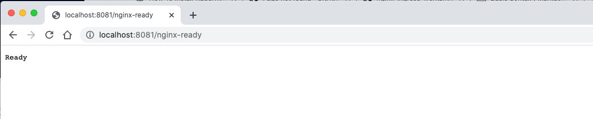
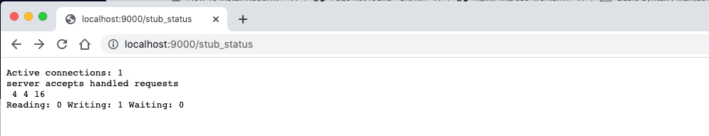
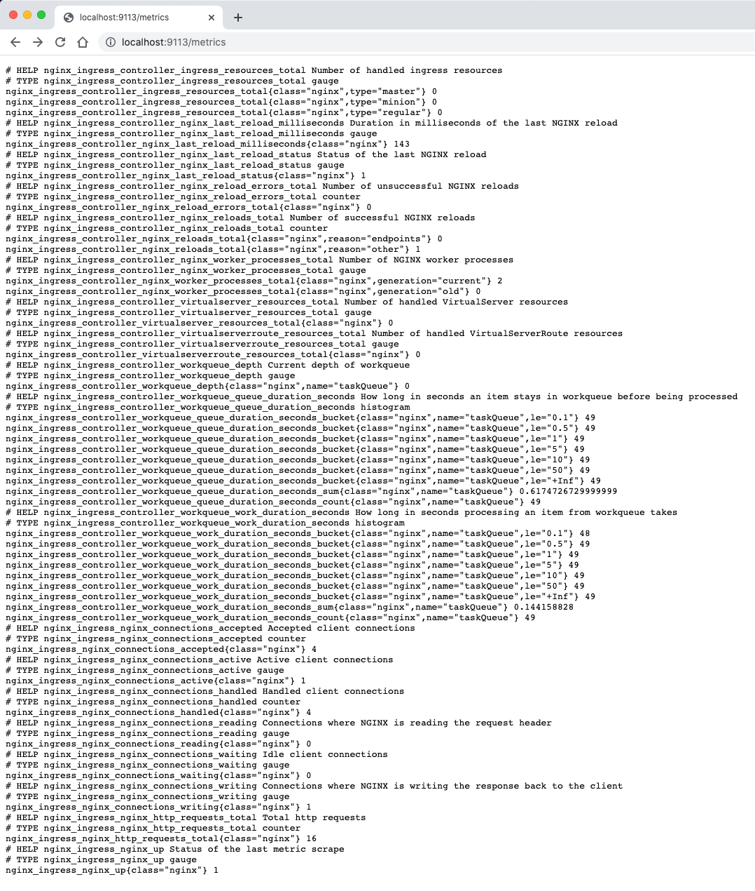
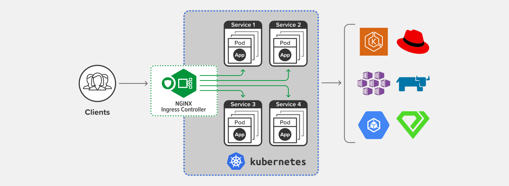

# Minikube Environment Setup for the NGINX Ingress Controller Workshops

# **Under Contruction - this is a Preview of the Setup Guide**

<br/>

## Welcome

Welcome to the setup guide for Minikube.  This will prepare a locally hosted Minikube environment, for use with the NGINX Ingress Workshops!

This Setup Guide includes

- Requirements
- Minikube installation
- NGINX Ingress Controller installation
- LoadBalancer Service setup
- Links to the Workshops

<br/>

## Pre-requisite Requirements

Hardware:  well - that's obvious, you need a modern computer with enough CPU/RAM/Disk to run a 3-node Minikube Kubernetes Cluster.  Check the Minikube website, to see if your PC/laptop has the juice needed:

Software:  Have the following software already installed on your PC:

- Docker
- Minikube


## Minikube Installation

Follow the directions for installation based on your host OS, Linux, MacOS, or Windows:

https://kubernetes.io/docs/tasks/tools/

## Minkube Startup

Start it up with 3 Nodes:
```bash
minikube start --nodes 3 -p nginx-workshop
```

Verify your 3 Nodes are up and running:

```bash
kubectl get nodes
```

```bash
kubectl get nodes
# should look something like this
NAME                 STATUS   ROLES                  AGE   VERSION
nginx-workshop       Ready    control-plane,master   23h   v1.21.2
nginx-workshop-m02   Ready    <none>                 23h   v1.21.2
nginx-workshop-m03   Ready    <none>                 23h   v1.21.2
```

<br/>

## Add the NGINX Ingress Controller

1. Follow the directions for installing the Ingress Controller with Manifests, with the following changes:

   - Skip the manifests for the `App Protect` WAF, that will be covered in a different Lab.
   - Make a copy, then `modify` the nginx-ingress or nginx-plus-ingress YAML files to use the image that you want to run.  (Examples are provided here for your review).

   https://docs.nginx.com/nginx-ingress-controller/installation/installation-with-manifests/

1. If you want to use NGINX Plus, you will need to provide that image, and have it available on your PC or a private repo.  You will need to change the `-image` spec, on ~line #21, in the `nginx-plus-ingress.yaml` file, to reference your private repo and image:tag.

   - If you don't have NGINX Plus and want to try it, you can request a free 30-day Trial here:  https://www.nginx.com/free-trial-request


   - If you want to use NGINX OSS, you can use the `nginx-ingress.yaml` file, and use the `latest` tag to pull the current version from http://hub.docker.com.

   You can pull the image to your local PC as well:

   ```bash
   docker pull nginx/nginx-ingress:latest
   ```
<br/>

Verify the NGINX Ingress Controller is running:

   ```bash
   kubectl get pods -n nginx-ingress
   ```

   ```bash
   # Should look similar to this...
   NAME                            READY   STATUS    RESTARTS   AGE
   nginx-ingress-fd4b9f484-t5pb6   1/1     Running   1          12h
   ```

## Test the Ingress Controller

1. Set a local variable for the Ingress Controller PodName:

   ```bash
   export NIC=$(kubectl get pods -n nginx-ingress -o jsonpath='{.items[0].metadata.name}')
   ```

   Check it:

   ```bash
   echo $NIC
   ```

   It should show you the `nginx-ingress-xxxxxx-yyyyy` Podname of the Ingress Controller.

1. Nginx Ready Page

   This is the port/page that the Kubernetes Readiness Probes will query, to verify the NGINX Ingress Controller Pod is ready, from the Kubernetes perspective:

   Start a K8s port-forward to port 8081:

   ```bash
   kubectl port-forward $NIC -n nginx-ingress 8081:8081
   ```

   Open a local browser to http://localhost:8081/nginx-ready

   

   If you don't see the Ready response, your Ingress Controller pod is probably not running.

   Type Control-C to stop the port-forward when you are finished.


1. Stub Status Page

   This is the traditional Nginx stub_status HTML page.  But NOTE:  The listen port has been changed to `9000`, to avoid conflicts with other pods!  Inspect the `nginx-ingress.yaml` and `nginx-plus-ingress.yaml` files, and you will see that the status port has been changed to 9000.

   Start a port-forward to port 9000:

   ```bash
   kubectl port-forward $NIC -n nginx-ingress 9000:9000
   ```

   Open a local browser to http://localhost:9000/stub_status.html

   

   If you don't see the statistics, your Ingress Controller pod is probably not running on port 9000.

   Type `Control-C` to stop the port-forward when you are finished.


1. Prometheus Stats Page

   This will verify that you have the Prometheus configuration correct, and that the scaper page is providing statistics on port 9113.

   Start a port-forward to port 9113:

   ```bash
   kubectl port-forward $NIC -n nginx-ingress 9113:9113
   ```

   Open a local browser to http://localhost:9113/metrics

   

   If you don't see the statistics, your Ingress Controller pod is probably not running on port 9113, or the Prometheus Annotations are not enabled.

   Type Control-C to stop the port-forward when you are finished.

>If all three of these tests were successful, the Ingress Controller is ready for the Workshops.

1. Configure the NodePort Service

  The final step in perparing your Minikube environment is to expose the Ingress Controller outside the cluster, using the K8s NodePort Service.

  Inspect the nodeport.yaml file.  See that were are opening ports 80, 443.  On your PC, run "minikube ip -p nginx-workshop" to find the IP address Minikube.  This IP will need to be added to your local `etc/hosts` file for name resolution. This will likely be a Private IP address, and not routeable. Using other networks is outside the scope of this Workshop.

1. Find your Minikube IP

1. Edit your local /etc/hosts file

1. Apply the nodeport.yaml

1. Test access with curl


## About NGINX OSS/Plus Ingress Controller

NGINX Plus Ingress Controller is an Enterprise-Ready resource for directing traffic to/from a Kubernetes Cluster.  NGINX runs all popular K8s frameworks, including Amazon EKS, Google GCP, Redhat Openshift, Azure AKS and others.  It can also work with your on-premise Data Center based K8s clusters.  NGINX Plus Ingress Controller is built from the same source code you know and trust from NGINX Plus.  

NGINX OSS Ingress Controller is an Open Source resource you can use for test, dev, and non-production workloads. You can find the full Kubernetes support matrix and technical specifications for NGINX Ingress Controller on the http://www.nginx.com website.  

<br/>



<br/>

NGINX Ingress Controller has the best-in-class traffic management solution for cloud‑native apps in Kubernetes and containerized environments. In a recent 
[CNCF](https://www.cncf.io/blog/2018/08/29/cncf-survey-use-of-cloud-native-technologies-in-production-has-grown-over-200-percent/)
survey, nearly two‑thirds of respondents reported using the NGINX Ingress Controller, more than all other controllers combined – and NGINX Ingress Controller has been downloaded more than [50 million times](https://hub.docker.com/r/nginx/nginx-ingress) on DockerHub. 

<br/>

Combining the speed and performance of NGINX with the trust and security behind F5 Networks, NGINX Ingress Controller is synonymous with high‑performing, scalable, reliable, and secure modern apps.

<br/>

## References

Minikube: https://kubernetes.io/docs/tutorials/kubernetes-basics/create-cluster/cluster-intro/

Multinode: https://minikube.sigs.k8s.io/docs/tutorials/multi_node/

NGINX Plus Ingress: https://docs.nginx.com/nginx-ingress-controller/intro/nginx-plus/

NGINX Installation: https://docs.nginx.com/nginx-ingress-controller/installation/installation-with-manifests/

NGINX Ingress Specs: https://docs.nginx.com/nginx-ingress-controller/technical-specifications/

<br/>

### Authors
- Chris Akker - Technical Solutions Architect @ F5, Inc.
- Shouvik Dutta - Technical Solutions Architect @ F5, Inc.
- Jason Williams - Product Management Engineer @ F5, Inc.

-------------

This completes the Setup Guide.<br/> 
Find the folder of a Workshop of interest and open the readme.md to get started.  Click on ([LabGuide](LabGuide.md)) to begin a Workshop.
