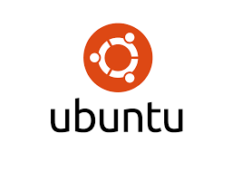

 

## NGINX Ingress Controller Workshop

 

> ><strong>Welcome to the NGINX OSS Workshop for NGINX Ingress Controller (NIC)!</strong>

 

## Overview

 

This Workshop will introduce the Open Source version of the `NGINX Ingress Controller` with hands-on practice through self-paced lab exercises.  You will learn how to deploy an NGINX Ingress Controller on a Kubernetes cluster, configure basic and advanced NGINX features; and then test it, and monitor it in realtime. 

 

NGINX Ingress  |  Hands-On Labs
:-------------------------:|:-------------------------:
  |  

 

The Hands-On Lab Exercises are designed to build upon each other, adding additional services and features as you progress through them.  

`It is important to complete the lab exercises in sequential order.`

By the end of this Workshop, you will have a working, operational NGINX Ingress Controller, with the skills to deploy and operate one for your Modern Application Kubernetes projects.

 

### Prerequisites

- Students:  F5.com UDF Account Registered with an Email Address

#### Client Machine - Student Provided

- Local Computer with Microsoft Remote Desktop application installed.
- Internet connection.
- Second monitor recommended.

#### Lab Client Machine - NGINX Provided
- Ubuntu Jumphost
- Chrome Browser, VisualStudio
- All labs are completed using RDP to an Ubuntu Jumphost.

 

Ubuntu | Chrome  |  Remote Desktop
:-------------------------:|:-------------------------:|:-------------------------:
  |  |

 

### ** Prerequisite Knowledge **

It is `highly recommended` for Students attending this Workshop to be familiar with NGINX and have some experience with Kubernetes administration, networking tools, and Load Balancing concepts.  Previous experience with VisualStudio Code is also helpful.

 

VisualStudio Code  |  Kubernetes  |  NGINX
:-----------------:|:------------:|:-------------------------:
  |     |  

 

An excellent Prerequisite for taking this Workshop is the NGINX Basics Workshop, also available from F5 NGINX, as it provides a fundamental basics of NGINX, on which the NGINX Ingress Controller is built.  Please contact your NGINX Event Marketing team for information on additional Workshops.

 

## Lab Outline

#### Lab 1: Lab Overview and Student access
- [Lab 1: Workshop Lab Overview](lab1/readme.md)

#### Lab 2: Verify NGINX Ingress Controller is running
- [Lab 2: Verify NGINX Ingress Controller](lab2/readme.md)

#### Lab 3: Configuring NGINX Ingress Controller  
- [Lab 3: Configure NGINX Ingress](lab3/readme.md)

#### Lab 4: Access NGINX Statistics
- [Lab 4: Enable NGINX Stub Status](lab4/readme.md)

#### Lab 5: Deploy NGINX Cafe Demo using manifests
- [Lab 5: Deploy NGINX Cafe Demo](lab5/readme.md)

#### Lab 6: HTTP load testing the Cafe Application
- [Lab 6: HTTP Load Testing](lab6/readme.md)

#### Lab 7: Scaling up/down the Cafe Application
- [Lab 7: Scaling Cafe Ingress](lab7/readme.md)

#### Lab 8: Monitoring NIC with Prometheus and Grafana
- [Lab 8: Prometheus and Grafana](lab8/readme.md)

#### Lab 9: Retail App using Virtual Server / VSRoute
- [Lab9: VirtualServer/VSRroute](lab9/readme.md)

#### Lab 10: Advanced NGINX features - Caching, A/B testing, Custom Error Pages
- [Lab10: Advanced NGINX Ingress](lab10/readme.md)

 

### Authors

- Chris Akker - Solutions Architect - Community and Alliances @ F5, Inc.
- Shouvik Dutta - Solutions Architect - Sales @ F5, Inc.
- Jason Williams - Principle Product Management Engineer @ F5, Inc.

 

Click [Lab1: Workshop Lab Overview](lab1/readme.md) to get started! 
