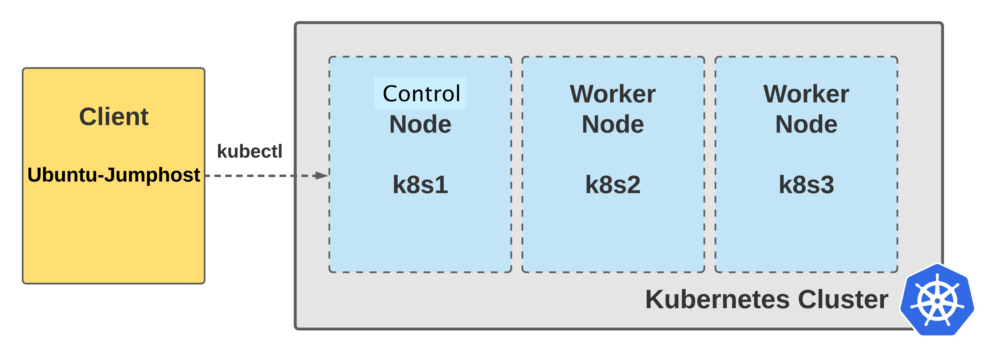
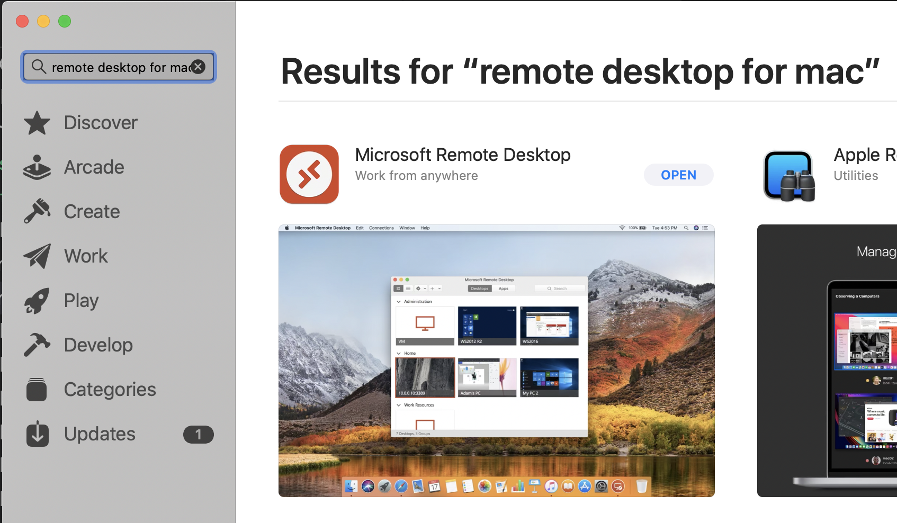
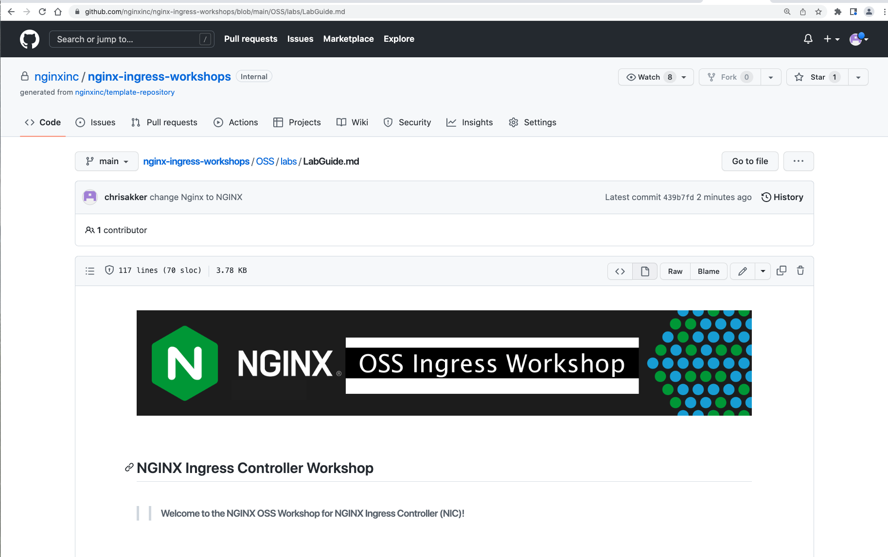
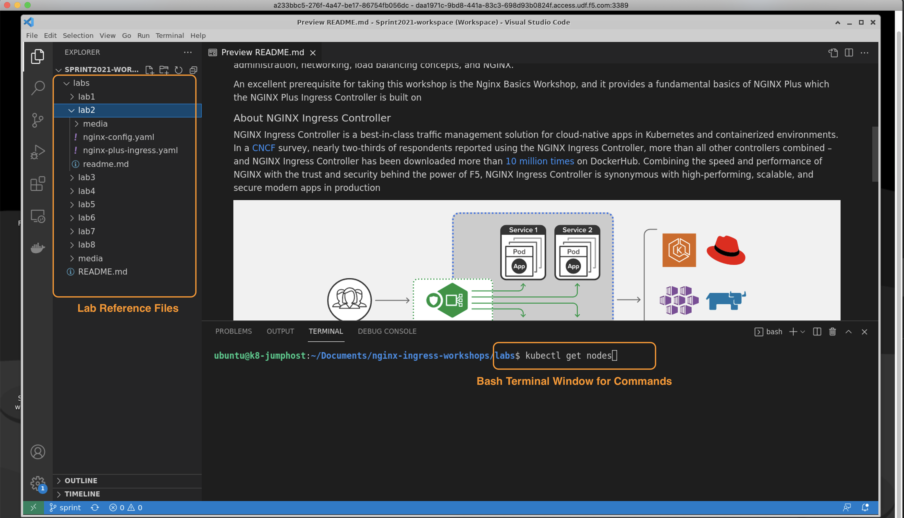

# Lab 1: Lab Overview and Student Access

## Introduction

This Workshop is hosted in F5's `Unified Demo Framework`, a cloud-based lab environment.  Once you have logged into the UDF system, and deployed your lab resources, you will be ready to begin the exercises.  

Your instructor will be sending the UDF email invitation, and ensure you are logged onto UDF, and show you how to start up your lab components.  Once the environment is up and running, your instructor will make sure you are able to access the LabGuide and get logged onto the Jumphost with RDP.

In this lab you will setup the workshop environment and prepare the Jumphost where you will be doing the labs from. You will be using the Microsoft `RDP protocol` to connect to an Ubuntu Desktop Jumphost.  It has `Chrome` and `VisualStudio Code` with a built-in bash terminal with tools like `kubectl` and `curl` ready to be used by the student.

> **Important:** All lab exercises must be run from the `Ubuntu Desktop` Jumphost in order to complete them successfully.

 

## Learning Objectives 

By the end of the lab, you will be able to: 

- Understand the components of the Workshop environment
- Open the LabGuide doc in a browser
- Connect to the Jumphost with an RDP (Remote Desktop Protocol) client
- Open VisualStudio Workspace
- Ready to start the Workshop labs

The Basic Architecture of the lab is shown here for reference:

 

## Access Jumphost

Prepare the Lab client machine for this lab by: 

- Establish RDP connection and login to the Ubuntu Jumphost
- Open Chrome with the LabGuide from GitHub
- Open VisualStudio Code, using the `NGINX-OSS NIC Workshop vs-code workspace` shortcut, located on the desktop of the Jumphost:

1. To access this Workshop, and complete the lab exercises, you will need Remote Desktop client software installed on your system. Windows PCs should already have Microsoft's Remote Desktop Client software installed. Mac users may need to install `Microsoft RDP Client` from the Apple App Store (free). https://apps.apple.com/us/app/microsoft-remote-desktop/id1295203466?mt=12

   

1. Find the Ubuntu-Jumphost, and under the `ACCESS` menu, now click on `XRDP` to login to the Jumphost:

   *Note:*  It will open the RDP session as Full Screen on your monitor.  If you want to use a different RDP screensize, click on Details, then XRDP, and you can choose from several resolutions.  FullHD, 1080x1920 is highly recommended for the lab exercises to match the Ubuntu Desktop size.

   

   Save, then Open the .RDP file after it is downloaded.
   
     The `XRDP` session will use these login credentials:

   > username: **ubuntu** 
   > password: **Nginx123**

   

   ### Note that you can re-open the LabGuide or RDP from the UDF Access page at any time.

1. Locate Chrome on the Ubuntu Desktop, and launch Chrome.  It should have the LabGuide open as the default Website.  If not, you can find the LabGide on the Bookmarks Bar.

   > For reference, the LabGuide can be found on GitHub at:

   https://github.com/nginxinc/nginx-ingress-workshops/blob/main/Plus/labs/LabGuide.md

   

1. After you have logged into the Jumphost, open `Nginx OSS NIC Workshop Workspace` to open VScode in the workshop project directory.

   > You will be running all the lab exercises in VS Code and its built-in bash Terminal to run commands like `kubectl`, `curl`, `docker` and much more.

   >> Important!  Change the Terminal commandline path to **`"nginx-ingress-workshop/OSS/labs"`** - all the Lab Exercises are run from this directory.

   

1. Open the VScode Bash Terminal for the bottom pane, if it is not already open:

   

1. Using the VScode Terminal (the bottom pane), go ahead a try a `kubectl` command, such as `kubectl get nodes`:

      

      Verify your Kubernetes Cluster is up and all Nodes are in the "Ready" state using this command:

      

      **NOTE:** If your nodes are not showing in `Ready` status then please inform your instructor.

 

**This completes this Lab.**

### Authors
- Chris Akker - Solutions Architect - Community and Alliances @ F5, Inc.
- Shouvik Dutta - Solutions Architect - Sales @ F5, Inc.

-------------

Navigate to ([Lab2](../lab2/readme.md) | [Main Menu](../LabGuide.md))
