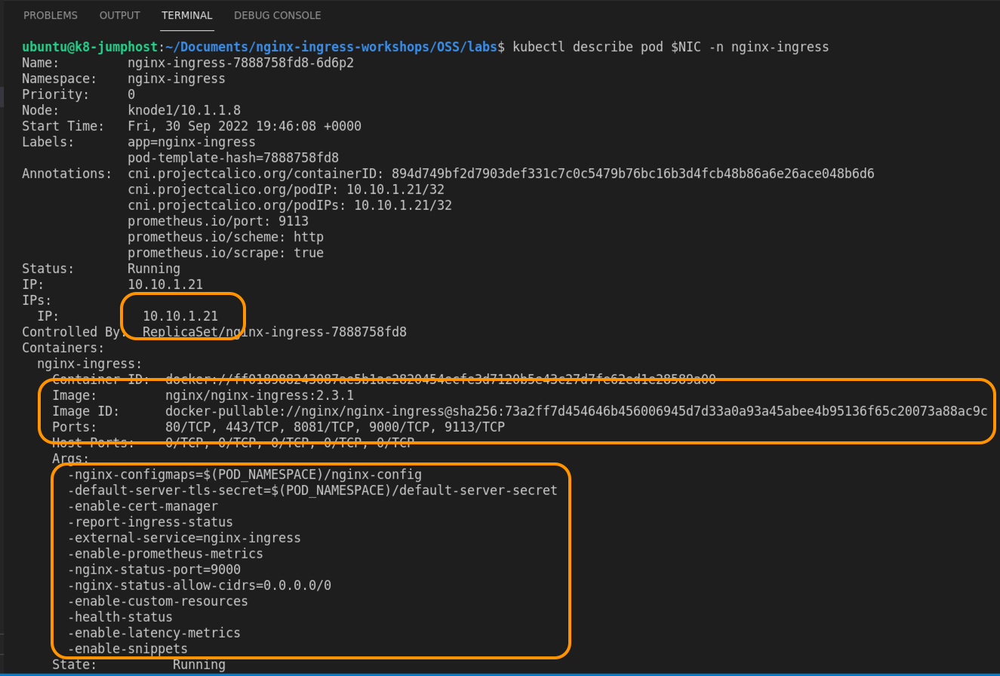
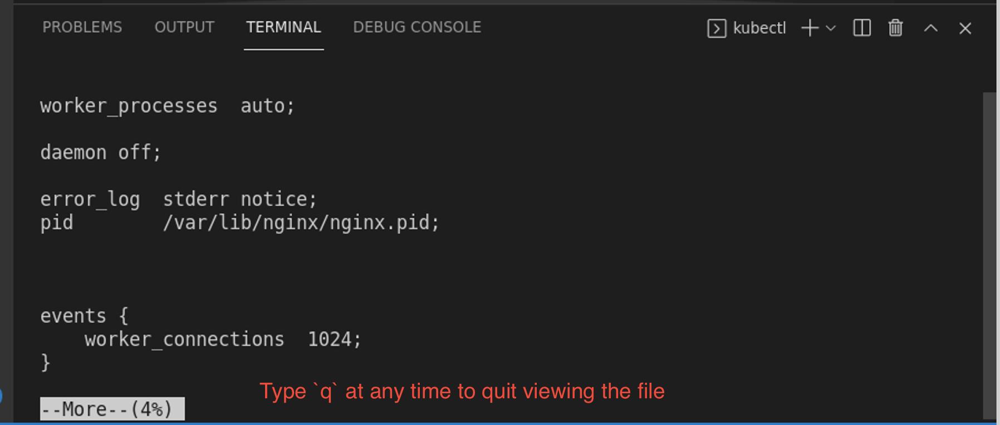
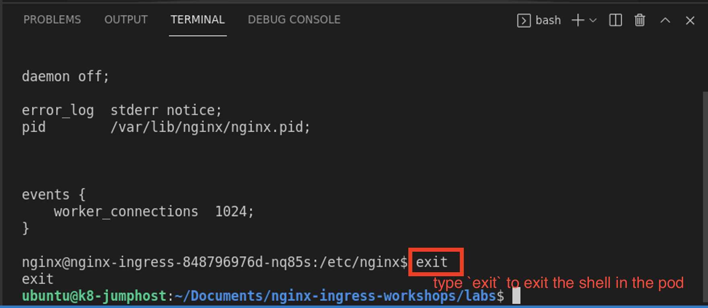

# Lab 2: Verify NGINX Ingress Controller is running

## Introduction

The NGINX Ingress Controller is already running in this workshop. You will be checking and verifying the Ingress Controller is running properly.

<br/>

## Learning Objectives 
- Intro to NGINX Ingress Controller
- Intro to Kubernetes environment, interacting with `kubectl` command
- Access the NGINX Stub Status Page

<br/>

## Check your Ingress Controller

1. First, verify the NGINX Ingress controller is up and running correctly in the Kubernetes cluster:

   ```bash
   kubectl get pods -n nginx-ingress
   ```

   ```bash
   # Should look similar to this...
   NAME                            READY   STATUS    RESTARTS   AGE
   nginx-ingress-fd4b9f484-t5pb6   1/1     Running   1          12h
   ```

1. Instead of remembering the unique pod name, `nginx-ingress-xxxxxx-xxxx`, we can store the Ingress Controller pod name into the `$NIC` variable to be used throughout the lab.

   **Note:** This variable is stored for the duration of the terminal session, and so if you close the terminal it will be lost. At any time you can refer back to this step to save the `$NIC` variable once again.

   **Note**: You must use the `kubectl` "`-n`" switch, followed by the namespace's name, to see resources that are not in the default namespace.

   ```bash
   export NIC=$(kubectl get pods -n nginx-ingress -o jsonpath='{.items[0].metadata.name}')
   ```

   Verify the variable is set correctly.
   ```bash
   echo $NIC
   ```
   **Note:** If this command doesn't show the name of the pod then run the previous command again.

<br/>

## Inspect the details of your Ingress Controller:

1. Inspect the details of the NGINX Ingress Controller pod using the `kubectl describe` command

   ```bash
   kubectl describe pod $NIC -n nginx-ingress
   ```

   **Note:** The IP address and TCP ports that are open on the Ingress (they should match the `lab2/nginx-ingress.yaml` file, around lines `25-35`). We have the following listening Ports:

   * Port `80 and 443` for http/s traffic,
   * Port `8081` for Readiness, 
   * Port `9000` for the Stub Status, and 
   * Port `9113` for Prometheus (You will see this in a later Lab)

   

<br/>

## Check the NGINX Stub Status Page

1. Using Kubernetes [port-forwarding](https://kubernetes.io/docs/tasks/access-application-cluster/port-forward-access-application-cluster/), see if stub status is running on port `9000`. Using the VScode terminal pane, run the following `kubectl port-forward` command:

   ```bash
   kubectl port-forward -n nginx-ingress $NIC 9000:9000
   ```

1. Now open Chrome web browser to view the NGINX Stub Status webpage, at http://localhost:9000/stub_status.html. 

   

   Do you see the NGINX Stub Status Page? If so, your Ingress Controller pod is up and running!

1. Close Chrome Web Browser, and hit `Ctrl-C` in the terminal to stop the Port Forward.

   

<br/>

### Take a look "under the hood" of Ingress Controller

The NGINX Ingress Controller is a pod running NGINX Proxy under the hood, let's go check it out.

1. Use the VScode Terminal to enter a shell in the NGINX Ingress Controller pod by running the [`kubectl exec`](https://kubernetes.io/docs/tasks/debug-application-cluster/get-shell-running-container/) command 

   ```bash
   kubectl exec -it $NIC -n nginx-ingress -- /bin/bash
   ```

1. Once inside a shell in the NGINX Ingress Controller pod, run the following commands to inspect the NGINX configuration:

   ```bash
   cd /etc/nginx
   more nginx.conf
   ```

   If you have worked with NGINX config files, it should look very similar.

1. Type `q ` to quit viewing the `nginx.conf `

   

1. Type `exit` to close the connection to the Ingress pod.

   

<br/>

**This completes this Lab.**

## References:

- https://docs.nginx.com/nginx-ingress-controller
- https://docs.nginx.com/nginx-ingress-controller/installation/installation-with-manifests/

### Authors
- Chris Akker - Solutions Architect - Community and Alliances @ F5, Inc.
- Shouvik Dutta - Technical Solutions Architect @ F5, Inc.

-------------
Navigate to ([Lab3](../lab3/readme.md) | [Main Menu](../LabGuide.md))
