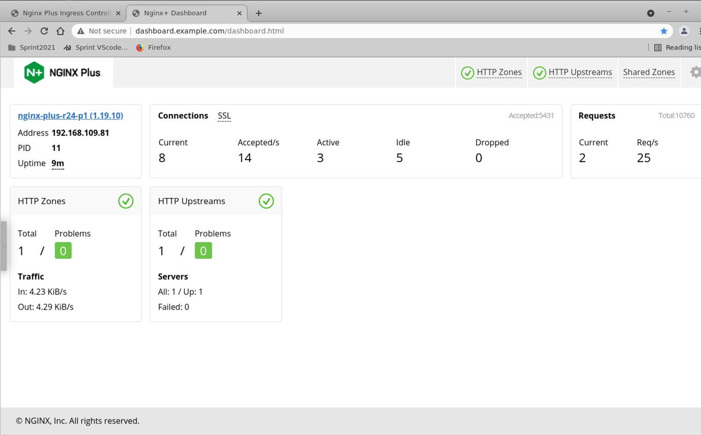

## Lab 4: NGINX Stub Status access

## Introduction

In this section, you are going to use the NGINX Stub Status to monitor the NGINX Ingress Controller. This is a standard NGINX feature to allow you to watch basic stats and triage any potential issues with the NGINX Ingress controller.

## Learning Objectives

- Deploy the NGINX Stub Status
- Test access to the Status Page

### Deploy the NGINX Stub Service

We will deploy a `Service` and a `VirtualServer` resource to provide access to the NGINX Stub Status for statistics.  NGINX Ingress [`VirtualServer`](https://docs.nginx.com/nginx-ingress-controller/configuration/virtualserver-and-virtualserverroute-resources/) is a [Custom Resource Definition (CRD)](https://kubernetes.io/docs/concepts/extend-kubernetes/api-extension/custom-resources/) used by NGINX to configure NGINX Server and Location blocks for NGINX configurations.


1. In the `lab4` folder, apply the `stubstatus-vs.yaml` file to deploy a `Service` and a `VirtualServer` resource to provide access to the NGINX status page for live monitoring:

    ```bash
    kubectl apply -f lab4/stubstatus-vs.yaml
    ```

## Test access to the Status Page

1. Open a new Chrome web browser tab, and click the Status Bookmark, or directly open http://dashboard.example.com/stub_status.html
    
    < change screenshot >
 
    

    You should see the same NGINX Status webpage as the `kubectl port-forward` test we did previously. Using the VirtualServer and Service definitions, your status page is exposed outside of your cluster at http://dashboard.example.com/stub_status.html.  

    > **_Recommended:_** Leave this Status Window open for the rest of the Workshop, you will refer to it often during later exercises.

    Congratulations! You have successfully configured your Ingress Controller for external access and the NGINX Status page.  Next we will deploy some application services and start routing some traffic through NGINX Ingress.

**This completes this Lab.**

## References:

- [NGINX Stub Status Monitoring](https://docs.nginx.com/nginx-ingress-controller/logging-and-monitoring/status-page/)

- [NGINX Stub Status Module](https://nginx.org/en/docs/http/ngx_http_stub_status_module.html)


### Authors
- Chris Akker - Solutions Architect - Community and Alliances @ F5, Inc.
- Shouvik Dutta - Technical Solutions Architect @ F5, Inc.

-------------

Navigate to ([Lab5](../lab5/readme.md) | [Main Menu](../LabGuide.md))

