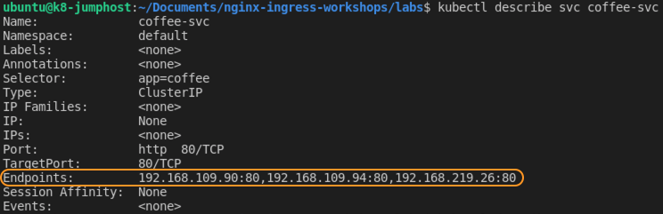
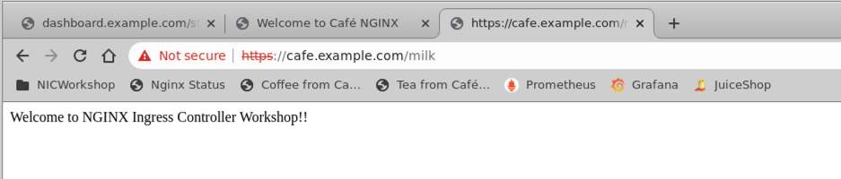

# Lab 5: Deploy the NGINX Cafe Ingress demo application, using manifests

## Introduction

In this section, you will build the "Cafe" Ingress Demo, which represents a Coffee Shop website with Coffee and Tea applications. You will be adding the following components to your Kubernetes Cluster: **Coffee** and **Tea** `services`, `cafe-secret`, and `cafe ` `virtualserver`.

## Learning Objectives
- Deploy the Cafe Demo app
- Compare VirtualServer and Ingress manifests
- Verify the URL path access to `/coffee` and `/tea` work correctly 
- Monitor the NGINX Stub Status page
- Verify the homepage redirect works correctly

## Deploy the Cafe Demo app

The Cafe application that you will deploy looks like the following diagram below.  Coffee and Tea pods and services, with NGINX Ingress routing the traffic for `/coffee` and `/tea` routes, using the `cafe.example.com` Hostname, and with TLS enabled.  There is also a hidden third service - more on that later!

< update diagram >


1. Deploy the Cafe application by applying the three manifests:

    ```bash
    kubectl apply -f lab5/cafe-secret.yaml
    kubectl apply -f lab5/cafe.yaml
    kubectl apply -f lab5/cafe-virtualserver.yaml
    ```
    

1. Check that all pods are running, you should see **three** Coffee and **three** Tea pods:

    ```bash
    kubectl get pods
    ```
    


1. Check that the Cafe `VirtualServer` , **`cafe-vs`**, is running:

    ```bash
    kubectl get virtualserver cafe-vs
    ```
    

    **Note:** The `STATE` should be `Valid`.  If it is not, then there is an issue with your yaml manifest file `(cafe-vs.yaml)`.  You could also use `kubectl describe vs cafe-vs` to get more information about the `VirtualServer` we just created.

## Compare VirtualServer and Ingress manifest

1. In the `lab5` folder, inspect the `cafe.yaml` manifest file.  Find the following configuration details:

  * **Question:** How many coffee and tea pods are we starting with?  

    <details><summary>Click for Hints!</summary>
      <br/>
      <p>
      <strong>Hint:</strong> Look for the number of replicas
      </p>
    </details>
  * **Question:** What are the two `Service` names ?  

    <details><summary>Click for Hints!</summary>
      <br/>
      <p>
      <strong>Hint:</strong> Look for <code>kind: Service</code>
      </p>
    </details>

  

1. Now inspect the `cafe-virtualserver.yaml` file.

  * **Question:**  What is the hostname ?  

    <details><summary>Click for Hints!</summary>
      <br/>
      <p>
      <strong>Hint:</strong> Look for <code>host</code>
      </p>
    </details>
  * **Question:**  Are we using SSL ? If so, which certificate ?  

    <details><summary>Click for Hints!</summary>
      <br/>
      <p>
      <strong>Hint:</strong> Look for <code>tls</code>
      </p>
    </details>
  * **Question:**  Are healthchecks enabled ? 

    <details><summary>Click for Hints!</summary>
      <br/>
      <p>
      <strong>Hint:</strong> Look for <code>healthCheck</code>
      </p>
    </details>
  * **Question:** What URI paths are defined, routing to where ? 

    <details><summary>Click for Hints!</summary>
      <br/>
      <p>
      <strong>Hint:</strong> Look for <code>route</code>
      </p>
    </details><br/>

  
  

1. Compare the `cafe-ingress.yaml` and `cafe-virtualserver.yaml` files.  How are they different?  Do you see, that the `virtualServer` definition has quite a few more options for controlling how traffic is routed to your Ingress and to your pods:
   
   You can make use of VSCode built-in **compare** tool as seen below: `Select the two files and then right-click Compare Selected:<br/>
    
    

    Do you see how many more options there are in a `VirtualServer` type over an `Ingress` type?

    

2. Now inspect the `cafe-secret.yaml` which is the TLS self-signed certificate we are using for this lab.

  

## Verify the URL path to `/coffee` and `/tea` work correctly 

1. Access the application using `curl`. We'll use the `-k` option to turn off certificate verification of our self-signed certificate:

  ``` bash
  # To get coffee:
  curl -k -I https://cafe.example.com/coffee 
  ```
  ```bash    
  # If your prefer tea:
  curl -k -I https://cafe.example.com/tea 
  ```
<br/>

## Monitor the NGINX Stats Page

<br/>

1. Open two new Chrome web browser windows for side by side viewing.
     
     -  Dashboard: http://dashboard.example.com/stub_status.html:
     -  And in two tabs, the Cafe Application components, Coffee
        (https://cafe.example.com/coffee) and  Tea
        (https://cafe.example.com/tea)

<br/>

### Cafe App

1. Using the second Chrome web browser window, open tabs for both: 
    
    - Coffee - [https://cafe.example.com/coffee](https://cafe.example.com/coffee)
    - Tea - [https://cafe.example.com/tea](https://cafe.example.com/tea)  

    **Did you see an initial Chrome TLS Security warning ?** No problem, we are using a self-signed TLS certificate for this Lab and you can safely Proceed.

    

1. While watching the Stats page, try refreshing the pages for Coffee and Tea several times:

   Do you see some changes in the number of connections and requests counters?


1. Verify the [`Endpoint`](https://kubernetes.io/docs/concepts/services-networking/service/) addresses, with `kubectl` commands that shows you the details of Coffee and Tea `Service`:

    ```bash
    # Describe Coffee Service 
    kubectl describe svc coffee-svc

    # Describe Tea Service 
    kubectl describe svc tea-svc
    ```
    The Service `Endpoints` should match the Server IPs in the Coffee and Tea web pages:

     
    

## Verify the homepage redirect works correctly

What happens if you try just plain  http://cafe.example.com? It should redirect you to TLS secured https://cafe.example.com/coffee.

1. Open Chrome Developer Tools: Right Click on the wepage and select `Inspect`.

    

1. Inspect the HTTP Headers: Open the `Network` Tab > view `Headers`. 

    

1. Try [https://cafe.example.com/milk](https://cafe.example.com/milk)

    **Question:** What just happened and why?

    <details><summary>Click for Hints!</summary>
    <br/>
    <p>
    <strong>Hint:</strong> Check your <code>cafe-virtualserver.yaml</code> file.<br/>
    <strong>Answer:</strong> Welcome to NGINX Ingress Controller Workshop!!<br/>   
    </p>
    </details><br/>

    < update screenshot >

     

<br/>

*Next, let's throw some traffic at your Cafe Ingress!*

**This completes this Lab.** 

## References: 

- [NGINX Ingress Controller Complete
  Example](https://github.com/nginxinc/kubernetes-ingress/tree/master/examples/complete-example)

### Authors
- Chris Akker - Solutions Architect - Community and Alliances @ F5, Inc.
- Shouvik Dutta - Technical Solutions Architect @ F5, Inc.

-------------

Navigate to ([Lab6](../lab6/readme.md) | [Main Menu](../LabGuide.md))

