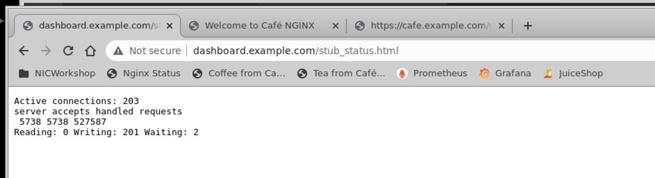
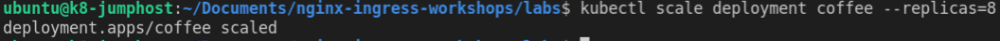
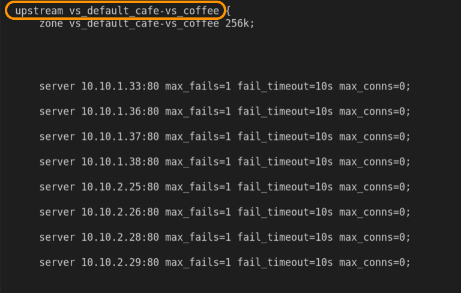
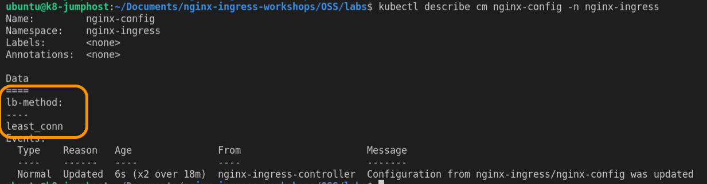
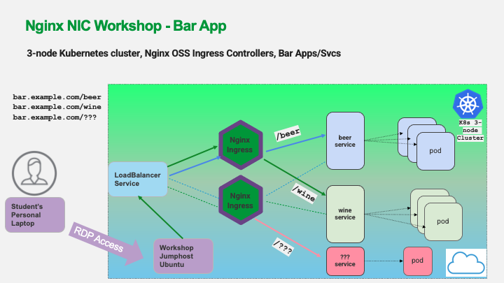

## Lab 6: HTTP Load Testing and Cafe Scaling

## Introduction

In this lab, you will send some HTTP traffic to your Ingress Controller and Cafe Application, and watch NGINX Ingress load balance the trafffic.  You will scale the application pods and Ingress Controller up and down, and watch what happens in realtime.

<br/>

## Learning Objectives

- HTTP Traffic Generation
- Scale Cafe Applications
- Optional Exercises
- Host-based Routing
- Observe NGINX Dashboard

<br/>

## HTTP Traffic Generation

We will use a tool called [`wrk` ](https://github.com/wg/wrk), runing in a docker container, to generate traffic to your Ingress Controller.

1. Open a Terminal from the Ubuntu Desktop

    

1. In the terminal window, run this command to start the load generation using `wrk` inside a docker container:

    ```bash
    docker run --rm williamyeh/wrk -t4 -c200 -d20m -H 'Host: cafe.example.com' --timeout 2s https://10.1.1.100/coffee
    ```

    

    This will run the `wrk` load tool for **20 minutes**, with **200 connections**.  You can run this command again if you need additional time.

1. Observe your NGINX Dashboard - http://dashboard.example.com/stub_status.html

    

    **Questions:**

     - Do you see the number of HTTP requests increasing?  
     - Do the coffee pods each take ~equal traffic?  

        <details><summary>Click for Hints!</summary>
        <br/>
        <p>
        <Strong>Hints:</Strong> Look at the "server" line, there you will find the total request counter. 
        </p>
        </details><br/>

## Scale Applications

Coffee Break Time !! Let's scale the Coffee `Deployment`. In anticipation of a surge in coffee drinkers - The boss says we need more Keurig pods.

1. While watching the Dashboard, change the number (`replicas`) of Coffee pods from **three**, to a total of **eight**:

    ```bash
    kubectl scale deployment coffee --replicas=8
    ```
    

    **Question:** How long did it take Kubernetes to add the new pods?  

    **Answer:** NGINX Ingress will begin routing traffic to the `five` new pods as soon as the K8s live readiness probes are successful. You can then reload the NGINX Ingress Controller so it can reconfigure its upstream groups and route traffic to all 8 of them. 

    Check to see if all 8 of the Coffee pods are running:

   ```bash
    kubectl describe deployment coffee
    ```

    

    Verify NGINX Ingress will send traffic to all 8 pods, find the `vs_default_cafe-vs_coffee` upstream block{}, and see if there are 8 server IP address:80 entries:

    ```bash
    kubectl exec -it $NIC -n nginx-ingress -- /bin/bash -c "nginx -T"
    ```

    
    
    Caffiene crises averted...!

1. Let's configure NGINX Ingress Controller to use the Load Balancing algorithm called `Least Connections` so that the most responsive (faster) pods are preferred for more Connections and HTTP Requests. Apply the following manifest:

    ```bash
    kubectl apply -f lab6/nginx-config-leastconn.yaml
    ```
   This is an Nginx ConfigMap for the Ingress Controller that configures it to use a different algorithm.

   


    - **Question:** Why are some pods faster or slower than others?
    <details>
      <summary>Click for Hints!</summary>
      <br/>
      <p>
        <strong>Answer:</strong>  </br></br> Some pods are slower than others, because there are other workloads running in the cluster, and you don't control where and when those other workloads are deployed, or how many resources they will consume among the pods.</br></br>This means not all pods are equal in performance, leading to an imbalance of Response Times. <br/></br>Some users will connect to a fast pod, some will get stuck with a slow pod.
      </p>
    </details><br/>

1.   
    In today's Modern Applicatin production workloads, it is important to send customers' requests to the most reliable and performant `pod` (server).  NGINX's `Least-Conn` Load Balancing algorithm allows you to handle more total requests, and, it adjusts automatically as pod performance and conditions in the Kubernetes cluster change minute by minute. 
    
    **This yields a better customer experience, essential for today's modern applications.** 
 

1. Boss says Coffee rush is now over, so scale back the number of coffee pods to **three**. Run the following `kubectl scale ` command:

    ```bash
    kubectl scale deployment coffee --replicas=3
    ```

    Did you notice any errors in the NGINX Dashboard while Kubernetes scaled down the pods? 

    When scaling down, NGINX will try to complete workloads before Kubernetes terminates a running `pod`, after all the responses in flight have finished processing on that` pod`, so there should not be any errors. 

    Did you notice any errors when you asked NGINX to change its load balancing algorithm from round-robin to `Least-Conn`? There should not have been any errors. The Configuration Reload should allows existing connections to finish their work, while allowing new connections to use the new configuration. 
    
    > This results in **no dropped connections during configuration changes.**

### Optional Lab Exercise1: 

Try the same scale up, then scale down commands for the Cafe **Tea** `Deployment`. Does NGINX also send more traffic to the faster Tea pods? Set the tea pods back to **three** replicas when you are finished.

**Note:**  You will have to target `/tea` with the `wrk` tool if you want to load test Tea:

1. Run the following command to apply load to the Tea Service:

    ```bash
    docker run --rm williamyeh/wrk -t4 -c200 -d15m -H 'Host: cafe.example.com' --timeout 2s https://10.1.1.10/tea
    ```

### Optional Lab Exercise2: 

1. You can change the load balancing algorithm back to round-robin if you like, and check out the differences. Apply the following manifest to make that change:

    ```bash
    kubectl apply -f lab6/nginx-config-roundrobin.yaml
    ```

## Host Based Routing

**New business opportunity**: The boss got a business loan to open the Cafe as a Bar in the evening for beer and wine tasting! So you need to add Beer and Wine applications, and expose these using the NGINX Ingress Controller. 

**Hurry up - it's almost Happy Hour!**

See the topological view of the new **beer** and **wine** applications

< update bar diagram >



1. In the `lab6` folder, inspect the `bar.yaml` and `bar-virtualserver.yaml` manifest files. You will see that we are adding the required ` Deployment` and `Service`, and exposing them with `VirtualServer`, using a new hostname, `bar.example.com.`

    

1. Create the **beer** and **wine** ` Deployment` and `Service`, by applying the provided manifests. 
   
    ```bash
    kubectl apply -f lab6/bar.yaml
    ```

1. Create a new `VirtualServer` listening on the hostname, **`bar.example.com`**, with `/beer` and `/wine` URI paths to the new application deployments, by applying the `bar-virtualserver.yaml` file:
   ```bash
   kubectl apply -f lab6/bar-virtualserver.yaml
   ```

1. Open two new Chrome web browser windows and browse to
   https://bar.example.com/beer and https://bar.example.com/wine.  
   
   **Note:** You can once again safely proceed to this insecure site.

   Do the new `beer` and `wine` applications load as expected?

   

1. Observe your NIC Dashboard again on http://dashboard.example.com/stub_status.html

    **Questions:**

    - What does the Dashboard show you when you refresh `/beer` and `/wine` multiple times?  
    - Did you find your new `HTTP upstreams` for **beer** and **wine**?  

<br>

    You can see how easy it is to add new `Deployment` and `Service`, and then configure NGINX Ingress Controller with CRDs to create a new HTTP Host route, URI paths and route traffic to these new services and have access to these applications immediately. The NGINX `VirtualServer` CRD's allow you to easily add new hosts and services.

    This ability of self-service Host and Path based HTTP routing makes it easy to add and deploy new services, and NGINX Ingress routes the traffic correctly (and BTW - you didn't have to submit even one Ticket to IT and WAIT !!). 
    
    As you can see, this enables application/development teams to rapidly build, deploy, and expose new digital services for the business, without waiting for lengthy deployment/approval processes.

**Bonus:** `Sneaky Pete!`  There was one additional `Happy Hour Drink Special` cocktail added by the boss's daughter.  Did you find it? 

  <details>
    <summary>Click for Answer!</summary>
    <br/>
    <p>
      <strong>Answer:</strong> In case you did't find it, the boss's daughter added <code>/cosmo</code> to the beer and wine manifests!  Does <code>https://bar.example.com/cosmo</code> work as intended ?
    </p>
  </details><br/>

You should also notice that Cafe is still running as before, adding the Bar services and VirtualServer definitions had no impact.

**This completes this Lab.**

## References: 
- [Least_conn Algorithm](http://nginx.org/en/docs/http/ngx_http_upstream_module.html#least_conn)
- [Random Algorithm](http://nginx.org/en/docs/http/ngx_http_upstream_module.html#random)
- [Wrk Tool](https://github.com/wg/wrk)

### Authors
- Chris Akker - Solutions Architect - Community and Alliances @ F5, Inc.
- Shouvik Dutta - Technical Solutions Architect @ F5, Inc.

-------------

Navigate to ([Lab7](../lab7/readme.md) | [Main Menu](../LabGuide.md))
