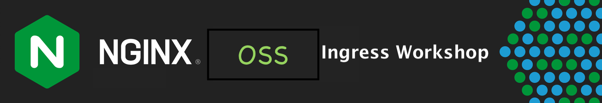

# Nginx Ingress Controller Workshop

 

## Welcome

Welcome to the Nginx Workshop for Kubernetes Ingress Controller (NIC)!
This Workshop will introduce Nginx Ingress Controller with hands-on practice through self-paced lab exercises.

You will learn how to configure an **`Nginx Ingress Controller`**, deploy it on a Kubernetes cluster, configure advanced Nginx features, loadtest it, scale it up and down and monitor it in realtime.  You will deploy new apps and services in your private cluster, terminate SSL, route HTTP traffic, configure redirects, set up healthchecks, and load balance traffic to running pods.

These Hands-On Lab Exercises are designed to build upon each other, adding additional services and features as you progress through them, completing the labs in sequential order is required. 

By the end of this Workshop, you will have a working, operational Nginx Ingress Controller, routing traffic to and from Kubernetes application pods and services, with the necessary skills to deploy and operate NIC for your own Digital Enterprise Applications running in Kubernetes.  Thank You for taking the time to attend this Nginx Workshop!

## About Nginx Ingress Controller

Nginx Ingress Controller is an Open Source resource for directing traffic to/from a Kubernetes Cluster.  Nginx runs all popular K8s frameworks, including Amazon EKS, Google GCP, Redhat Openshift, Azure AKS and others.  It can also work with your on-premise Data Center based K8s clusters.  Nginx Ingress Controller is built from the same source code you know and trust from Nginx OSS.  You can find the full Kubernetes support matrix and technical specifications for Nginx Ingress Controller on the http://www.nginx.org website.  

 

 

Nginx Ingress Controller has the best-in-class traffic management solution for cloud‑native apps in Kubernetes and containerized environments. In a recent 
[CNCF](https://www.cncf.io/blog/2018/08/29/cncf-survey-use-of-cloud-native-technologies-in-production-has-grown-over-200-percent/)
survey, nearly two‑thirds of respondents reported using the Nginx Ingress Controller, more than all other controllers combined – and Nginx Ingress
Controller has been downloaded more than [10 million
times](https://hub.docker.com/r/nginx/nginx-ingress) on DockerHub. 

 

 

Combining the speed and performance of Nginx with the trust and security behind F5 Networks, Nginx Ingress Controller is synonymous with high‑performing, scalable, and secure modern apps in development, testing, QA, and staging.

https://docs.nginx.com/nginx-ingress-controller/intro/how-nginx-ingress-controller-works/

https://docs.nginx.com/nginx-ingress-controller/technical-specifications/

 

### Authors
- Chris Akker - Technical Solutions Architect @ F5, Inc.
- Shouvik Dutta - Technical Solutions Architect @ F5, Inc.
- Jason Williams - Product Management Engineer @ F5, Inc.

-------------

This completes the Introduction.  
Click on ([LabGuide](LabGuide.md)) to begin the workshop.
