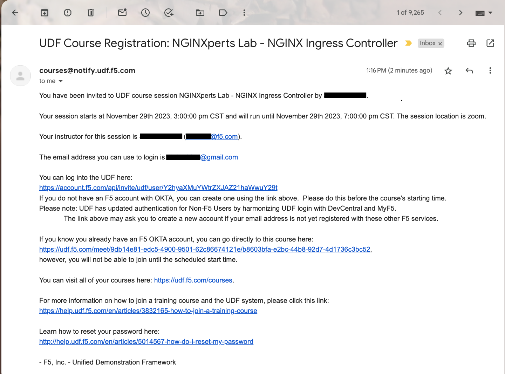
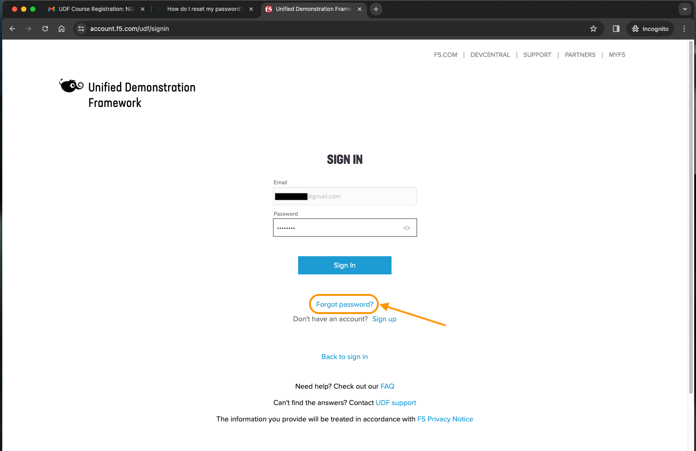
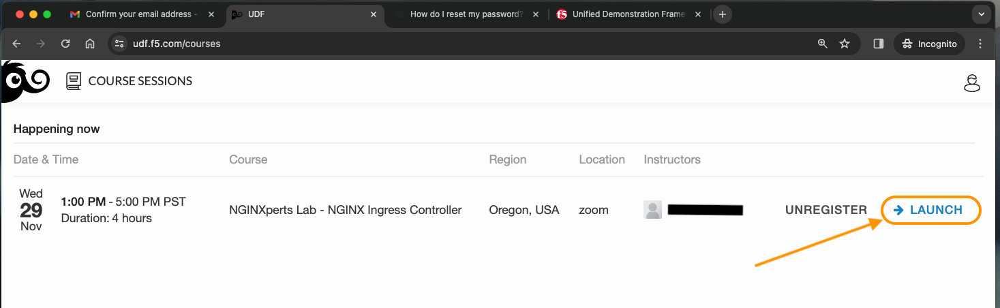
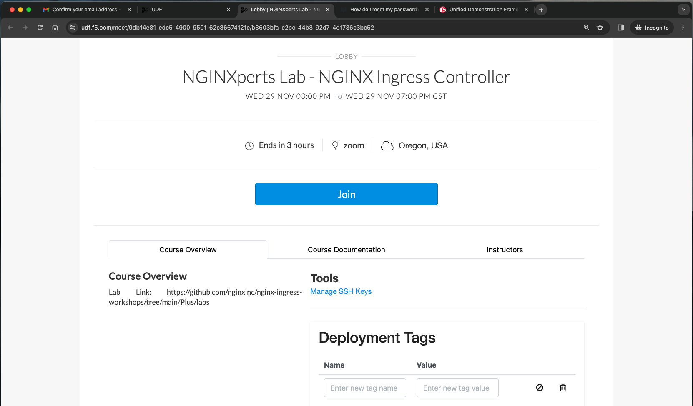
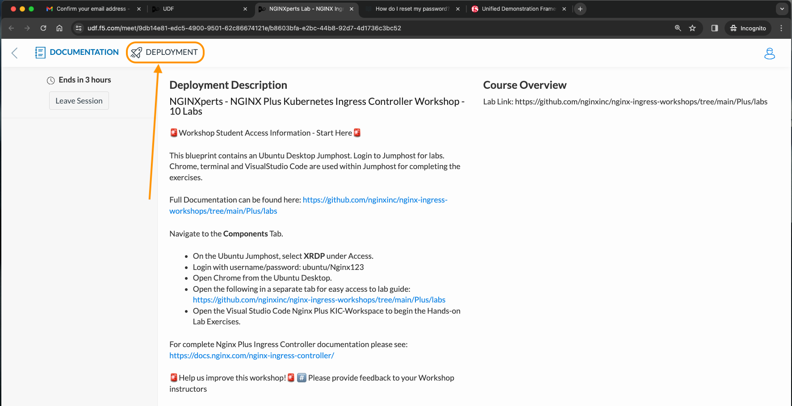
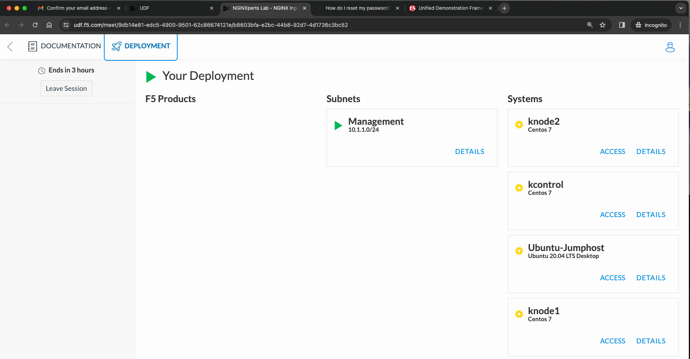
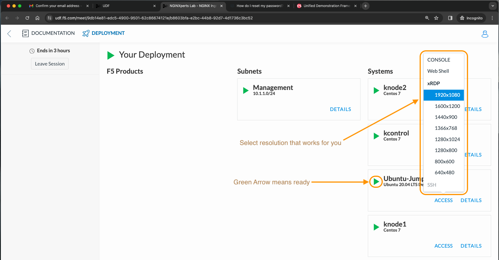
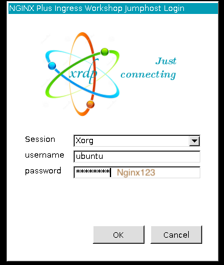

# Workshop pre-work
## Prep for your upcoming F5/NGINX workshop! 

If you're here that probably means you are currently in, or registered for, an upcoming NGINX workshop. By taking the time to run through this exercise you are helping us save time during the workshop- we appreciate it.

## Step 0: If this is your first time in a Workshop
Look for an email from **`noreply@registration.udf.f5.com`**. This will have your temporary password.

### If you cannot find your invite email ("Welcome to F5's Unified Demonstration Framework") STOP
  * These commonly get caught by spam filters. *Make sure to check your spam folder **and** your system's email Quarantine.*
  * If you still cannot find your invite email, you either have not been invited to a workshop or we have an incorrect email. Please get help from whoever sent you to this page.

## Step 1: Get yourself to UDF
### Navigate to https://udf.f5.com/ and select ```Non-F5 Users```

If this is your first time using UDF, use your temporary password to login, and go through all the readings of the fine prints. NOTE: this will *not be the password to the Jumphost or other VMs in the class!* 

### If you already have an account but you can't remember your password, simply reset it using your corporate email that you used to register for the workshop.


## Step 2: Get into the test course
### Click ```Launch``` (This will open a new tab.)


### And then ```Join```


### Click the ```DEPLOYMENT``` tab at the top


## Step 3: RDP to the Jumpbox
   * username: `ubuntu`
   * password: `Nginx123`

THIS REQUIRES AN RDP CLIENT! If you have a Mac *and* haven't downloaded an RDP client before, here is the first-party version:

[Microsoft's RDP client on the Apple Apps Store](https://apps.apple.com/us/app/microsoft-remote-desktop/id1295203466?mt=12)

### Now we just have to wait for the Jumpbox to finish booting. . .


### Make sure to select a small enough resolution to see the whole screen.


### Accept the self-signed cert, and your username and password will be `user` and `user`. (This is *not* your email & UDF password.)


### If you cant connect to the Jumphost, _remember to shut off your VPN_, or join a non-proxied network (sometimes a guest network in the office will work).

### For machines running Windows and attached to a domain, Windows will helpfully attempt to use your domain creds to log in, and you'll see:


### Click "More choices" to enter both a username and a password.


That wraps the pre-requisites.
<br/>

### Authors
- Dominic Lucia - Solutions Engineer - Channels @ F5, Inc.
- Chris Akker - Solutions Architect - Community and Alliances @ F5, Inc.
- Shouvik Dutta - Solutions Architect - Community and Alliances @ F5, Inc.

-------------

Navigate to ([Lab1](../lab1/readme.md) | [Main Menu](../LabGuide.md))
