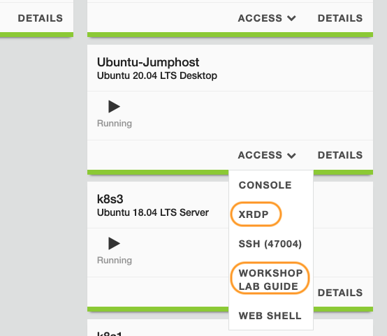
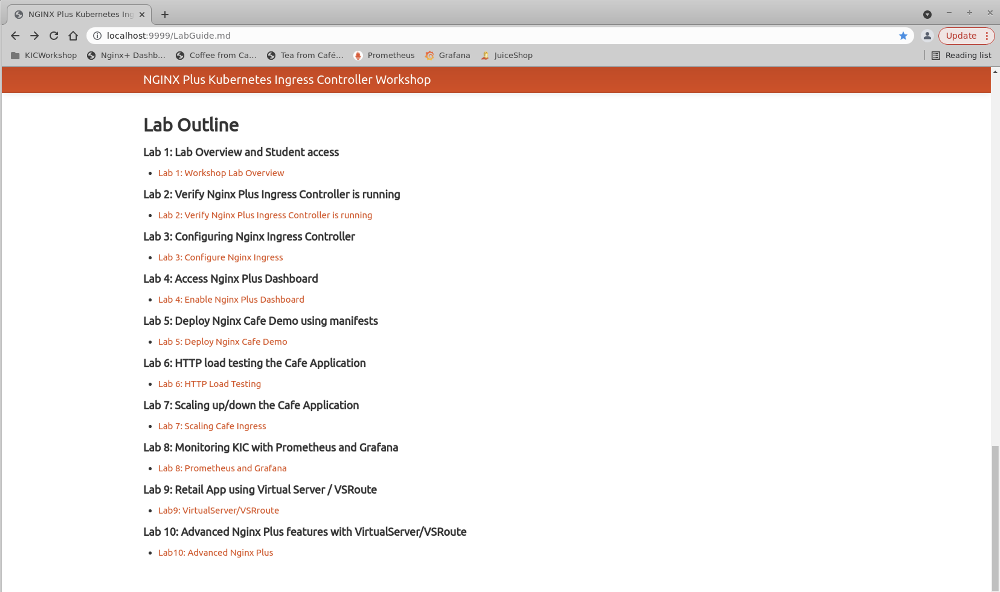

# Lab 1: Lab Overview and Student Access

## Introduction

This Workshop is hosted in F5's Unified Demo Framework, a cloud-based lab environment.  Once you have logged into the UDF system, and deployed your lab resources, you will be ready to begin the exercises.

In this lab you will setup the workshop environment and prepare the Jumphost where you will be doing the labs from. You will be using the Microsoft `RDP protocol` to connect to an Ubuntu Desktop Jumphost.  It has `VisualStudio Code` editor with a built-in bash terminal with tools like `kubectl` and `curl` already loaded to be used by the student.

> **Important:** All lab exercises must be run from the `Ubuntu Desktop` Jumphost in order to complete them successfully.

## Learning Objectives 

By the end of the lab, you will be able to: 

- Understand the components of the Workshop environment
- Connect to Jumphost with an RDP (Remote Desktop Protocol) client
- Open the LabGuide doc in a browser
- Ready to start the Workshop labs

The Basic Architecture of the lab is shown here for reference:

## Access Jumphost

Prepare your client machine for this lab by: 

- Opening the LabGuide
- Opening `NginxPlus NIC Workshop vs-code workspace` shortcut, located on the desktop of the Jumphost:

Locate the **`Ubuntu-Jumphost`** component and click on the **`ACCESS`** dropdown link.

   

Click `WORKSHOP LAB GUIDE`, which should open this Lab Guide in a seperate tab.
     
     

For reference, the LabGuide can be found at:
https://githubcom/nginxinc/nginx-ingress-workshops/blob/main/Plus/labs/LabGuide.md

1. To access this Workshop, and complete the lab exercises, you will need a Remote Desktop client software installed on your system. Windows PCs should already have Microsoft's Remote Desktop Client software installed. Mac users may need to install `Microsoft RDP Client` from the Apple App Store (free). https://apps.apple.com/us/app/microsoft-remote-desktop/id1295203466?mt=12

   

1. Under `ACCESS` now click on `XRDP` to login to the Jumphost

   

   The `XRDP` session will use these login credentials:

   - username: **ubuntu**
   - password: **Nginx123**

   
      
   ### Note: You can re-open these from the UDF Access page at any time.

1. After you have logged into the Jumphost, open `NginxPlus NIC Workshop Workspace` to open VScode in the workshop project directory. You will be running all the lab exercises in VS Code and its built-in Terminal to run commands like `kubectl`, `curl`, `docker` and much more.

   

1. Using the VScode Terminal (the bottom pane), go ahead a try a `kubectl` command, such as `kubectl get nodes`.

      

      Verify your Kubernetes Cluster is up and all Nodes are in the "Ready" state using this command:

      

      **NOTE:** If your nodes are not showing in `Ready` status then please inform your instructor.

1. As part of the lab, you will be using `Chrome` browser which you can also find on the Jumphost desktop, which also has the Lab Guide and some other links bookmarked which will be used for subsequent labs.

   

**This completes this Lab.**

### Authors
- Chris Akker - Solutions Architect - Community and Alliances @ F5, Inc.
- Shouvik Dutta - Solutions Architect - Sales @ F5, Inc.

-------------

Navigate to ([Lab2](../lab2/readme.md) | [Main Menu](../intro/LabGuide.md))
