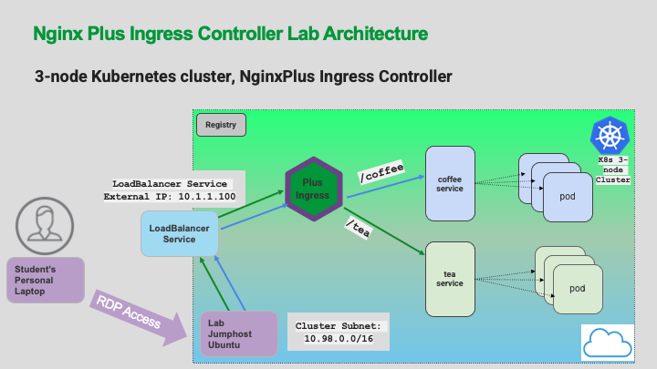

# Lab 3: Configuring NGINX Ingress Controller

## Introduction

The NGINX Ingress Controller is already running in this Workshop. You will be configuring Ingress Controller for external access outside of your cluster using a [`LoadBalancer`](https://kubernetes.io/docs/tasks/access-application-cluster/create-external-load-balancer/) Service.  The Kubernetes `LoadBalancer` Service is what assigns IP addresses to the `Ingress`, so it can communicate with clients outside the cluster, and also with pods inside the Cluster.

**Note:** Your Kubernetes cluster is running on a private lab network. We will be using a private IP for external access. In a public cloud environment, the `LoadBalancer` Service from a Cloud Provider would provide you with a routable public IP address.

## Learning Objectives 

- Test and verify the `LoadBalancer` Service
- Test and verify access to the Ingress Controller using the external IP address.

## Inspect the LoadBalancer Service

1. Review this Workshop's network architecture diagram below. There are 3 important pieces of information needed for these exercises:

   - `LoadBalancer` Service
   - An External IP address 
   - The Kubernetes Cluster IP subnet, used to assign IPs to Pods, including the Ingress Controller

   

1. Inspect the `lab3/loadbalancer.yaml` manifest. You can see that port `80` and `443` are being opened and we are requesting an external IP address. This will give the Ingress Controller a static private IP address from an IP address management system in the lab. 

    

    **IMPORTANT SECURITY NOTE:** In a real world deployment using a Cloud Provider, with a public IP address, this would expose your Ingress Controller to the open Internet with `NO PROTECTION` other than basic TCP port filters. Doing this in production would require Security/Firewall Protections, which are not part of this lab exercise.

1. Confirm there is an `nginx-ingress` service with `TYPE: LoadBalancer`. Run the following command to get networking details of our pod:

   ```bash
   kubectl get deployments,services -n nginx-ingress
   ```
   
   You will see the two IP addresses for the Ingress Controller. Both of these IPs must exist for the `LoadBalancer` service to work correctly:

   - **`EXTERNAL-IP`**: This is your external IP address 
   - **`CLUSTER-IP`**: This is your Kubernetes internal IP address
   <br/>

   ```bash
   kubectl get deployments,services -n nginx-ingress

   ###Sample output###
   NAME                            READY   UP-TO-DATE   AVAILABLE   AGE
   deployment.apps/nginx-ingress   1/1     1            1           25d

   NAME                    TYPE           CLUSTER-IP       EXTERNAL-IP  PORT(S)                      AGE
   service/nginx-ingress   LoadBalancer   10.105.153.177   10.1.1.100   80:31501/TCP,443:30287/TCP   25d

   ```

   In the example above you see: 

   - `Cluster-IP` address of `10.105.153.177`  
   - `External-IP` address of `10.1.1.100` 
   - Both IPs are mapped from port `80` to a NodePort (`31501`); and from port `443` to NodePort (`30287`)

   **NOTE:** 

   - Your `Cluster-IP` address may be different based on your cluster. 
   - Since this is a lab environment and not a public cloud environment, the `External-IP` address is contained within the lab and has no public access.

## Verify access to the Ingress Controller using the External IP

1. Use the `LoadBalancer` External-IP address that we captured from the previous step to test your **nginx-ingress** service. Use `curl` command to test it.

   ```bash
   #Test Access to Ingress through LoadBalancer:
   curl -I http://10.1.1.100
   ```
   You should see the following output if the `LoadBalancer` Service is configured correctly for Ingress:

   ```bash
   ###Sample output###
   HTTP/1.1 404 Not Found
   Server: nginx/1.23.2
   Date: Tue, 30 May 2023 17:10:58 GMT
   Content-Type: text/html
   Content-Length: 153
   Connection: keep-alive
   ```

   **Question: Why did you get a 404?** 

   <details><summary>Click for Hints!</summary>
   <br/>
   <p>
   <strong>Answer</strong> – The Ingress Controller default server will return an <b>HTTP 404 Not Found page, or an HTTP 400 Bad Request status code</b> for all requests that have no Ingress routing rules defined; this is NGINX's default 404 error page. You will deploy a Demo application in the subsequent labs, which will fix this.
   </p>
   </details>


**This completes this Lab.**


## References:  
- [NGINX NIC LoadBalancer for cloud
  providers](https://docs.nginx.com/nginx-ingress-controller/installation/installation-with-manifests/#get-access-to-the-ingress-controller)
- [Kubernetes LoadBalancer Service
  Type](https://kubernetes.io/docs/concepts/services-networking/service/#loadbalancer)

### Authors
- Chris Akker - Solutions Architect - Community and Alliances @ F5, Inc.
- Shouvik Dutta - Solutions Architect - Community and Alliances @ F5, Inc.

-------------

This completes the Lab.<br/> Navigate to ([Lab4](../lab4/readme.md) | [Main
Menu](../LabGuide.md))
