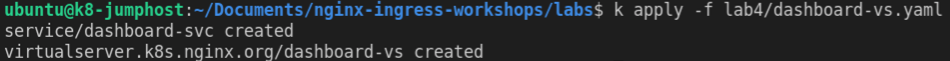

## Lab 4: Nginx Plus Dashboard access

## Introduction

In this section, you are going to use the NGINX Plus Dashboard to monitor both NGINX Ingress Controller as well as our backend applications. This is a great feature to allow you to watch and triage any potential issues with NGINX Ingress controller as well as any issues with your backend applications, for example, HTTP response times, healthcheck failures, status codes, TCP connections, SSL sessions, etc.

## Learning Objectives

- Deploy the Nginx Dashboard Service
- Test access to the Dashboard

### Deploy the Nginx Dashboard Service

We will deploy a `Service` and a `VirtualServer` resource to provide access to the NGINX Plus Dashboard for live monitoring.  NGINX Ingress [`VirtualServer`](https://docs.nginx.com/nginx-ingress-controller/configuration/virtualserver-and-virtualserverroute-resources/) is a [Custom Resource Definition (CRD)](https://kubernetes.io/docs/concepts/extend-kubernetes/api-extension/custom-resources/)used by NGINX to configure NGINX Server and Location blocks for NGINX configurations.


1. In the `lab4` folder, apply the `dashboard-vs.yaml` file to deploy a `Service` and a `VirtualServer` resource to provide access to the NGINX Plus Dashboard for live monitoring

    ```bash
    kubectl apply -f lab4/dashboard-vs.yaml
    ```
    

## Test access to the Dashboard

1. Open a new Chrome web browser tab, and click the Dashboard Bookmark, or directly open http://dashboard.example.com/dashboard.html

    

    You should see the same Nginx Plus Dashboard as the `kubectl port-forward` test we did in a previously. Now your dashboard is exposed outside of your cluster at http://dashboard.example.com/dashboard.html.  

    > **_Recommended:_** Leave this Dashboard Window open for the rest of the Workshop, you will refer to it often during later exercises.

    Congratulations! You have successfully configured your Ingress Controller for external access and the Nginx Plus Dashboard.  Next we will deploy some application services and start routing some traffic through Nginx Ingress.

**This completes this Lab.**

## References:

- [NGINX Plus Live Activity
  Monitoring](https://docs.nginx.com/nginx/admin-guide/monitoring/live-activity-monitoring)
- [NGINX Plus Dashboard example](http://demo.nginx.com)

### Authors
- Chris Akker - Technical Solutions Architect @ F5, Inc.
- Shouvik Dutta - Technical Solutions Architect @ F5, Inc.

-------------

Navigate to ([Lab5](../lab5/readme.md) | [Main Menu](../LabGuide.md))

