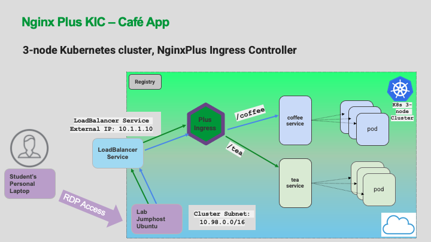
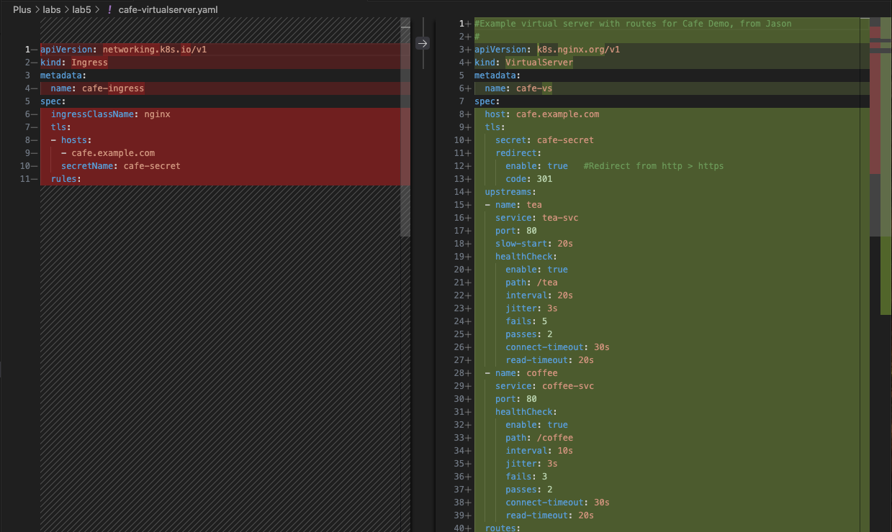

# Lab 5: Deploy the NGINX Cafe Ingress demo application, using manifests

<br/>

## Introduction

In this section, you will build the "Cafe" Ingress Demo, which represents a Coffee Shop website with Coffee and Tea applications. You will be adding the following components to your Kubernetes Cluster: **Coffee** and **Tea** `services`, `cafe-secret`, and `cafe ` `virtualserver`.

<br/>

## Learning Objectives

- Deploy the Cafe Demo app
- Compare VirtualServer and Ingress manifests
- Verify the URL path access to `/coffee` and `/tea` work correctly 
- Monitor the NGINX Plus Dashboard
- Verify the homepage redirect works correctly

<br/>

## Deploy the Cafe Demo app

The Cafe application that you will deploy looks like the following diagram below.  Coffee and Tea pods and services, with NGINX Ingress routing the traffic for `/coffee` and `/tea` routes, using the `cafe.example.com` Hostname, and with TLS enabled.  There is also a hidden third service - more on that later!



1. Deploy the Cafe application by applying the three manifests:

    ```bash
    kubectl apply -f lab5/cafe-secret.yaml
    kubectl apply -f lab5/cafe.yaml
    kubectl apply -f lab5/cafe-virtualserver.yaml
    ```

    ```bash
    ###Sample output###
    secret/cafe-secret created
    deployment.apps/coffee created
    service/coffee-svc created
    deployment.apps/tea created
    service/tea-svc created
    virtualserver.k8s.nginx.org/cafe-vs created
    ```

2. Check that all pods are running, you should see **three** Coffee and **three** Tea pods:

    ```bash
    kubectl get pods
    ```

    ```bash
    ###Sample output###
    NAME                      READY   STATUS    RESTARTS   AGE
    coffee-56b7b9b46f-9ks7w   1/1     Running   0             28s
    coffee-56b7b9b46f-mp9gs   1/1     Running   0             28s
    coffee-56b7b9b46f-v7xxp   1/1     Running   0             28s
    tea-568647dfc7-54r7k      1/1     Running   0             27s
    tea-568647dfc7-9h75w      1/1     Running   0             27s
    tea-568647dfc7-zqtzq      1/1     Running   0          27s
    ```

3. Check that the Cafe `VirtualServer` , **`cafe-vs`**, is running:

    ```bash
    kubectl get virtualserver cafe-vs
    ```

    ```bash
    ###Sample output###
    NAME      STATE   HOST               IP    PORTS   AGE
    cafe-vs   Valid   cafe.example.com                 4m6s
    ```

    **Note:** The `STATE` should be `Valid`.  If it is not, then there is an issue with your yaml manifest file `(cafe-vs.yaml)`.  You could also use `kubectl describe vs cafe-vs` to get more information about the `VirtualServer` we just created.

<br/>

## Compare VirtualServer and Ingress manifest

1. In the `lab5` folder, inspect the `cafe.yaml` manifest file.  Find the following configuration details:

    - **Question:** How many coffee and tea pods are we starting with?  

      <details><summary>Click for Hints!</summary>
        <br/>
        <p>
        <strong>Hint:</strong> Look for the number of replicas
        </p>
      </details>
  
    - **Question:** What are the two `Service` names ?  

      <details><summary>Click for Hints!</summary>
        <br/>
        <p>
        <strong>Hint:</strong>: Look for <code>kind: Service</code>
        </p>
      </details>

    

1. Now inspect the `cafe-virtualserver.yaml` file.

    - **Question:**  What is the hostname ?  

      <details><summary>Click for Hints!</summary>
        <br/>
        <p>
        <strong>Hint:</strong> Look for <code>host</code>
        </p>
      </details>

    - **Question:**  Are we using SSL ? If so, which certificate ?  

        <details><summary>Click for Hints!</summary>
          <br/>
          <p>
          <strong>Hint:</strong> Look for <code>tls</code>
          </p>
        </details>

    - **Question:**  Are healthchecks enabled ? 

        <details><summary>Click for Hints!</summary>
          <br/>
          <p>
          <strong>Hint:</strong> Look for <code>healthCheck</code>
          </p>
        </details>

    - **Question:** What URI paths are defined, routing to where ? 

        <details><summary>Click for Hints!</summary>
          <br/>
          <p>
          <strong>Hint:</strong> Look for <code>route</code>
          </p>
        </details>
        <br/>

    
    

1. Compare the `cafe-ingress.yaml` and `cafe-virtualserver.yaml` files.  How are they different?  Do you see, that the `virtualServer` definition has quite a few more options for controlling how traffic is routed to your Ingress and to your pods:

   You can make use of VSCode built-in **compare** tool as seen below: `Select the two files and then right-click Compare Selected:<br/>

    

    Do you see how many more options there are in a `VirtualServer` type over a community `Ingress` type?

    

1. Now inspect the `cafe-secret.yaml` which is the TLS self-signed certificate we are using for this lab.

  

<br/>

## Verify the URL path to `/coffee` and `/tea` work correctly 

1. Access the application using `curl`. We'll use the `-k` option to turn off certificate verification of our self-signed certificate:

  To get coffee:

  ```bash
  curl -k -I https://cafe.example.com/coffee 
  ```
  
  If you prefer tea:

  ```bash
  curl -k -I https://cafe.example.com/tea 
  ```

<br/>

## Monitor the NGINX Plus Dashboard

<br/>

1. Open two new Chrome web browser windows for side by side viewing.

     - Dashboard: http://dashboard.example.com/dashboard.html
     - And in two tabs, the Cafe Application components, Coffee
        (https://cafe.example.com/coffee) and  Tea
        (https://cafe.example.com/tea)

### Dashboard

Do you see any changes in the Plus Dashboard? Is `cafe.example.com` in the `HTTPZones` tab? In `HTTP Upstreams` tab do you see **three** coffee and **three** tea pod IP addresses?

The `Server Zones` table contains the Virtual Servers statistics of the Ingress, the HTTP Upstreams are the actual Pods running in Kubernetes which are being load balanced.

 


**Question:** Why the funny Upstreams name:  vs_default_cafe-vs_coffee ?

**Answer:**  The name follows a standardized format of `vs_namespace_virtualserver-name_service`.

<br/>

### Cafe App

1. Using the second Chrome web browser window, open tabs for both: 

    - Coffee - [https://cafe.example.com/coffee](https://cafe.example.com/coffee)
    - Tea - [https://cafe.example.com/tea](https://cafe.example.com/tea)  

    **Did you see an initial Chrome TLS Security warning ?** No problem, we are using a self-signed TLS certificate for this Lab and you can safely Proceed.

    

1. While watching the Dashboard, try refreshing the pages for Coffee and Tea several times:

   What do you see in the HTTP Upstreams?

   The **Requests** column should increment each time you refresh, and request are distributed in in a "round-robin" Load Balancing method

    

1. Check the `Server Name` and `Server Address` in the gray box of the Coffee and Tea webpage, it should change as you refresh. The `Server Name` is the Kubernetes assigned pod name, and the `Server Address` you see is the Pod's internal IP address, assigned by the cluster network.

   Do they match up with the Server IPs in the Dashboard? 

1. Verify the [`Endpoint`](https://kubernetes.io/docs/concepts/services-networking/service/) addresses, with `kubectl` commands that shows you the details of Coffee and Tea `Service`:

    Describe Coffee Service:

    ```bash
    kubectl describe svc coffee-svc
    ```

    ```bash
    ###Sample output###
    Name:              coffee-svc
    Namespace:         default
    Labels:            <none>
    Annotations:       <none>
    Selector:          app=coffee
    Type:              ClusterIP
    IP Families:       <none>
    IP:                None
    IPs:               <none>
    Port:              http  80/TCP
    TargetPort:        80/TCP
    Endpoints:         192.168.2.92:80,192.168.27.18:80,    192.168.49.193:80
    Session Affinity:  None
    Events:            <none>
    ```

    Describe Tea Service:

    ```bash
    kubectl describe svc tea-svc
    ```

    ```bash
    ###Sample output###
    Name:              tea-svc
    Namespace:         default
    Labels:            <none>
    Annotations:       <none>
    Selector:          app=tea
    Type:              ClusterIP
    IP Families:       <none>
    IP:                None
    IPs:               <none>
    Port:              http  80/TCP
    TargetPort:        80/TCP
    Endpoints:         192.168.24.186:80,192.168.37.136:80,   192.168.9.236:80
    Session Affinity:  None
    Events:            <none>
    ```

    As you can see above, the Service `Endpoints` attribute should match the Server IPs in the dashboard.

<br/>

## Verify the homepage redirect works correctly

What happens if you try just plain  http://cafe.example.com? It should redirect you to TLS secured https://cafe.example.com/coffee.

1. Open Chrome Developer Tools: Right Click on the wepage and select `Inspect`.

    

1. Inspect the HTTP Headers: Open the `Network` Tab > view `Headers`.

    

1. Try [https://cafe.example.com/milk](https://cafe.example.com/milk)

    **Question:** What just happened and why?

    <details><summary>Click for Hints!</summary>
    <br/>
    <p>
    <strong>Hint:</strong> Check your <code>cafe-virtualserver.yaml</code> file.<br/>
    <strong>Answer:</strong> Welcome to NGINX Plus NIC Workshop!!<br/>
    </p>
    </details><br/>

    

<br/>

*Now, let's throw some traffic at your Cafe Ingress!*

**This completes this Lab.*

<br/>

## References:

- [NGINX Ingress Controller Complete
  Example](https://github.com/nginxinc/kubernetes-ingress/tree/master/examples/complete-example)

<br/>

### Authors

- Chris Akker - Solutions Architect - Community and Alliances @ F5, Inc.
- Shouvik Dutta - Solutions Architect - Community and Alliances @ F5, Inc.

-------------

Navigate to ([Lab6](../lab6/readme.md) | [Main Menu](../LabGuide.md))
