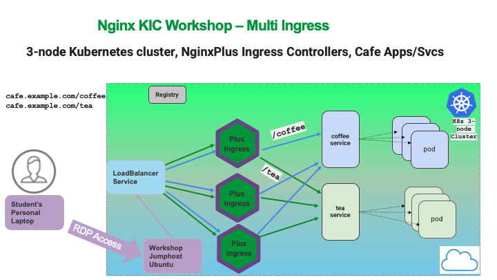

# Lab 7: NGINX Ingress Controller High Availability and Enhanced Logging

## Introduction

In Production Kubernetes clusters, it is important to have High Availability for the Ingress Controllers, just like any traditional load balancer, and the pods themselves.  NGINX Ingress Controllers can be added and removed just like application pods.  

It is considered a Best Practice to have **at least three Ingress Controllers** for Production workloads running in the cluster.  This will provide a very solid High Availability foundation for managing production traffic.

It is also helpful to development and operations teams to see granular details about the traffic to and from the services and pods.  NGINX Plus has the capability to provide many details to gain insight into these traffic flows, using additional logging variables.

## Learning Objectives

- Scaling NGINX Ingress Controller
- Seeing Ingress Under the Hood
- Configuring Enhanced Logging

## Scaling NGINX Ingress

Next, let's scale the number of Ingress Controllers pods from one to **three**. This will provide High Availability, and also increase performance and capacity.

1. Run the following `kubectl scale` command:

    ```bash
    kubectl scale deployment nginx-ingress -n nginx-ingress --replicas=3
    ```

1. To see the newly created NGINX Plus Ingress Controller pods run the following command in the `nginx-ingress` namespace:

    ```bash
    kubectl get pods -n nginx-ingress
    ```

    You should see **three** NGINX Plus Ingress Controller pods running

    ```bash
    ###Sample Output###
    NAME                             READY   STATUS       RESTARTS   AGE
    nginx-ingress-55c78c65d7-9hwdf   1/1     Running      0          33s
    nginx-ingress-55c78c65d7-kxrb5   1/1     Running      0          33s
    nginx-ingress-55c78c65d7-q8kmp   1/1     Running      0          2d23h
    ```

    **Questions:**
     - What happened to your `WRK` loadtest traffic on the Dashboard ?
     - Did it drop by approximately 1/3rd.  Why?

        <details><summary>Click for Hints!</summary>
          <br/>
          <p>
            <strong>Answer</strong>: there are now <strong>three Ingress Controllers</strong>, each taking 1/3rd of the traffic from the LoadBalancer Service, out in front of all 3 Ingress Controllers.  The incoming traffic to the first Ingress Controller is now equally shared with 2 new Ingress Controllers. <br/>

            Refer to the topology diagram of this lab's Multi-Ingress deployment:
          </p>

          
        </details><br/>

1. Now scale the number of NGINX Plus Ingress Controllers up to **four**, in anticipation of a surge of traffic from an overnight Digital Marketing campaign for *free coffee=free caffeine*. Run the following `kubectl scale` command:

   ```bash
   kubectl scale deployment nginx-ingress -n nginx-ingress --replicas=4
   ```

   ```bash
   kubectl get pods -n nginx-ingress
   ```

   ```bash
    ###Sample Output###
    NAME                             READY   STATUS       RESTARTS   AGE
    nginx-ingress-55c78c65d7-9hwdf   1/1     Running      0          5m
    nginx-ingress-55c78c65d7-k47f7   1/1     Running      0          3s
    nginx-ingress-55c78c65d7-kxrb5   1/1     Running      0          5m
    nginx-ingress-55c78c65d7-q8kmp   1/1     Running      0          2d23h
    ```

    What do you observe?

   **Food for thought** - With most Cloud providers, you could use AutoScaling to do this automatically!

1. The Marketing push is over, so scale the Ingress Controllers back down to **one**. Run the following `kubectl scale` command:

    ```bash
    kubectl scale deployment -n nginx-ingress nginx-ingress --replicas=1
    ```

    ```bash
    kubectl get pods -n nginx-ingress
    ```

    ```bash
    ###Sample Output###
    NAME                             READY   STATUS         RESTARTS   AGE
    nginx-ingress-55c78c65d7-9hwdf   0/1     Terminating        0          6m
    nginx-ingress-55c78c65d7-k47f7   0/1     Terminating        0          88s
    nginx-ingress-55c78c65d7-kxrb5   0/1     Terminating        0          6m
    nginx-ingress-55c78c65d7-q8kmp   1/1     Running            0          2d23h
    ```

## Ingress Under the Hood

1. Let's take peek under the hood – check out the NGINX Plus Ingress Controller Configurations. Run the following commands to view the NGINX Configuration:

    ```bash
    # Store the NIC Pod name in a variable
    export NIC=$(kubectl get pods -n nginx-ingress -o jsonpath='{.items[0].metadata.name}')

    # Check the full NGINX config
    kubectl exec -it $NIC -n nginx-ingress -- nginx -T
    ```

    **Inspect the output:** `nginx -T` prints out the entire NGINX configuration. Scroll up and down - do you see:

    - `server` block
    - the `listen` ports
    - `café.example.com` Hostname
    - `TLS` configurations
    - `upstream blocks` with Pod IPs
    - the `least_time` or `round-robin` load balancing method  

    This is all standard NGINX Plus under the hood, it should look very familiar.

## Enhanced Logging with NGINX Plus Ingress

The Marketing Team has open a P1 ticket, complaining about **slow website response time** during the Free Coffee promotion.  Let's add some additional fields to the NGINX Access Log, you need more data about the performance of the **coffee** and **tea** pods for Developers.  The free coffee campaign was quite popular but customer feedback was the website was too slow -arghh!

For reference, this is the default NGINX Access Log format:
  
```bash
log_format main $remote_addr - $remote_user [$time_local] $request $status $body_bytes_sent $http_refererm $http_user_agent $http_x_forwarded_for;
```

However, there are only **two** log variables with any useful data related to the actual pods:

- HTTP status code (`$status`)
- Bytes Sent (`$body_bytes_sent`)

1. Use the `kubectl log` command, to view the default NGINX Plus Ingress Controller Access log format:

    ```bash
    kubectl logs $NIC -n nginx-ingress --tail 10 --follow
    ```

    

    How do you even know *which `pod`* sent the response? To properly troubleshoot and identify the poor performance of a pod, you need much more information.

1. Type `Control-C` to stop the log `tail` when finished.

1. Lets implement an **Enhanced** Access Log format, to collect extra NGINX Plus Request and Response and pod statistics, we can do this by adding new log variables specifc to NGINX Plus Ingress such as the Kubernetes pods' resource and traffic details.

    NGINX Plus has many variables that can be used for logging. In the code snippet below
    (`lab7/nginx-config-enhanced-logging.yaml`), you can see the new **Enhanced** Access Log format for the NGINX Plus Ingress Controller, as a `ConfigMap`:

      ```yaml
      kind: ConfigMap
      apiVersion: v1
      metadata:
        name: nginx-config
        namespace: nginx-ingress
      data:
        lb-method: "least_time last_byte"
        log-format:  '$remote_addr - $remote_user [$time_local] "$request" $status $body_bytes_sent "$http_referer" "$http_user_agent" "$http_x_forwarded_for" rn="$resource_name" "$resource_type" "$resource_namespace" svc="$service" "$request_id" rt=“$request_time” ua=“$upstream_addr” uct="$upstream_connect_time" uht="$upstream_header_time" urt="$upstream_response_time" uqt=“$upstream_queue_time“ cs=“$upstream_cache_status“'
      ```

      Taking advantage of the additional logging variables from NGINX Plus will provide detailed insight into which upstream pods are working the best, and which are having issues.  This should help the app dev team to identify the slow pods and further help in their troubleshooting steps.

1. Apply the **Enhanced** Access Log format (`lab7/nginx-config-enhanced-logging.yaml`) manifest using the `kubectl apply` command:

    ```bash
    kubectl apply -f lab7/nginx-config-enhanced-logging.yaml
    ```

    ```bash
    ###Sample Output###
    configmap/nginx-config configured
    ```

1. Let's generate new traffic by refreshing the `cafe.example.com/coffee` webpage in the Chrome web browser several times, to send some requests, to see the new **Enhanced** Access Logging format.

    Now we are ready to inspect the the new logs: the Pod's HTTP Header and Response times have been added to the log format, in addition to the pod's actual Kubernetes name. The response time values in the log should be similar to what you observed in the Plus Dashboard.

1. Take a look at the **Enhanced** NGINX Access log format using the `kubectl log` command:

    ```bash
    kubectl logs $NIC -n nginx-ingress --tail 10 --follow
    ```

    

1. Type`Control-C` to stop the log  `tail` when finished.

   Hopefully, using this additional logging information will help pinpoint issues with various pods, and allow the Developers to improve the performance of their applications.

**This completes this Lab.**

## References

- [Summary of ConfigMap Keys - logging](http://docs.nginx.com/nginx-ingress-controller/configuration/global-configuration/configmap-resource/#logging)
- [NGINX Variables](http://nginx.org/en/docs/varindex.html)

### Authors

- Chris Akker - Solutions Architect - Community and Alliances @ F5, Inc.
- Shouvik Dutta - Solutions Architect - Community and Alliances @ F5, Inc.

-------------

Navigate to ([Lab8](../lab8/readme.md) | [Main Menu](../LabGuide.md))
