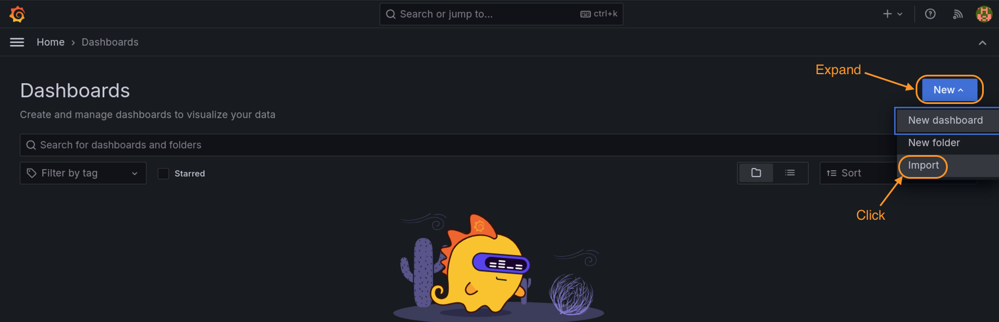

# Monitoring NGINX Plus Ingress with Prometheus and Grafana    

## Introduction

This lab exercise is going to walk you through how to install and use several tools to monitor your NGINXPlus Ingress Controller in your Kubernetes cluster. 

## Learning Objectives 

By the end of the lab, you will be able to: 

- Learn and Use Helm Charts
- Deploy Prometheus using Helm
- Deploy Grafana using Helm
- Access these apps thru NGINX Ingress Controller

<br/>

Helm | Prometheus | Grafana
:-------------------------:|:-------------------------:|:-------------------------:
  |  |

<br/>

Here is a brief description of what these different tools and application provide, and how you will use them.

`Helm` will make it simple to install everything into your cluster. This keeps the setup easier to deploy and easier to manage.  (Note, you can also install using the `manifests` method or `operator` method as well). It will come down to personal preference or specific requirements when installing software into Kubernetes.  You will use the Helm Chart provided by NGINX for this lab exercise.

`Prometheus` is a software package that can watch and collect statistics from many different k8s pods and services.  It then provides those statistics in a simple html/text format, often referred to as the "scraper page", meaning that it scrapes the statistics and presents them as a simple text-based web page.

`Grafana` is a data visualization tool, which contains a time series database and graphical web presentation tools.  Grafana imports the Prometheus scraper page statistics into it's database, and allows you to create `Dashboards` of the statistics that are important to you.  There are a large number of pre-built dashboards provided by both Grafana and the k8s community, so there are many available to use. And of course, you can customize them as needed or build your own.

<br/>

### Helm Installation


**Note:** Helm should already be installed on the Ubuntu Jumpbox for you.

1. Verify Helm is installed and you are running Version 3.x or higher:

    ```bash
    # check your helm version (Needs to be v3 or higher)
    helm version --short
    ```
    

    If Helm is not installed, run this command to install it:

    ```bash
    # Install helm command
    curl -sSL https://raw.githubusercontent.com/helm/helm/master/scripts/get-helm-3 | bash
    ```

1. Create a new Kubernetes namespace called `monitoring`. You will use this namespace for Prometheus and Grafana components:

    ```bash
    kubectl create namespace monitoring
    ```
    

    <br/>

### Prometheus Installation


<br/>

1. The first step will be to deploy `Prometheus` into our cluster. Below are the steps to install it using Helm as follows:  

    ```bash
    helm repo add prometheus-community https://prometheus-community.github.io/helm-charts

    helm repo add kube-state-metrics https://kubernetes.github.io/kube-state-metrics

    helm repo update
    ```

    

1. Once the repos have been added to Helm, the next step is to deploy a `release`. For this lab, you will create a release called `nginx-prometheus`.   

    ```bash
    helm install nginx-prometheus prometheus-community/prometheus --set server.persistentVolume.enabled=false,alertmanager.persistentVolume.enabled=false -n monitoring
    ```
    

    <br/>

### Grafana Installation


<br/>

1. Next step will be to setup and deploy Grafana into your cluster: 

    ```bash
    helm repo add grafana https://grafana.github.io/helm-charts
    ```

    

1. The Grafana repo is added via Helm. Next you will install Grafana using the below command. For this lab, you will create a second release called `nginx-grafana`.  

    ```bash
    helm install nginx-grafana grafana/grafana -n monitoring
    ```

    

    If you want to check the status of your helm installations, you can run this command which will show all helm deployments across the cluster"

    ```bash
    helm ls -A
    ```

    

    <br/>

### Testing the NGINX Plus Prometheus "scraper" Port and Page

<br/>

Verify that NGINX Plus NIC is enabled for exporting Prometheus statistics.  This requires 3 settings:

- Prometheus `Annotations` are enabled
- Port `9113` is open
- The Plus command-line argument `- -enable-prometheus-metrics` is enabled, to allow the collection of the NIC's statistics on that port.

**!Bonus!** - These settings have already been enabled for you in this lab, but they are `not` enabled by default.  

To see these settings, inspect the `lab2/nginx-plus-ingress.yaml` file, lines 15-17, 33-34, and 68.

Annotations | Port  | Plus Args
:-------------------------:|:-------------------------:|:-------------------------:
 | |


1. Now verify this is enabled and working, using k8s port-forward:

    ```bash
    kubectl port-forward -n nginx-ingress $NIC 9113:9113
    ```

    Open Chrome, and navigate to http://localhost:9113/metrics.  You should see an HTML scraper page like this one:

    
    

    If you see an HTML page from NGINX NIC similar to the one above, you are good to go.  If you refresh this page several times, you will see that the stats are immediately updated.  Notice that there is a `# TYPE and # HELP` in the scraper page entries, which describes the data type and definition of each metric.

    <br>

    > It is important to point out, that the scraper page contains `all` of the NGINX Plus statistics that you see on the Dashboard, and a few extras.

    >> **This rich set of metrics will provide a great data source for the monitoring and graphing of NGINX Plus NIC.**

    <br/>

    There are many tools that can collect, display, alert, and archive these metrics.  You will use Prometheus and Grafana next to do just that.<br/>
    Press `Control + C` to stop the port-forward when you are finished with the scraper page.

    <br/>

### Prometheus Testing


<br/>

1. To test Prometheus you will run this command to create a shell variable for the Prometheus Server:

    ```bash
    export PROMETHEUS_SERVER=$(kubectl get pods --namespace monitoring -l "app.kubernetes.io/name=prometheus,app.kubernetes.io/component=server" -o jsonpath="{.items[0].metadata.name}")
    ```

1. Use k8s port-forward to test access to the Prometheus Server:

    ```bash
    kubectl port-forward $PROMETHEUS_SERVER 9090:9090 -n monitoring 
    ```

    Using Chrome, navigate to http://localhost:9090.  You should see a webpage like this.  Search for `nginx_ingress_` in the query box to see a list of all the statistics that Prometheus is collecting for you:

    

    Select `nginx_ingress_nginxplus_http_requests_total` from the list, click on Graph, and then click the "Execute" Button.  This will provide a graph similar to this one:

    

    Take a few minutes to explore the many  different statistics, time windows, etc.

    <br/>

### Optional Prometheus Exercise

<br/>

1. Create a Prometheus graph showing the `nginxplus HTTP upstream response time` from the pods.  This should match the upstream response time values you see in the NGINX Plus Dashboard.

    Can you find where the pod `CPU stats` are recorded ?  As you can see, there are hundreds of stats you can use to monitor NGINX NIC, k8s components, pods, and other resources.

    Press `Control + C` to stop port-forward when you are finished.

<br/>

### Grafana Testing


<br/>

1. Retrieve the Grafana admin login password, which was dynamically created by Helm during the installation:

    ```bash
    kubectl get secret --namespace monitoring nginx-grafana -o jsonpath="{.data.admin-password}" | base64 --decode ; echo
    ```

1. To test Grafana, set a shell variable to the Grafana Server to the name of the Grafana pod:

    ```bash
    export GRAFANA_SERVER=$(kubectl get pods --namespace monitoring -l "app.kubernetes.io/name=grafana,app.kubernetes.io/instance=nginx-grafana" -o jsonpath="{.items[0].metadata.name}")
    ```

1. Use k8s port-forward:

    ```bash
    kubectl -n monitoring port-forward $GRAFANA_SERVER 3000:3000  
    ```

1. Using Chrome, navigate to http://localhost:3000 on your browser.

    You can login into Grafana using `admin` and the `password` retrieved above.

    

    After logging in, you should see the main Grafana Welcome page:

    

    You will be creating and using some custom Grafana Dashboards in the next sections.

    Press `Control + C` to stop port-forward when you are finished.

    <br/>

### NGINX Ingress for Prometheus and Grafana

<br/>

For you and your team to access Prometheus and Grafana from outside the cluster, you will add these apps to your existing NGINX Ingress Controller. In your lab environment, you will use VirtualServer and VirtualServerRoute manifests, to take advantage of NGINX's ability to do cross-namespace routing.  (Prometheus and Grafana are running in the "monitoring" namespace, remember?).  

1. Inspect the `prometheus-vs.yaml`, `grafana-vs.yaml` and `grafana-vsr.yaml` files in the lab8 folder.

    Notice that you are routing requests to your Prometheus and Grafana applications that live in a different namespace (`monitoring` in this lab), which are specified in your `VirtualServer/VirtualServerRoute` configuration.

1. Apply the VS manifests:

    ```bash
    kubectl apply -f lab8/prometheus-vs.yaml
    kubectl apply -f lab8/grafana-secret.yaml
    kubectl apply -f lab8/grafana-vs.yaml
    kubectl apply -f lab8/grafana-vsr.yaml
    ```

    

    <br/>


1. To test access through NGINX Ingress, open Chrome and navigate to Prometheus (http://prometheus.example.com) and Grafana (https://grafana.example.com) bookmarks. 


Prometheus | Grafana
:-------------------------:|:-------------------------:
  |

Try another Prometheus query that interests you.

<br/>

You can login to Grafana using the same admin/password credentials that you used earlier.

<br/>

### Configure Grafana Data Sources

1. Once logged in, from the left panel you need to click on `Configuration -> Data sources` and add `Prometheus` as a data source.

    

1. Once `Prometheus` is added as a data source, in the Prometheus `settings` tab, update the HTTP URL to `http://nginx-prometheus-server:80`.

    

    Scroll to the botton, and click "Save and Test", it should show a Green Checkmark status and then click the "Back" button.

### Import Grafana Custom Dashboards

1. Now you should be ready to import the NGINX Dashboards for NIC from NGINX, Inc. From the left panel click on `Import` to add the dashboard:

    

1. Next you will import the two Grafana dashboard JSON definition files present in the `lab8` folder.

   - `NGINX-Basic.json` gives you basic metrics which come from NGINX Opensource.
   - `NGINXPlusICDashboard.json` is provided by NGINX, Inc, giving you advanced Layer 4 thru 7 TCP/HTTP/HTTPS metrics which are only available from NGINX Plus.

    Copy the entire json file and place it within the  `Import via panel json` textbox and click on `Load` button.

    

    <br/>

2. Once you have imported both Dashboards, it's time to check them out:

    From the Grafana homepage, navigate to the `General` section as shown:

    

    In the `General` section, click on the `NGINX` dashboard.

    

    This should open up the NGINX 
    Basic Grafana Dashboard. You can expand the sub-sections or adjust the `time range` and `refresh` interval in the upper right corner as needed.  You can see this shows the up/down Status of the Ingress, and few Connections and Requests stats:

    

    **NOTE:** If you see a red bar with the message "**No Data**" in the top most pane as seen in below screenshot then click on edit, and change Value options Fields to "Numeric Fields" and click Apply.

    

    
    
    <br/>

3. Next, from the `General` section, select the `NGINX Plus Ingress Controller` Dashboard.

    

    This should open up the NGINX Plus Grafana Dashboard. You can expand the sub-sections or adjust the time range and refresh time as needed.

    

    If the graphs are blank or do not show much data, try restarting the loadtest tool from the previous lab, you should see some statistics being collected and graphed after a few minutes:

    ```bash
    docker run --rm williamyeh/wrk -t4 -c200 -d20m -H 'Host: cafe.example.com' --timeout 2s https://10.1.1.100/coffee
    ```

    

    <br/>

**This completes this Lab.**

<br/>

-------

## References:

- [VirtualServer and VirtualServerRoute](https://docs.nginx.com/nginx-ingress-controller/configuration/virtualserver-and-virtualserverroute-resources/)

- [Grafana NGINX Plus IC Dashboard](https://github.com/nginxinc/kubernetes-ingress/tree/master/grafana)

### Authors
- Chris Akker - Solutions Architect - Community and Alliances @ F5, Inc.
- Shouvik Dutta - Technical Solutions Architect @ F5, Inc.
- Jason Williams - Principle Product Management Engineer @ F5, Inc.


-------------

Navigate to ([Lab9](../lab9/readme.md) | [Main Menu](../LabGuide.md))