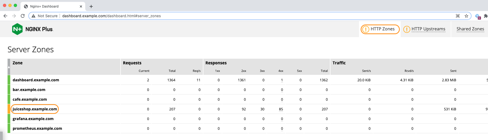
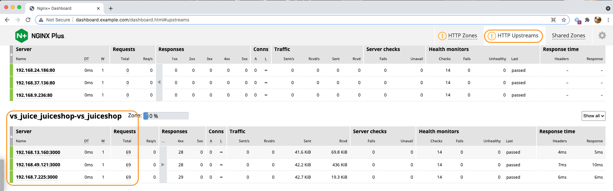
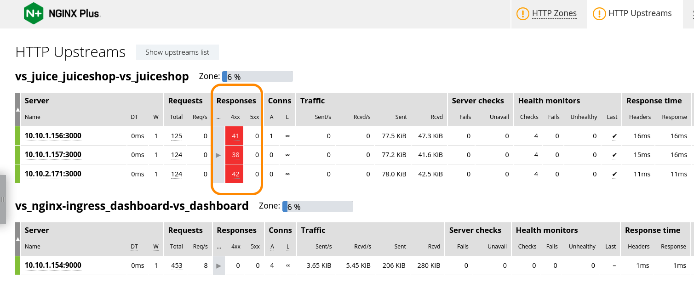
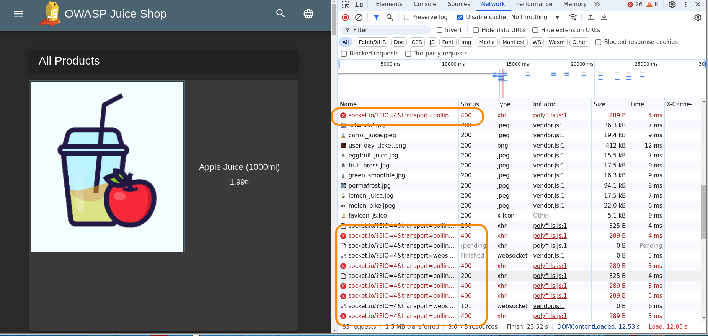
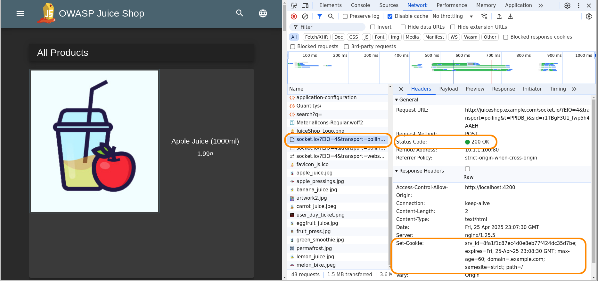

## Lab 9: Deploy JuiceShop application, using VS/VSR manifests ##

In this lab, we deploy a new application, leaving the current Cafe and Bar apps up and running. This new app environment is deployed using NGINX Plus VirtualServer/VSRroute manifests.

<br/>

## Learning Objectives 

By the end of the lab, you will be able to: 

- Create a new Kubernetes namespace
- Deploy and test a new application
- Access this new app thru NGINX Ingress Controller
- Troubleshoot and fix the 400 errors

<br/>


<br/>

You will launch a new application, called `Juice Shop`, representing a modern online retail sales app, a nice refeshing addition to Cafe and Bar. It will be deployed in a new Kubernetes namespace called "juice" in your cluster.  The Juice Shop app is often used to test various HTTP and Website vulnerabilities. However, you will use it to test various NGINX Plus features.

1. Inspect both of the Lab9 Juiceshop YAML files, `juiceshop.yaml`, and `juiceshop-vs.yaml`.  Do you see the deployment, service, and virtual server and route definitions?  

1. Next deploy the JuiceShop namespace, application using these manifests:

    ```bash
    kubectl create namespace juice
    ```

    ```bash
    ###Sample Output###
    namespace/juice created
    ```

    ```bash
    kubectl apply -f lab9/juiceshop.yaml
    kubectl apply -f lab9/juiceshop-vs.yaml
    ```

    ```bash
    ###Sample Output###
    deployment.apps/juiceshop created
    service/juiceshop-svc created
    secret/juice-secret created
    virtualserver.k8s.nginx.org/juiceshop-vs created
    ```

1. Show running Juice components:

    ```bash
    kubectl get pods,svc,vs -n juice -o wide
    ```
    
    ```bash
    ###Sample Output###
    NAME                             READY   STATUS    RESTARTS   AGE    IP               NODE   NOMINATED NODE   READINESS GATES
    pod/juiceshop-55bb4899cf-h4vpj   1/1     Running   0          2m2s   192.168.44.93    k8s3   <none>           <none>
    pod/juiceshop-55bb4899cf-m9qg9   1/1     Running   0          2m2s   192.168.35.215   k8s2   <none>           <none>
    pod/juiceshop-55bb4899cf-r866z   1/1     Running   0          2m2s   192.168.15.52    k8s3   <none>           <none>

    NAME                    TYPE        CLUSTER-IP   EXTERNAL-IP   PORT(S)   AGE    SELECTOR
    service/juiceshop-svc   ClusterIP   None         <none>        80/TCP    2m3s   app=juiceshop

    NAME                                       STATE   HOST                    IP    EXTERNALHOSTNAME   PORTS   AGE
    virtualserver.k8s.nginx.org/juiceshop-vs   Valid   juiceshop.example.com                                    2m1s
    ```

1. Test the new Juice Shop application and VS/VSR manifests.

    Open Chrome, navigate to (http://juiceshop.example.com).  Click around for a few minutes to explore the application.

    Did you notice, how easy it was with Plus NIC, to launch a completely new application in just a few seconds?  With just 2 YAML manifest files - and `no IT tickets` required to do this?  NGINX NIC can perform the Layer7 Hostname and path routing for many different applications running in your Kubernetes cluster.

    

1. Check the NIC Plus Dashboard, you should see a new JuiceShop HTTP Zone and Upstreams:

    

    

<br/>

### Oh NO - HTTP 400 Errrrrrors - you hate those

<br/>

As you watch the NIC Plus Dashboard, you notice some `yellow` and `red` highlighting, indicating some issues...you see some 400 errors, just randomly showing up.  Those are really annoying, because the error messages don't really tell you anything about what the problem is.  `HTTP 400 Bad Request` ... not helpful!



**Time for troubleshooting!!** Roll up your sleeves - Open Chrome Dev Tools (Right+Click and select Inspect, then choose the Network tab).  Hit Refresh a couple times ... what objects are coming back with 400 errors?  Can you figure out what's going on?  What is `socket.io/?EIO` ???  Maybe you have heard of it, maybe not.



After some chin scratching, hair pulling, and discussions with co-workers, you decide on consultation with Google, Stack Overflow, perhaps Reddit and other websites and forums. *You come to the possibility that Persistence is required.*  If you don't know, the term `Persistence` refers to the networking concept of a temporary association between a client and a server.  When you insert a Load Balancer with multiple backend servers between the client and the server, you must provide a method to maintain that client-server association.  

>This association is commonly called `persistence` or `affinity` or `sticky`, depending on the vendor.  In NGINX terms, it is called `persistence`, but the NGINX directive is `sticky`.

1. Inspect the manifest `lab9/juiceshop-vs-cookie.yaml`, lines 16-24.  You will see that `session sticky cookie` is enable, and is set for 1 minute.  It is set low intentionally in this lab for testing purposes, you would likely set this to an hour or longer, depending on your application requirements.

    ```yaml
    ...snip

    sessionCookie:
        enable: true
        name: srv_id            # this is the name of the cookie
        path: /
        expires: 1m             # expiration timer
        domain: .example.com
        httpOnly: false
        # secure: true
        samesite: strict

    ...snip

    ```

1. Go ahead and apply this updated Juiceshop VirtualServer manifest with `sticky cookie` enabled.

    ```bash
    kubectl apply -f lab9/juiceshop-vs-cookie.yaml

    ```

    Verify the Nginx Ingress Controller accepted your new configuration:

    ```
    kubectl get vs juiceshop-vs -n juice

    ```

    ```bash
    ## Sample output ##
    NAME           STATE   HOST                    IP           PORTS      AGE
    juiceshop-vs   Valid   juiceshop.example.com   10.1.1.100   [80,443]   27m

    ```

    NOTE: If the STATE does not say `Valid`, there is an issue with your manifest and you must correct it.

1. Using the same Chrome browser with Dev Tools, try Refresh a couple times.  Do the 400 errors for `socket.io` go away?

1. Click on one of the `socket.io objects`, can you find the `srv_id cookie`, and what is the expiration time set to?

    

1. Check your NIC Plus Dashboard as you Refresh Juiceshop, what do you see?

    The cookie persist should be working, and all of your requests should now be going to just `ONE` of the Juiceshop upstream servers.   If you wait longer than a minute, and try again, you might get load balanced and stick to one of the other two upstream servers.

Congratulations, you have now fixed the 400 errors, using your keyboard and wits and NGINX sticky cookies!

**This completes this Lab.**

## References:

- [NGINX sticky](https://docs.nginx.com/nginx/admin-guide/load-balancer/http-load-balancer/#enabling-session-persistence)
- [NGINX VirtualServer / Route](https://docs.nginx.com/nginx-ingress-controller/configuration/virtualserver-and-virtualserverroute-resources/)

- [JuiceShop Demo Source](https://github.com/bkimminich/juice-shop)

### Authors

- Chris Akker - Solutions Architect - Community and Alliances @ F5, Inc.
- Shouvik Dutta - Solutions Architect - Community and Alliances @ F5, Inc.

-------------

Navigate to ([Lab10](../lab10/readme.md) | [Main Menu](../LabGuide.md))
