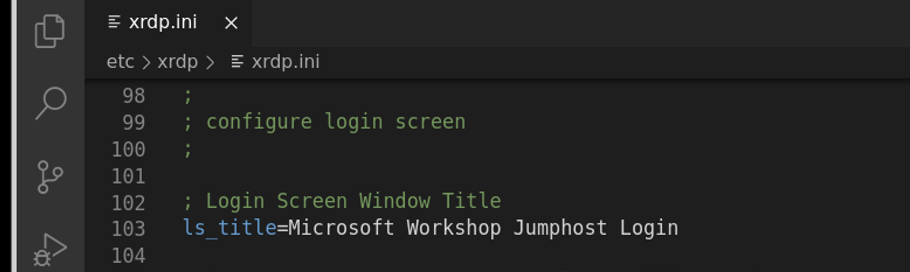

## UDF Configuration and Settings for Nginx Plus KIC Workshop - add all UDF environment setup and configuration notes here:

**Note** Check the expiration of the NginxPlus Repo crt/key that was used to create the Ingress image:

```bash
openssl x509 -enddate -noout -in nginx-repo.crt
```

## Build a (new) NGINX Ingress image
- Webshell or SSH to the k8s Master UDF component.  This is the easiest, as the container registry is also located on the k8s Master.
- follow normal KIC build procedures, like

Git clone, checkout, etc.
- cd into `kubernetes-ingress` directory
- copy nginx-repo .crt and .key file as required to build a new KIC image
- type `git checkout vX.Y.Z`
- type `make build debian-image-plus PREFIX=registry:5000/nginx-kic:1.12.0`
- type `docker push registry:5000/nginx-kic:1.12.0`
- Update `nginx-plus-ingress.yaml` deployment file in the lab2 folder to use local registry and (new) image name.

## UDF Local Container Registry, on k8s Master Node

- is running in a container on the K8s Master node, on port 5000.

- To query the registry:

```
curl http://localhost:5000/v2/_catalog
curl http://localhost:5000/v2/nginx-kic/tags/list
```

- Other useful commands to pull, tag and push other images to local registry

```
docker tag nginx:latest registry:5000/nginx:latest
docker push registry:5000/nginx:latest
```

### Process to "Customize" the udfmaster Blueprint for a dedicated "branded" customer, partner, or technical event Workshop.

There are several components that can easily be changed on the Ubuntu Jumphost in the `udfmaster` Blueprint, and then Nominated as a new Blueprint with a custom name for your custom environment.  Do NOT change the `udfmaster` BluePrint and Nominate it, it will NOT be approved.

- Customize the Ubuntu Desktop background:  

  Copy a 1980x1080 .jpg or .png file to the Jumphost Pictures folder, and change the background to this new graphic file.  Desktops with dark gray or black backgrounds will look the best, light colors will not look good.  Smaller sized backgrounds will create borders and not look good, so a full-sized HD image is best.
  
- Customize the name of the Visual Studio workspace, and the Desktop icon.

  Just set the VSCode workspace exactly how you want it to look - the size, windows, layout, terminal.  Then save as a Workspace with a new name on the Ubuntu Desktop.  Delete the previous workspace icon. 

- Customize the XRDP Login Window on the Ubuntu Jumphost.  The `/etc/xrdp/xrdp.ini` file controls the settings for the xrdp daemon.  Make a backup copy of this file, and you can change the "ls_title", located on line #103 of the xrdp.ini file.  Do not make any other changes.

| xrdp.ini | XRDP Login |
|----------|------------|
| |  |


- Customize the password used for XRDP Login.  This is set using the `passwd` Linux command, while connected as the ubuntu user.  Do not add or change additional users or passwords, you will likely break other things.

## Steps to "clean" the UDF Blueprint before Nominating a new version

- The goal is to start with a "clean" Ubuntu desktop client, and a clean k8s cluster.

- Remove the 3 Helm repos:  Prometheus, Kube Metrics, and Grafana

```bash
helm repo remove prometheus-community
helm repo remove kube-state-metrics
helm repo remove grafana
```

- Delete the command history from the Ubuntu bash shell:

```bash
rm .bash_history
```

- Verfiy that the Ingress Controller is set for round-robin.  Use the lab2/nginx-config.yaml file if needed.

```bash
kubectl describe cm nginx-config -n nginx-ingress
```


Note:  I have noticed that you must run this command twice before the history is actually deleted!

- Remove all of the k8s namespaces, deployments, services, pods, configmaps, secrets, ingresses, virtualservers, and virtualserverroutes used for labs 1-10.  
**Leave the nginx-ingress namespace, with ingress controller running, all Nginx CRDs, and the LoadBalancer Service running.**

- If you updated any lab content in VScode, and pushed it with GIT - you must clean up after yourself, do not leave GIT username/passwords/tokens on the Jumphost!

### TODO Items - Jason Williams

Document the LoadBalancer Service yaml file here, it's missing ?

Document the deployment steps for MetalLB here.

- Install metallb
kubectl apply -f https://raw.githubusercontent.com/metallb/metallb/v0.10.2/manifests/namespace.yaml
   73  kubectl apply -f https://raw.githubusercontent.com/metallb/metallb/v0.10.2/manifests/metallb.yaml

- Create a metallb folder

- Apply the config map
kubectl apply -f metallb-cm.yaml

Document the updated LoadBalancer Service yaml file here, it's missing ?

- Apply the Loadbalancer YAML ( Is this updated for Metal LB ? )
kubectl apply -f /service/loadbalancer.yaml
