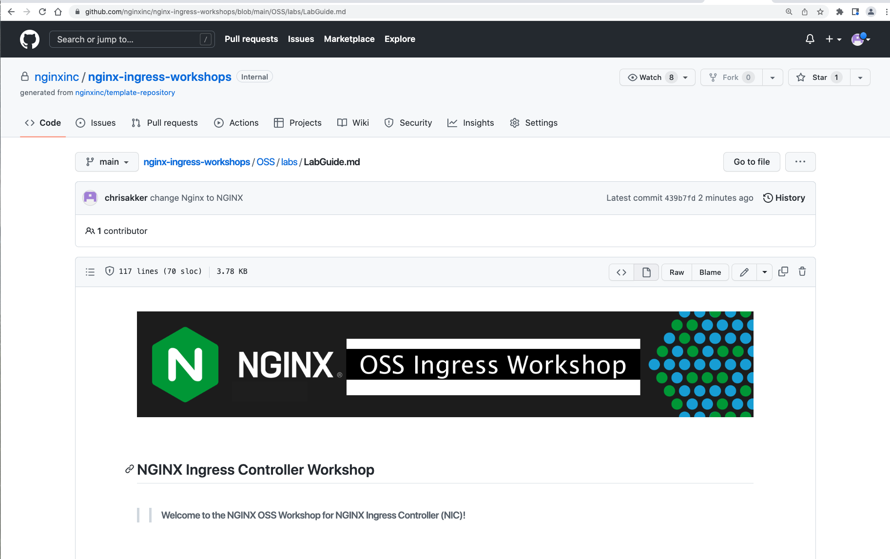
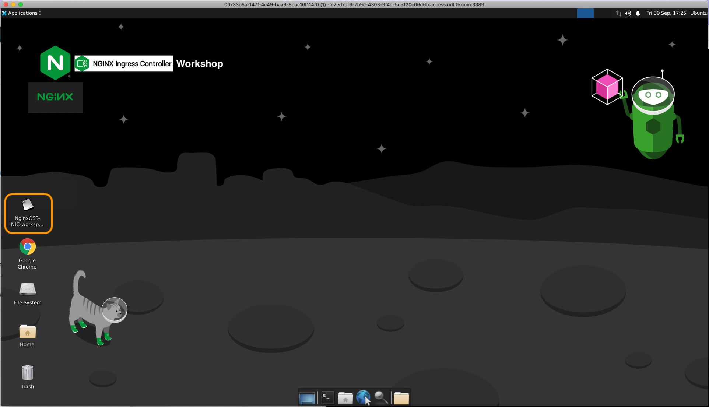
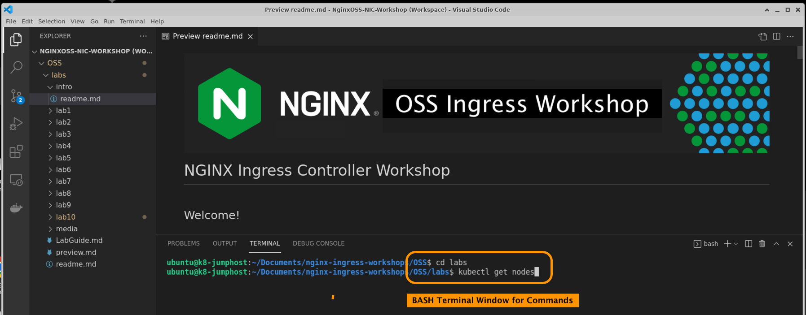
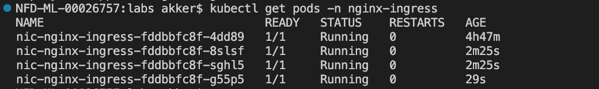

# Lab 1: Rancher Deskstop and Nginx Ingress Installation

## Introduction

<br/>

During Part1 of this Rancher Master Class Series, you have installed and configured the following:

- Rancher Desktop for Mac (Windows version coming soon)
- Configure Rancher Desktop resources
- Customize the Rancher Desktop networking
- Install and Configure MetalLB
- Deploy and test a Loadbalancer Service
- Deploy Nginx OSS Ingress Controller with Helm


The Full Master Class Part 1 documentation can be found here.  You MUST complete Part1, before you can do the lab exercises in Part 2.


<br/>

## Learning Objectives 

By the end of the lab, you will be able to: 

- Understand the components of the Workshop environment
- Open the LabGuide doc in a browser

- Open VisualStudio Workspace
- Ready to start the Workshop labs

<br/>


1. Locate Chrome on the Ubuntu Desktop, and launch Chrome.  It should have this LabGuide open as the default Website.  If not, you can find the LabGuide on the Bookmarks Bar.

   > For reference, the LabGuide can be found on GitHub at:

   https://github.com/nginxinc/nginx-ingress-workshops/blob/main/OSS/labs/LabGuide.md

   

1. After you have logged into the Jumphost, open `Nginx OSS NIC Workshop Workspace` to launch VScode in the workshop project directory.

   > You will be running all the lab exercises in VS Code and its built-in bash Terminal to run commands like `kubectl`, `curl`, `docker` and much more.

   >> Important!  Change the Terminal commandline path to **`"nginx-ingress-workshop/OSS/labs"`** - all the Lab Exercises are run from this directory.

   

1. Open the VScode Bash Terminal for the bottom pane, if it is not already open:

   

1. Using the VScode Terminal (the bottom pane), go ahead a try a `kubectl` command, such as `kubectl get nodes`:

   ```bash
   kubectl get nodes
   ```


      

      Verify your Kubernetes Cluster is up and all Nodes are in the "Ready" state:

      

      **NOTE:** If your nodes are not showing in `Ready` status then please inform your instructor.

<br/>

**This completes this Lab.**

### Authors
- Chris Akker - Solutions Architect - Community and Alliances @ F5, Inc.
- Shouvik Dutta - Solutions Architect - Community and Alliances @ F5, Inc.

-------------

Navigate to ([Lab2](../lab2/readme.md) | [Main Menu](../LabGuide.md))
