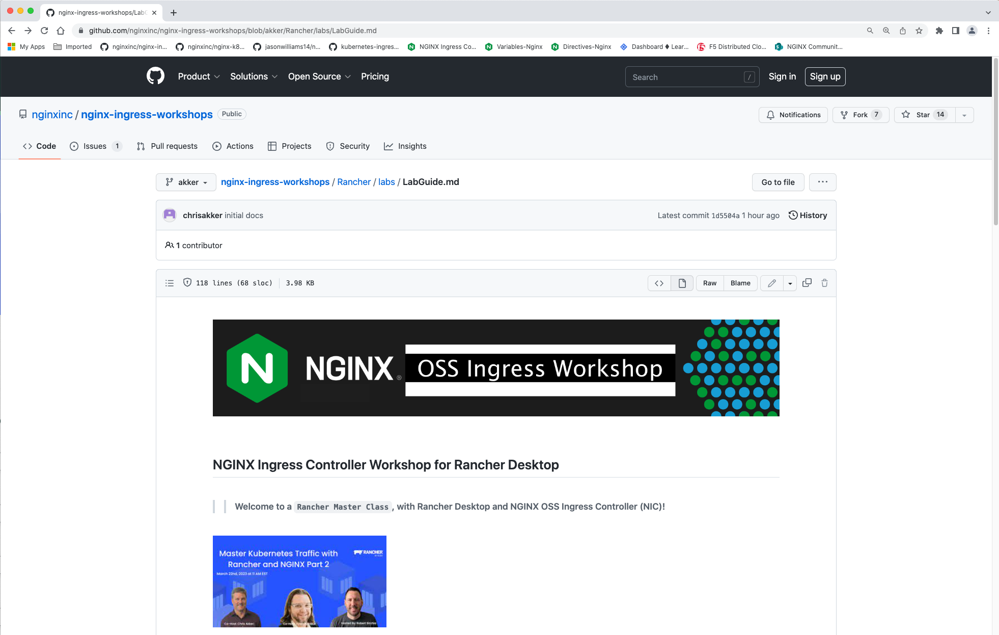
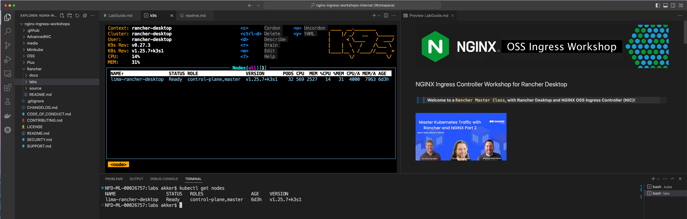
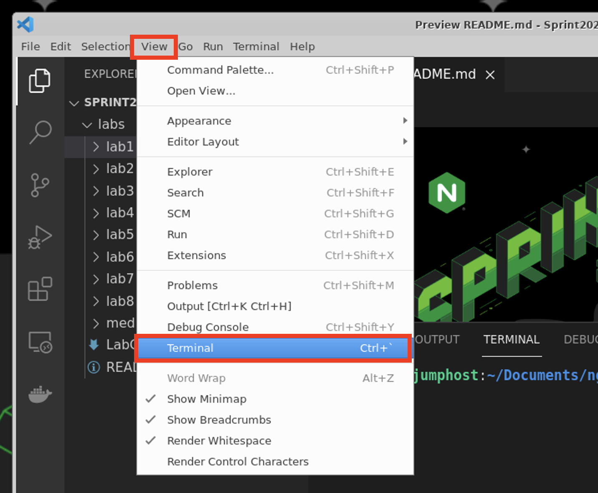

# Lab 1: Rancher Deskstop and Nginx Ingress Installation

## Introduction

<br/>

During Part1 of this Rancher Master Class Series, you installed and configured the following:

- Rancher Desktop for Mac (Windows version coming soon)
- Configure Rancher Desktop resources
- Customize the Rancher Desktop networking
- Install and Configure MetalLB
- Deploy a Loadbalancer Service with External-IP
- Deploy Nginx OSS Ingress Controller with Helm


The complete Rancher Master Class Part 1 documentation can be found here.  You MUST complete Part1, before you can do the lab exercises in Part 2.

Link to Rancher Master Class Part 1 - [Master Class Part1](Rancher/docs/rdt/readme.md)

Video of Rancher Master Class Part 1:  https://more.suse.com/master-kubernetes-traffic-rancher-NGINX-part1.html


<br/>

## Learning Objectives 

By the end of the lab, you will be able to: 

- Understand the components of the Workshop environment
- Open the LabGuide doc in a browser
- Open VisualStudio and k9s
- Ready to start the Workshop labs

<br/>

1. Open the LabGuide which be found on GitHub at:

   https://github.com/nginxinc/nginx-ingress-workshops/blob/main/Rancher/labs/LabGuide.md

   

1. Open Visual Studio Code, and prep the layout as follows, (or your preferences).

   > You will be running all the lab exercises in VS Code and its built-in bash Terminal to run commands like `kubectl`, `curl`, `nerdctl` and much more.

   >> Important!  Change the Terminal commandline path to **`"nginx-ingress-workshop/Rancher/labs"`** - all the Lab Exercises are run from this directory.

   

1. Open the VScode Bash Terminal for the bottom pane, if it is not already open:

   

1. Using the VScode Terminal (the bottom pane), go ahead a try a `kubectl` command, such as `kubectl get nodes`:

   ```bash
   kubectl get nodes
   ```

      Verify your Kubernetes Cluster is up and the Rancher lima Node in the "Ready" state:

      

      **NOTE:** If your Node is not showing in `Ready` status, you must fix it before proceeding.

<br/>

**This completes this Lab.**

### Authors
- Chris Akker - Solutions Architect - Community and Alliances @ F5, Inc.
- Shouvik Dutta - Solutions Architect - Community and Alliances @ F5, Inc.

-------------

Navigate to ([Lab2](../lab2/readme.md) | [Main Menu](../LabGuide.md))
