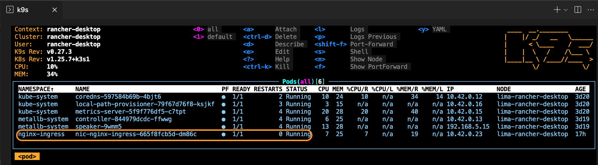
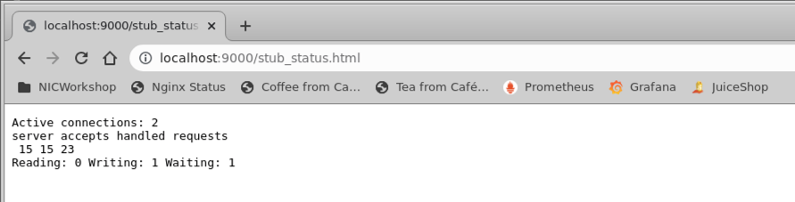
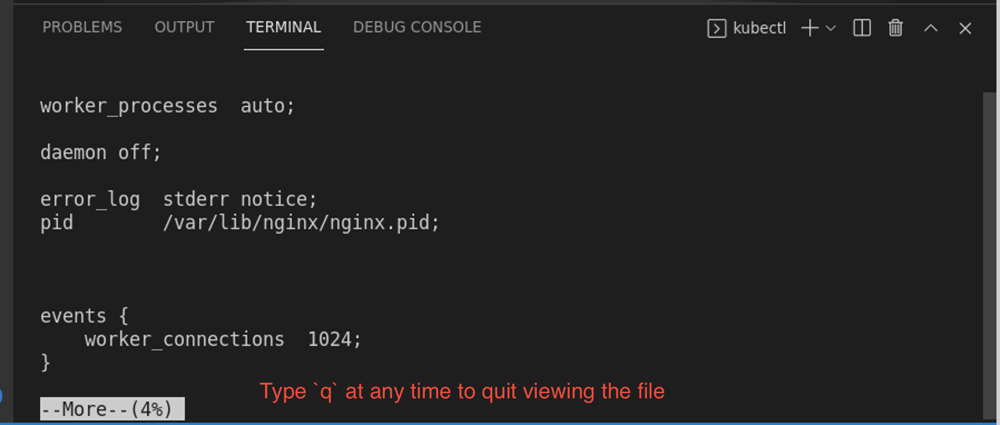
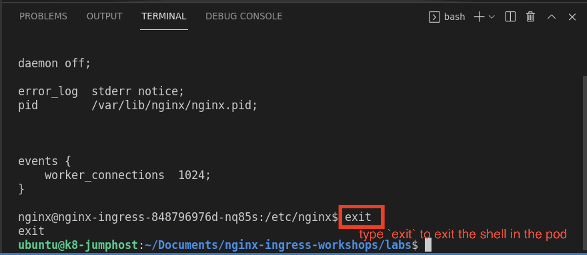

# Lab 2: Verify NGINX Ingress Controller is running

## Introduction

The NGINX Ingress Controller is already running in this workshop. You will be checking and verifying the Ingress Controller is running properly.

<br/>

## Learning Objectives 
- Deploy Nginx Ingress with Helm Values file
- Intro to NGINX Ingress Controller
- Intro to Kubernetes environment, interacting with `kubectl` command
- Access the NGINX Stub Status Page

<br/>

## Deploy Nginx Ingress with Helm Values file

At the end of Rancher Master Class Part 1, you deployed Nginx Ingress using a Helm CLI command.  However, you will need to use additional advanced features of Nginx for Master Class Part 2, this workshop.  To enable these, your Helm installation will be re-deployed using a `Helm VALUES` yaml file, which is an easy way to configure / re-configure Nginx Ingress.  Helm and the helm values.yaml file will become the `source of truth` for how Nginx Ingress is deployed and configured using Helm.

1. Inspect the `lab2/lab2_values.yaml` file.  You will see that we are defining some customPorts, and adding a custom ConfigMap so you can customize Nginx configurations.

1. List the current Helm releases running:

   ```bash
   helm ls -A
   ```

1. Remove the existing Nginx Ingress Controller Helm deployment.  This example follows the Master Class Part 1, helm release name "nic":

   ```bash
   helm uninstall nic -n nginx-ingress
   ```

1. Re-deploy the Nginx Ingress Controller, using the Values file:

```bash
helm install nic -n nginx-ingress -f lab2/lab2_values.yaml
```

## Check your Ingress Controller

1. First, verify the NGINX Ingress controller is up and running correctly in the Kubernetes cluster:

   ```bash
   kubectl get pods -n nginx-ingress
   ```

   ```bash
   # Should look similar to this...
   NAME                            READY   STATUS    RESTARTS   AGE
   nic-nginx-ingress-fd4b9f484-t5pb6   1/1     Running   1          12h
   ```

   Or, check your k9s window, make sure nic-nginx-ingress-xxxx-yyyy is running.

   

2. Instead of remembering the unique pod name, `nic-nginx-ingress-xxxxxx-xxxx`, you can store the Ingress Controller pod name into the `$NIC` variable to be used throughout the labs.

   **Note:** This variable is only valid for the duration of the terminal session, and so if you close the terminal it will be lost. At any time you can refer back to this step to create the `$NIC` variable once again.

   **Note**: You must use the `kubectl` "`-n`" switch, followed by the namespace's name, to see resources that are not in the default namespace.

   ```bash
   export NIC=$(kubectl get pods -n nginx-ingress -o jsonpath='{.items[0].metadata.name}')
   ```

   Verify the variable is set correctly.
   ```bash
   echo $NIC
   ```
   **Note:** If this command doesn't show the name of the pod then run the previous command again.

<br/>

## Inspect the details of your Ingress Controller:

1. Inspect the details of the NGINX Ingress Controller pod using the `kubectl describe` command

   ```bash
   kubectl describe pod $NIC -n nginx-ingress
   ```

   **Observe:** The IP address and TCP ports that are open on the Ingress. Verify you have the following listening Ports:

   * Port `80 and 443` for http/s traffic,
   * Port `8081` for Readiness, 
   * Port `9000` for the Stub Status, and 
   * Port `9113` for Prometheus (You will see this in a later Lab)

   

<br/>

## Check the NGINX Stub Status Page

1. Using Kubernetes [port-forwarding](https://kubernetes.io/docs/tasks/access-application-cluster/port-forward-access-application-cluster/), see if stub status is running on port `9000`. Using the VScode terminal pane, run the following `kubectl port-forward` command:

   ```bash
   kubectl port-forward -n nginx-ingress $NIC 9000:9000
   ```

1. Now open Chrome web browser to view the NGINX Stub Status webpage, at http://localhost:9000/stub_status.html. 

   

   Do you see the NGINX Stub Status Page? If so, your Ingress Controller pod is up and running!  Hit Refresh a few times, the counters should increment.

1. Close the Chrome Web Browser, and hit `Ctrl-C` in the terminal to stop the Port Forward.

   

<br/>

### Take a look "under the hood" of Ingress Controller

The NGINX Ingress Controller is a pod running NGINX Proxy under the hood, let's go check it out.

1. Use the VScode Terminal to enter a shell to the NGINX Ingress Controller pod by running the [`kubectl exec`](https://kubernetes.io/docs/tasks/debug-application-cluster/get-shell-running-container/) command 

   ```bash
   kubectl exec -it $NIC -n nginx-ingress -- /bin/bash
   ```

1. Once inside a shell in the NGINX Ingress Controller pod, run the following commands to inspect the NGINX configuration:

   ```bash
   cd /etc/nginx
   more nginx.conf
   ```

   If you have worked with NGINX config files, it should look very familiar.

1. Type `q ` to quit viewing the `nginx.conf `

   

1. Type `exit` to close the connection to the Ingress pod.

   

<br/>

**This completes this Lab.**

## References:

- Nginx Ingress:  https://docs.nginx.com/nginx-ingress-controller
- Installation with Manifests:  https://docs.nginx.com/nginx-ingress-controller/installation/installation-with-manifests/
- Installation with Helm:  https://docs.nginx.com/nginx-ingress-controller/installation/installation-with-helm/


### Authors
- Chris Akker - Solutions Architect - Community and Alliances @ F5, Inc.
- Shouvik Dutta - Solutions Architect - Community and Alliances @ F5, Inc.

-------------
Navigate to ([Lab3](../lab3/readme.md) | [Main Menu](../LabGuide.md))
