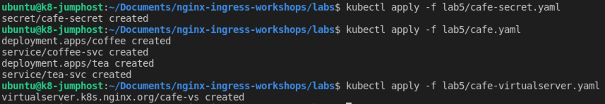
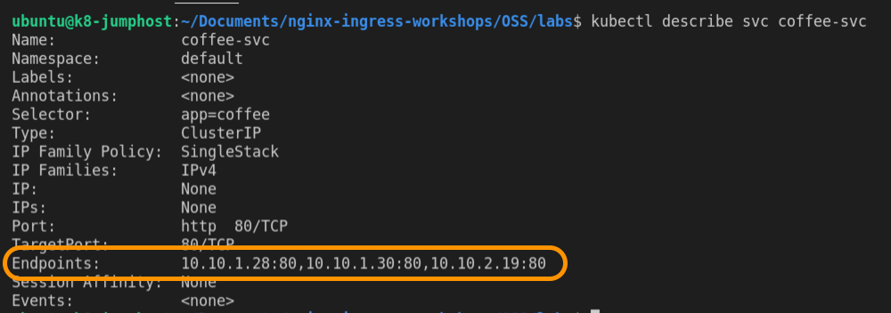
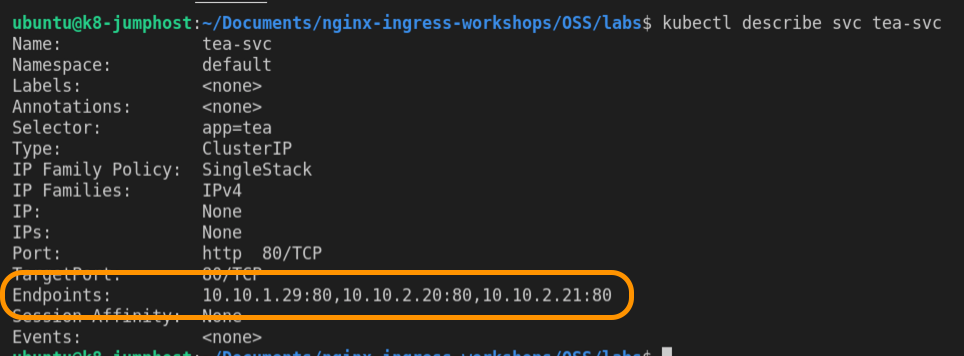
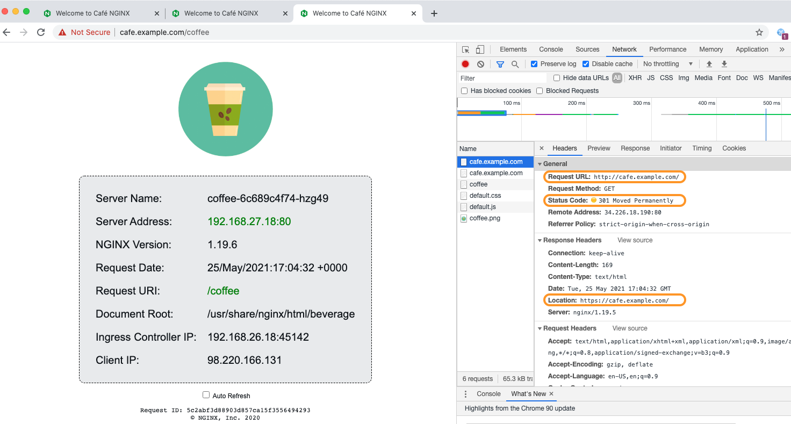
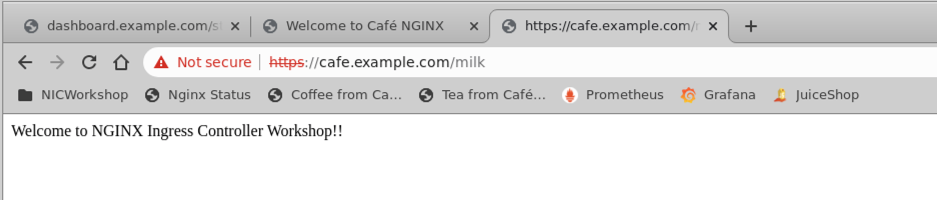

# Lab 5: Deploy the NGINX Cafe Ingress Demo application, using manifests

## Introduction

In this section, you will build the "Cafe" Ingress Demo, which represents a Coffee Shop website with simple Coffee and Tea applications. You will be adding the following components to your Kubernetes Cluster:
 - **coffee** and **tea** `services`
 - `cafe-secret` for TLS
 - `cafe ` `virtualserver`

<br/>

## Learning Objectives
- Deploy the Cafe Demo app
- Inspect the Cafe Manifests and CRDs
- Verify the URL request path routing to `/coffee` and `/tea` work correctly
- Verify TLS self-signed cert is working 
- Verify the homepage redirect works correctly
- Monitor the NGINX Stub Status page

<br/>

## Deploy the Cafe Demo app

The Cafe application that you will deploy looks like the diagram below.  Coffee and Tea pods and services, with NGINX Ingress routing the traffic for `/coffee` and `/tea` routes, using the `cafe.example.com` Hostname, and with TLS enabled.  There is also a hidden third service - more on that later!


1. Deploy the Cafe application by applying the three manifests:

    ```bash
    kubectl apply -f lab5/cafe-secret.yaml
    kubectl apply -f lab5/cafe.yaml
    kubectl apply -f lab5/cafe-virtualserver.yaml

    ```
    

1. Check that all pods are running, you should see `three` Coffee and `three` Tea pods:

    ```bash
    kubectl get pods
    ```
    
    or
    
  

1. Check that the Cafe `VirtualServer` , **`cafe-vs`**, is running:

    ```bash
    kubectl get virtualserver cafe-vs
    ```
    

    **Note:** The `STATE` should be `Valid`.  If it is not, then the STATE would show Invalid, and there is likely an issue with your manifest yaml file `(cafe-vs.yaml)`.  You could also use `kubectl describe vs cafe-vs` to get more information about the `VirtualServer` you just created.

<br/>

## Inspect the VirtualServer CRD for Cafe

1. In the `lab5` folder, inspect the `cafe.yaml` manifest file.  Find the following configuration details:

  * **Question:** How many coffee and tea pods are we starting with?  

    <details><summary>Click for Hints!</summary>
      <br/>
      <p>
      <strong>Hint:</strong> Look for the number of replicas
      </p>
    </details>
  * **Question:** What are the two `Service` names ?  

    <details><summary>Click for Hints!</summary>
      <br/>
      <p>
      <strong>Hint:</strong> Look for <code>kind: Service</code>
      </p>
    </details>

  

  Inspect the `cafe-virtualserver.yaml` manifest file.

  * **Question:**  What is the hostname ?  

    <details><summary>Click for Hints!</summary>
      <br/>
      <p>
      <strong>Hint:</strong> Look for <code>host</code>
      </p>
    </details>
  * **Question:**  Are we using SSL ? If so, which certificate ?  

    <details><summary>Click for Hints!</summary>
      <br/>
      <p>
      <strong>Hint:</strong> Look for <code>tls</code>
      </p>
    </details>
  * **Question:**  Are Healthchecks enabled ? 

    <details><summary>Click for Hints!</summary>
      <br/>
      <p>
      <strong>Hint:</strong> Look for <code>healthCheck.  Active Healthchecks are an NGINX Plus feature, so they are commented out here.</code>
      </p>
    </details>
  * **Question:** What URI paths are defined, routing to where ? 

    <details><summary>Click for Hints!</summary>
      <br/>
      <p>
      <strong>Hint:</strong> Look for <code>route</code>
      </p>
    </details><br/>

  
  

2. Now inspect the `cafe-secret.yaml` which is the TLS self-signed certificate we are using for this lab.

  

<br/>

## Verify the URL path to `/coffee` and `/tea` work correctly 

1. Access the application using `curl`. You'll use the `-k` option to turn off certificate verification of our self-signed certificate:

  ``` bash
  # To get coffee:
  curl -k -I https://cafe.example.com/coffee 
  ```
  ```bash    
  # If your prefer tea:
  curl -k -I https://cafe.example.com/tea 
  ```
  You should have received HTTP 200 Responses to both curl requests.

  

<br/>

## Monitor the NGINX Stats Page

<br/>

1. Open two new Chrome web browser windows for side by side viewing.
     
     -  Dashboard: http://dashboard.example.com/stub_status.html:
     -  And in the second browser, open two tabs, the Cafe Application components, Coffee
        (https://cafe.example.com/coffee) and  Tea
        (https://cafe.example.com/tea)

<br/>

### Cafe App

1. Using the second Chrome web browser window, open tabs for both: 
    
    - Coffee - [https://cafe.example.com/coffee](https://cafe.example.com/coffee)
    - Tea - [https://cafe.example.com/tea](https://cafe.example.com/tea)  

    **Did you see an initial Chrome TLS Security warning ?** No problem, we are using a self-signed TLS certificate for this Lab and you can safely Proceed.

    

1. At the bottom of the /coffee page, enable the Auto Refresh.  Go back to the Stats page, try refreshing it several times:

   Do you see some changes in the number of connections and requests counters?

   `Yes` - Every time you refresh the stub_status page, it will show you the most recent server statistics from NGINX.


1. Verify the [`Endpoint`](https://kubernetes.io/docs/concepts/services-networking/service/) addresses, with `kubectl` commands that shows you the details of Coffee and Tea `Service`:

    ```bash
    # Describe Coffee Service 
    kubectl describe svc coffee-svc

    # Describe Tea Service 
    kubectl describe svc tea-svc
    ```
    The `Service Endpoints` should match the `Server IPs` in the Coffee and Tea web pages as it Refreshes:

     
    

    Your Endpoint IPs should match the /coffee and /tea webpage `Server Address` field, and as you refresh, you should see the IPs change in round-robin fashion.  
    
    >Your Ingress is load balancing the requests among the three pods behind each Service!

<br/>

## Verify the homepage redirect works correctly

What happens if you try unsecured  http://cafe.example.com? It should redirect you to TLS secured https://cafe.example.com/coffee.

1. Verify the Redirect - Open Chrome Developer Tools, then Right Click on the wepage and select `Inspect`.

    

1. Inspect the HTTP Headers: Open the `Network` Tab > view `Headers`. 

    

1. Try [https://cafe.example.com/milk](https://cafe.example.com/milk)

    **Question:** Say - What just happened and why?

    <details><summary>Click for Hints!</summary>
    <br/>
    <p>
    <strong>Hint:</strong> Check your <code>cafe-virtualserver.yaml</code> file.<br/>
    <strong>Answer:</strong> /milk returns: Welcome to NGINX Ingress Controller Workshop!!<br/>   
    </p>
    </details><br/>

      


<br/>

**This completes this Lab.** 

*Next, let's throw some traffic at your Cafe Ingress!*


## References: 

- [NGINX Ingress Controller Complete
  Example](https://github.com/nginxinc/kubernetes-ingress/tree/master/examples/complete-example)

### Authors
- Chris Akker - Solutions Architect - Community and Alliances @ F5, Inc.
- Shouvik Dutta - Solutions Architect - Community and Alliances @ F5, Inc.

-------------

Navigate to ([Lab6](../lab6/readme.md) | [Main Menu](../LabGuide.md))

