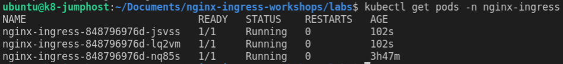
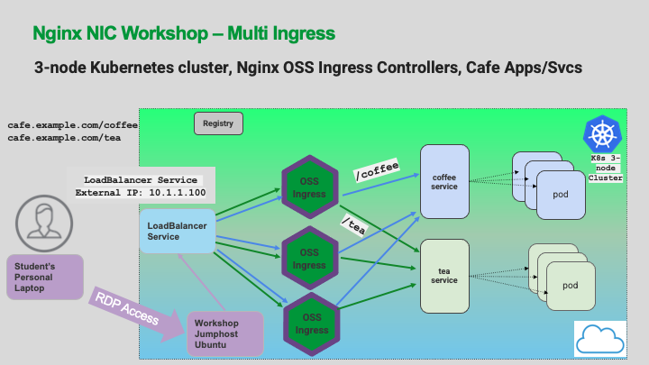
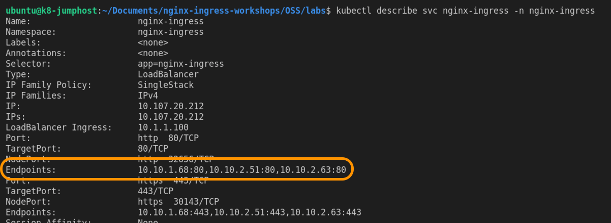
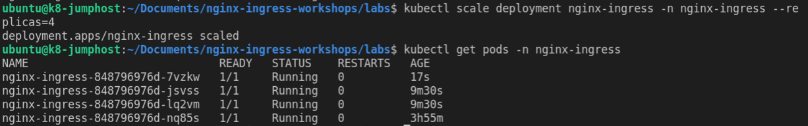
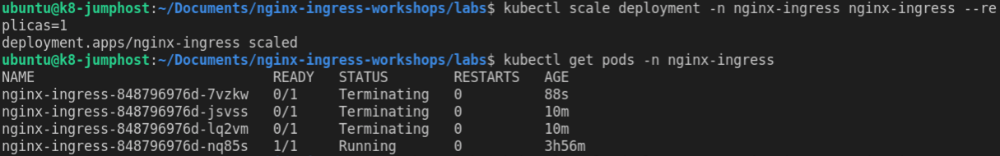
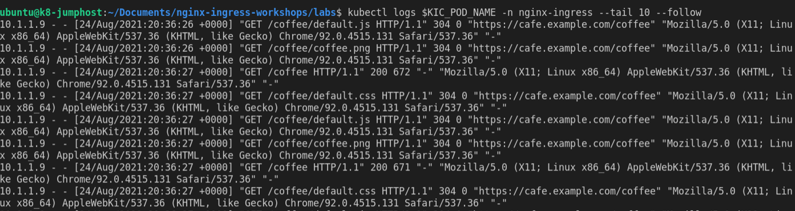
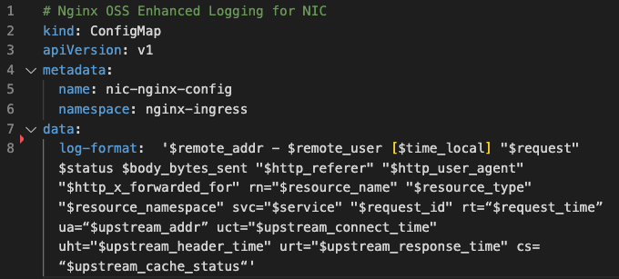
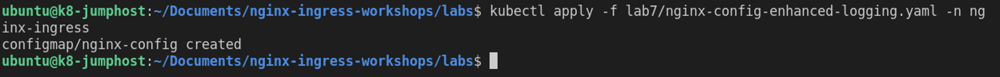
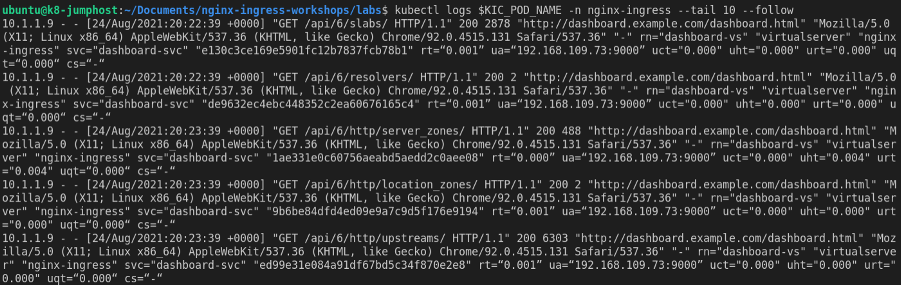

## Lab 7: NGINX Ingress Controller High Availability and Enhanced Logging

## Introduction

In Production Kubernetes clusters, it is important to have High Availability for the Ingress Controllers, just like any traditional load balancer, and the pods themselves.  NGINX Ingress Controllers can be added and removed just like application pods.  

It is considered a Best Practice to have **at least three Ingress Controllers** for Production workloads running in the cluster.  This will provide a very solid High Availability foundation for managing production traffic.

It is also helpful to development and operations teams to see granular details about the traffic to and from the services and pods.  NGINX has the capability to provide many details to gain insight into these traffic flows, using additional logging variables.

<br/>

## Learning Objectives

- Scaling NGINX Ingress Controller
- Seeing Ingress Under the Hood
- Configuring Enhanced Logging

<br/>

## Scaling NGINX Ingress

Next, let's scale the number of Ingress Controllers pods from one to **three**. This will provide High Availability, and also increase performance and capacity.

1. Run the following `kubectl scale` command:

    ```bash
    kubectl scale deployment nic-nginx-ingress -n nginx-ingress --replicas=3
    ```

1. To see the newly created NGINX Ingress Controller pods run the following command in the `nginx-ingress` namespace:

    ```bash
    kubectl get pods -n nginx-ingress
    ```

    You should see **three** NGINX Ingress Controller pods running

    

    **Questions:** 
     - What happened to your `WRK` loadtest traffic on the Dashboard ?
     - Did it drop by approximately 1/3rd.  Why?

    <details><summary>Click for Hints!</summary>
      <br/>
      <p>
        <strong>Answer</strong>: there are now <strong>three Ingress Controllers</strong>, each taking 1/3rd of the traffic from the LoadBalancer Service, out in front of all 3 Ingress Controllers.  The incoming traffic to the first Ingress Controller is now equally shared with 2 new Ingress Controllers. <br/> 

        Refer to the topology diagram of this lab's Multi-Ingress deployment:
      </p>
      
      

      To verify this, check the `nginx-ingress` Service, there are now 3 Endpoints, which map to the 3 IPs of the Ingress Controllers.

      ```bash
      kubectl describe svc nginx-ingress -n nginx-ingress
      ```

      

    </details><br/>

1. Now scale the number of NGINX Ingress Controllers up to **four**, in anticipation of a surge of traffic from an overnight Digital Marketing campaign for *free coffee=free caffeine*. Run the following `kubectl scale` command:

   ```
   kubectl scale deployment nic-nginx-ingress -n nginx-ingress --replicas=4
   ```

   Then,

   ```bash
   kubectl get pods -n nginx-ingress
   ```

   

    What do you observe about the traffic?  You can restart the wrk load tool if you like.

   **Food for thought** - With most Cloud providers, you could use AutoScaling to do this automatically!

1. The Marketing push is over, so scale the Ingress Controllers back down to **one**. Run the following `kubectl scale` command:

    ```bash
    kubectl scale deployment nic-nginx-ingress -n nginx-ingress --replicas=1
    ```

    Then,

    ```bash
    kubectl get pods -n nginx-ingress
    ```
    

<br/>

## Ingress Under the Hood

1. Now that you have several apps up and running on your Ingress, let's take a deep look under the hood – check out the NGINX Ingress Controller configuration. Run the following commands to view the NGINX Configuration:

    Store the NIC Pod name in a variable
    
    ```bash
    export NIC=$(kubectl get pods -n nginx-ingress -o jsonpath='{.items[0].metadata.name}')
    ```

    Then,
    
    Check the full NGINX config
    
    ```bash
    kubectl exec -it $NIC -n nginx-ingress -- nginx -T
    ```

    **Inspect the output:** `nginx -T` prints out the entire NGINX configuration. Scroll up and down - do you see:

    - `server` blocks
    - the `listen` ports 
    - `café.example.com` Hostname
    - `TLS` configurations 
    - `upstream blocks` with Pod IPs
    - `location blocks` with URI paths 
    - the `least_conn` or `round-robin` load balancing directive
    - the `HTTP > HTTPS` redirect  

    This is all standard NGINX under the hood, it should look very familiar.

<br/>

## Enhanced Logging with NGINX Ingress


<br/>

The app developers are asking you to help fix an **"application too slow"** escalation ticket from the Marketing team - ugh!!  The "free coffee" campaign was popular - but customer feedback was that the website was too slow. Let's add some additional fields to the NGINX Access Log, you need much more data about the performance of the **coffee** and **tea** pods for the Developers.  

For reference, this is the default NGINX Access Log format:
  
```bash
log_format main $remote_addr - $remote_user [$time_local] $request $status $body_bytes_sent $http_referer $http_user_agent $http_x_forwarded_for;
```

However, there are only **two** log variables with any useful data related to the actual pods:

  - HTTP status code (`$status`)
  - Bytes Sent (`$body_bytes_sent`)
  
  `Not much to work with!`

1. Use the `kubectl log` command, to view the default NGINX Ingress Controller Access log format:

    ```bash
    kubectl logs $NIC -n nginx-ingress --tail 10 --follow
    ```

    

    Click refresh a few times on Coffee, Tea, Beer, Wine, or Cosmo webpages.  How do you even know *`which pod`* sent the response?  The log does not show this important info. To properly troubleshoot and identify the poor performance of a pod, you need much more information. 

1. Type `Ctrl-C` to stop the log `tail` when finished.

1. You will implement an **Enhanced** Access Log format, to collect extra NGINX Request and Response and pod statistics, you can do this by adding new log variables specifc to NGINX Ingress such as the Kubernetes pods' name, IP, resource and traffic details. 

    NGINX has many variables that can be used for logging. In the YAML snippet below
    (`lab7/nginx-config-enhanced-logging.yaml`), you can see the new **Enhanced** Access Log format for the NGINX Ingress Controller, as a `ConfigMap`:

      ```yaml
      kind: ConfigMap
      apiVersion: v1
      metadata:
        name: nginx-config
        namespace: nginx-ingress
      data:
        lb-method: "least_conn"
        log-format:  '$remote_addr - $remote_user [$time_local] "$request" $status $body_bytes_sent "$http_referer" "$http_user_agent" "$http_x_forwarded_for" rn="$resource_name" "$resource_type" "$resource_namespace" svc="$service" "$request_id" rt=“$request_time” ua=“$upstream_addr” uct="$upstream_connect_time" uht="$upstream_header_time" urt="$upstream_response_time" uqt=“$upstream_queue_time“ cs=“$upstream_cache_status“'
      ```

      

      Taking advantage of the additional logging variables from NGINX will provide detailed insight into which upstream pods are working the best, and which are having issues.  This should help the app dev team to identify the slow pods and further help in their troubleshooting steps.

1. Apply the **Enhanced** Access Log format (`lab7/nginx-config-enhanced-logging.yaml`) manifest using the `kubectl apply` command:

    ```bash
    kubectl apply -f lab7/nginx-config-enhanced-logging.yaml -n nginx-ingress
    ```
    

1. Now generate new traffic by refreshing the `cafe.example.com/coffee` webpage again several times, to send some requests, to see the new **Enhanced** Access Logging format.

   Now you are ready to inspect the the new logs: the Pods' additional metadata have been added to the log format, in addition to the pod's actual IP address (look for ua=). 

1. Take a look at the **Enhanced** NGINX Access log format using the `kubectl log` command:

    ```bash
    kubectl logs $NIC -n nginx-ingress --tail 10 --follow
    ```

    

1. Type` Control-C` to stop the log  `tail` when finished.

**Question:**

  Did you find the following:
  - K8s Service name
  - Ingress Controller VirtualServer name
  - Pod IP:Port information
  - Upstream Response Time
  - NGINX RequestID

**This completes this Lab.** 

<br/>

## References: 

- [Summary of ConfigMap Keys - logging](http://docs.nginx.com/nginx-ingress-controller/configuration/global-configuration/configmap-resource/#logging)
- [NGINX Variables](http://nginx.org/en/docs/varindex.html)

### Authors
- Chris Akker - Solutions Architect - Community and Alliances @ F5, Inc.
- Shouvik Dutta - Solutions Architect - Community and Alliances @ F5, Inc.

-------------

Navigate to ([Lab8](../lab8/readme.md) | [Main Menu](../LabGuide.md))

