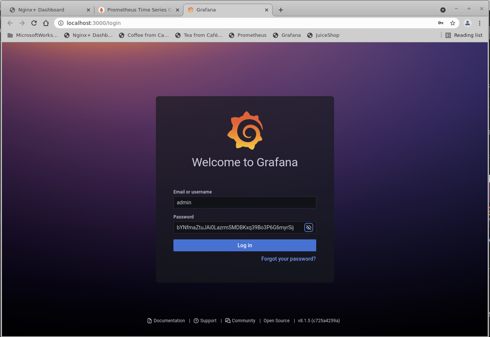

# Monitoring NGINX Ingress with Prometheus and Grafana    

## Introduction

This lab exercise is going to walk you through how to install and use several tools to monitor your NGINX Ingress Controller in your Kubernetes cluster. 

## Learning Objectives 

By the end of the lab, you will be able to: 

- Learn and Use Helm Charts
- Deploy Prometheus using Helm
- Deploy Grafana using Helm
- Access these apps thru NGINX Ingress Controller

<br/>

Helm | Prometheus | Grafana
:-------------------------:|:-------------------------:|:-------------------------:
  |  |

<br/>

Here is a brief description of what these different tools and application provide, and how you will use them.

`Helm` will make it simple to install everything into your cluster. This keeps the setup easier to deploy and easier to manage.  (Note, you can also install using the `manifests` method or `operator` method as well). It will come down to personal preference or specific requirements when installing software into Kubernetes.  You will use the Helm Chart provided by NGINX for this lab exercise.

`Prometheus` is a software package that can watch and collect statistics from many different k8s pods and services.  It then provides those statistics in a simple html/text format, often referred to as the "scraper page", meaning that it scrapes the statistics and presents them as a simple text-based web page.

`Grafana` is a data visualization tool, which contains a time series database and graphical web presentation tools.  Grafana imports the Prometheus scraper page statistics into it's database, and allows you to create `Dashboards` of the statistics that are important to you.  There are a large number of pre-built dashboards provided by both Grafana and the k8s community, so there are many available to use. And of course, you can customize them as needed or build your own.

<br/>

### Helm Installation


**Note:** Helm should already be installed on the Ubuntu Jumpbox for you.

1. Verify Helm is installed and you are running Version 3.x or higher:

    ```bash
    helm version --short
    ```
    

    If Helm is not installed, run this command to install it:

    ```bash
    curl -sSL https://raw.githubusercontent.com/helm/helm/master/scripts/get-helm-3 | bash
    ```

1. Create a new Kubernetes namespace called `monitoring`. You will use this namespace for Prometheus and Grafana components:

    ```bash
    kubectl create namespace monitoring
    ```
    

    <br/>

### Prometheus Installation


<br/>

1. The first step will be to deploy `Prometheus` into our cluster. Below are the steps to install it using Helm as follows:  

    ```bash
    helm repo add prometheus-community https://prometheus-community.github.io/helm-charts

    helm repo add kube-state-metrics https://kubernetes.github.io/kube-state-metrics

    helm repo update
    ```

    

1. Once the repos have been added to Helm, the next step is to deploy a `release`. For this lab, you will create a release called `nginx-prometheus`.   

    ```bash
    helm install nginx-prometheus prometheus-community/prometheus --set server.persistentVolume.enabled=false,alertmanager.persistentVolume.enabled=false -n monitoring
    ```

    

    <br/>


### Grafana Installation


<br/>

1. Next step will be to setup and deploy Grafana into your cluster, using Helm, add the Grafana repo: 

    ```bash
    helm repo add grafana https://grafana.github.io/helm-charts
    ```

    

1. After the Grafana repo is added, you will install Grafana using the below command. For this lab, you will create a second release called `nginx-grafana`.  Notice we are also setting the Grafana admin Password to `Nginx123`: 

    ```bash
    helm install nginx-grafana grafana/grafana -n monitoring
    ```

    

    If you want to check the status of your helm installations, you can run this command which will show all helm deployments across the cluster:

    ```bash
    helm ls -A
    ```

    

    Verify all the Prometheus and Grafana pods are running:

    ```bash
    kubectl get pods -n monitoring
    ```

    

    <br/>

## Testing the NGINX Ingress's Prometheus "scraper" Port and Page

<br/>

Verify that NGINX NIC is enabled for exporting Prometheus statistics.  This is defined in the Helm values file:

To see these settings, inspect the `lab2/lab2_values.yaml` file, lines 13-14.


 

1. Now verify this is enabled and the scraper page is working, using k8s port-forward:

    ```bash
    kubectl port-forward -n nginx-ingress $NIC 9113:9113
    ```

    Open Chrome, and navigate to http://localhost:9113/metrics.  You should see an HTML scraper page like this one:

    
    

    If you see an HTML page from NGINX NIC similar to the one above, you are good to go.  If you refresh the Coffee page several times, and then this page several times, you will see that the stats are immediately updated.  Notice that there is a `# TYPE and # HELP` in the scraper page entries, which describes the data type and definition of each metric.  For example, the `Total http requests` counter is highlighted.

    <br>

    > It is important to point out, that the scraper page contains `all` of the NGINX statistics that you see on the Dashboard/Stub_Status, and a few extras.

    >> **This set of metrics will provide a good data source for the monitoring and graphing of NGINX Ingress.**

    Note: If you were running NGINX Plus, there would be an `additional ~240 metrics` for all the server, location, and upstream statistics; see the Plus Workshop for more details if you are interested.

    <br/>

    There are many tools that can collect, display, alert, report, and archive these metrics.  You will use Nginx Ingress to expose Prometheus and Grafana outside the cluster, to do just that.

    <br/>

## NGINX Ingress for Prometheus and Grafana

<br/>

For you and your team to access Prometheus and Grafana from outside the cluster, you will add these apps to your existing NGINX Ingress Controller. In your Rancher environment, you will use VirtualServer and VirtualServerRoute manifests, to take advantage of NGINX's ability to do cross-namespace routing.  (Prometheus and Grafana are running in the "monitoring" namespace, remember?).  

1. Inspect the `prometheus-vs.yaml`, `grafana-vs.yaml` and `grafana-vsr.yaml` files in the lab8 folder.

    Notice that you are routing requests to your Prometheus and Grafana applications that live in a different namespace (`monitoring` in this lab), which are specified in your `VirtualServer/VirtualServerRoute` configuration.

1. Apply the VS manifests:

    ```bash
    kubectl apply -f lab8/prometheus-vs.yaml
    kubectl apply -f lab8/grafana-secret.yaml
    kubectl apply -f lab8/grafana-vs.yaml
    kubectl apply -f lab8/grafana-vsr.yaml
    ```

    

    <br/>


1. Now test access to Prometheus and Grafana, `through NGINX Ingress`. Open 2 new Chrome tabs, and try the Prometheus (http://prometheus.example.com) and Grafana (https://grafana.example.com) hostnames. 


Prometheus | Grafana
:-------------------------:|:-------------------------:
  |

Try a Prometheus query that shows the total number of HTTP requests, like the image below.  There are *many* statistics that you can find and graph with Prometheus.


<br/>

To log onto the Grafana Server, the username is "admin", and use the following kubectl command to retrieve the Grafana admin login password, which was dynamically created by Helm during the installation:

    ```bash
    kubectl get secret --namespace monitoring nginx-grafana -o jsonpath="{.data.admin-password}" | base64 --decode ; echo
    ```



<br/>

>WOW!! - See how easy that was - adding a couple NGINX VirtualServers, to provide external access to your monitoring tools running inside the cluster!

<br/>

### Configure Grafana Data Sources

1. Once logged into Grafana, from the left panel you need to click on `Configuration -> Data sources` and add `Prometheus` as a data source.

    

1. After `Prometheus` is added as a data source, in the Prometheus `settings` tab, update HTTP URL to `http://nginx-prometheus-server:80`.

    

    Scroll to the bottom, and click "Save and Test", it should show a Green Checkmark status and then click the "Home" button.

<br/>

### Import Grafana Custom Dashboards

1. Now you should be ready to import the Grafana Dashboards for NIC from NGINX, Inc. From the left panel click on `Import` to add the dashboard:

    

1. Next you will import 2 Grafana dashboard JSON definition files present in the `lab8` folder.

   - `NGINX-Basic.json` gives you basic metrics which come from NGINX Opensource.
   - `NGINXPlusICDashboard.json` is provided by NGINX, Inc, giving you advanced Layer 4-7 TCP/HTTP/HTTPS metrics which are only available from NGINX Plus.

    Copy the entire json file and place it within the  `Import via panel json` textbox and click on `Load` button.  Select `Prometheus` in the Data Source box.

    

    <br/>

2. Once you have imported both Dashboards, it's time to check them out:

    From the Grafana homepage, navigate to the `General` section as shown:

    

    In the `General` section, click on the `NGINX` dashboard.

    

    This should open up the NGINX Basic Grafana Dashboard. You can expand the sub-sections or adjust the `time range` and `refresh` interval in the upper right corner as needed.  You can see this shows the up/down Status of the Ingress, and the Connections and HTTP Requests stats:

    

    **NOTE:** If you see a red bar with the message "**No Data**" in the top most pane as seen in below screenshot - then click on edit, and change Value options Fields to "Numeric Fields" and click Apply.

    

    
    
    If needed, restart your `WRK` tool, to generate some traffic for the graphs.

    ```bash
    nerdctl run --rm williamyeh/wrk -t2 -c200 -d5m -H 'Host: cafe.example.com' --timeout 2s https://192.168.2.100/coffee
    ```

    
    
    <br/>

3. **Optional** - if you want to check out the NGINX Plus statistics in Grafana, from the `General` section, select the `NGINX Plus Ingress Controller` Dashboard.

    

    This should open up the NGINX Plus Grafana Dashboard. You can expand the sub-sections or adjust the time range and refresh time as needed.  There are also sample screenshots in the Plus workshop, Lab 8.

    

    <br/>

**This completes this Lab.**

<br/>

-------

## References:

- [VirtualServer and VirtualServerRoute](https://docs.nginx.com/nginx-ingress-controller/configuration/virtualserver-and-virtualserverroute-resources/)

- [Grafana NGINX Plus IC Dashboard](https://github.com/nginxinc/kubernetes-ingress/tree/master/grafana)

- [WRK loadtest tool](https://github.com/wg/wrk)

### Authors
- Jason Williams - Sr. Product Management Engineer @ F5, Inc.
- Chris Akker - Solutions Architect - Community and Alliances @ F5, Inc.
- Shouvik Dutta - Solutions Architect - Community and Alliances @ F5, Inc.

-------------

Navigate to ([Lab9](../lab9/readme.md) | [Main Menu](../LabGuide.md))