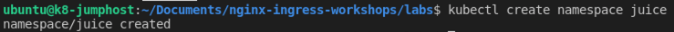
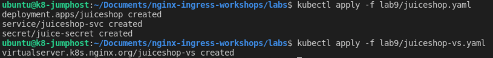
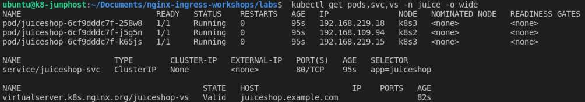

## Lab 9: Deploy JuiceShop application, using VS/VSR manifests ##

In this lab, you deploy a new application, leaving the current Cafe and Bar apps up and running. This new app environment is deployed using NGINX VirtualServer/VSRoute manifests.

<br/>

## Learning Objectives 

By the end of the lab, you will be able to: 

- Create a new Kubernetes namespace
- Deploy and test a new application
- Access this new app thru NGINX Ingress Controller

<br/>


<br/>

You will launch a new application, called `Juice Shop`, representing a modern online retail sales app, a nice refeshing addition to Cafe and Bar. It will be deployed in a new Kubernetes namespace called "juice" in your cluster.  The Juice Shop app is often used to test various HTTP and Website vulnerabilities. However, you will use it to test various NGINX features.

1. Inspect both of the Lab9 Juiceshop YAML files, `juiceshop.yaml`, and `juiceshop-vs.yaml`.  Do you see the deployment, service, and virtual server and route definitions?  

1. Next deploy the JuiceShop namespace, application using the following command and manifests:

    ```bash
    kubectl create namespace juice
    ```
    

    ```bash
    kubectl apply -f lab9/juiceshop.yaml
    kubectl apply -f lab9/juiceshop-vs.yaml
    ```

    

1. Show running Juice components:

    ```bash
    kubectl get pods,svc,vs -n juice -o wide
    ```
    

    Make sure your Juiceshop VirtualServer STATE is Valid.

    <br/>

1. Test the new Juice Shop application.

    Open Chrome, navigate to https://juiceshop.example.com or use the Bookmark.  Click around for a few minutes to explore the application.

    

    Did you notice, how easy it was with NGINX Ingress, to launch a completely new application in just a few seconds?  With just 2 YAML manifest files - and `no IT tickets` required to do this?  NGINX Ingress can perform the Layer7 Hostname and path routing for many different applications running in your k8s cluster.  
    
    And if you haven't noticed yet, all of your labs' FQDN/HTTP Hostnames are using the same Public IP Address for DNS, check out the /etc/hosts file on Ubuntu to confirm this.

    ```bash
    cat /etc/hosts
    ```

    

**This completes this Lab.**

<br/>

## References:

- [NGINX VirtualServer / Route](https://docs.nginx.com/nginx-ingress-controller/configuration/virtualserver-and-virtualserverroute-resources/)

- [JuiceShop Demo Source](https://github.com/bkimminich/juice-shop)

### Authors

- Chris Akker - Solutions Architect - Community and Alliances @ F5, Inc.
- Shouvik Dutta - Technical Solutions Architect @ F5, Inc.

-------------

Navigate to ([Lab10](../lab10/readme.md) | [Main Menu](../LabGuide.md))
